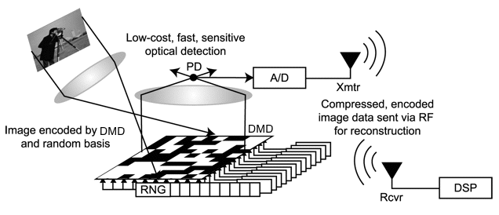
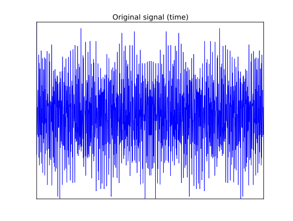
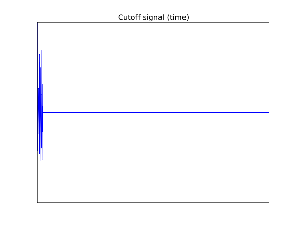
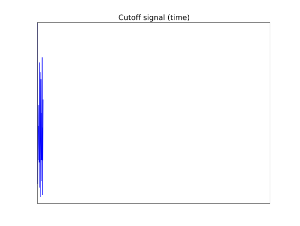
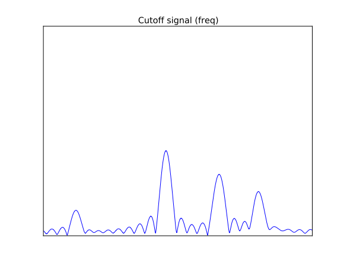
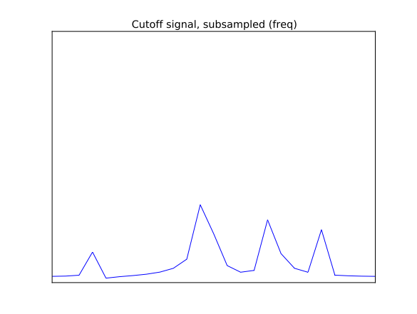
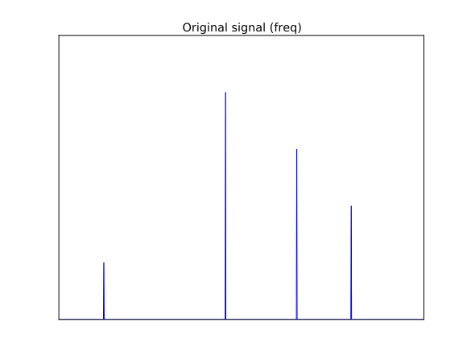
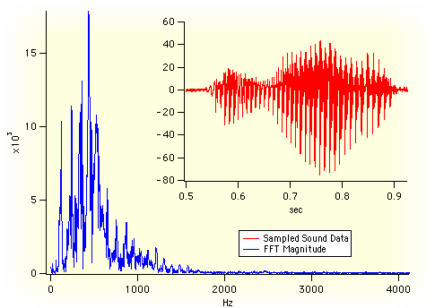

# Sketching via Hashing:  from Heavy Hitters to Compressive Sensing to Sparse Fourier Transform

Piotr Indyk

## Mit

# Outline

- Sketching via hashing

- Compressive sensing

- Numerical linear algebra

- (regression, low rank approximation)

- Sparse Fourier Transfor .... M

- c1 … (cm)

b

A

# “Sketching via hashing”:  a technique

- Suppose that we have a sequence S of elements a1..as from range {1…n}
- Want to approximately count the elements using small space
- For each element a, get an approximation of the count xa of a in S
- Method:
- Initialize an array c=[c1,…cm.
- Prepare a random hash function h: {1..n}→{1..m}
- For each element A. perfor .... M

$$c_{h(a)}=c_{h(a)}+inc(a)$$

- Result:

$$c_j=\sum a: h(a)=j x_a \cdot inc(a)$$

- To estimate xa return

$$x_a^* = c_{h(a)}/inc(a)$$

a1, a2, a3, a4, …………as

c1    …   ch(a) … cm

a

# Why would this work?

- We have

$$c_{h(a)} =x_a \cdot inc(a)+noise$$

- Therefore

$$x_a^* = c_{h(a)}/inc(a) = x_a+noise/inc(a)$$

-
- Incrementing options:
- inc(a)=1 [FCAB98,EV’02,CM’03,CM’04]

Simply counts the total, no under-estimation

- inc(a)=±1 [CFC’02]

Noise can cancel, unbiased estimator,  can under-estimate

- inc(a)=Gaussian [GGIKMS’02]

Noise has a nice distribution

$$c_j=\sum a: h(a)=j x_a \cdot inc(a)$$

$$x_a^* = c_{h(a)}/inc(a)$$

c1    …   ch(a) … cm

xa

# What are the guarantees?

- For simplicity, consider inc(a)= .... 1
- Tradeoff between accuracy and space .... M
- Definitions:
- Let k=m/ .... C
- Let H be the set of k heaviest coefficients of x , i.e., the “head”
- Let Tail1k=x-H .... 1

- (i.e., the sum of coeffs not in the head)

-
- Will show that, with constant probability

xa ≤ x*a ≤xa + Tail1k/k

- Meaning:
- For a stream with s elements, the error is always at most 1/k * s
- Even better if head really heavy

$$c_j=\sum a: h(a)=j x_a$$

$$x_a^* = c_{h(a)}$$

- c1 … (cm)

xa

xa*

Head

# Analysis

- We show how to get an estimate
- x*a ≤xa + Tail / k

- Pr[ |x*a-xa| &gt; Tail/k] ≤ P1+P2, where

	P1 = Pr[ a collides with (another) head element ]

$$P_{2} = Pr[ sum of tail elems colliding with a is$$

                   &gt; Tail/k ]

- We have

$$P_{1} \le k/m =1/C$$

$$P_{2} \le (Tail/m)/(Tail/k) = k/m = 1/C$$

-
- Total probability of failure ≤ 2/ .... C
-
- Can reduce the probability to 1/poly(n) by log n repetitions

  space O(k log n)

-
- $$c_j=\sum a: h(a)=j x_a$$

$$x_a^* = c_{h(a)}$$

- c1 … (cm)

xa

xa*

Head

# Compressive sensing

# Compressive sensing  [Candes-Romberg-Tao, Donoho]  (also: approximation theory, learning Fourier coeffs,  finite rate of innovation, …)

- Setup:
- Data/signal in n-dimensional space : .... X

$$E.g., x is an 256x256 image  n=65536$$

- Goal: compress x into a “measurement” Ax ,

     where A is a m x n “measurement matrix”, m &lt;&lt; n

- Requirements:
- Plan A: want to recover X. from A. .... X
- Impossible: underdetermined system of equations
- Plan B: want to recover an “approximation” x* of .... X
- Sparsity parameter k
- Informally: want to recover largest K. coordinates of .... X
- Formally: want x* such that e.g.

(L1/L1)      ||x*-x||1 C minx’ ||x’-x||1 =C Tail1k

     over all x’ that are k-sparse (at most k non-zero entries)

- Want:
- Good compression (small m=m(k,n))
- Efficient algorithms for encoding and recovery
- Why linear compression ?

=

A

x

 Ax

# Applications

-
- Single pixel camera

  [Wakin, Laska, Duarte, Baron, Sarvotham, Takhar, Kelly, Baraniuk’06]

-
-
- Pooling Experiments [Kainkaryam, Woolf’08], [Hassibi et al’07], [Dai-Sheikh, Milenkovic, Baraniuk], [Shental-Amir-Zuk’09],[Erlich-Shental-Amir-Zuk’09], [Kainkaryam, Bruex, Gilbert, Woolf’10]…

# Results

Excellent

Scale:

Very Good

Good

Fair

<table>
  <thead>
    <tr>
      <th>[Candes-Romberg-Tao’04]</th>
      <th>D</th>
      <th>k log(n/k)</th>
      <th>nc</th>
      <th>l2 / l1</th>
    </tr>
  </thead>
</table>

<table>
  <thead>
    <tr>
      <th>Paper</th>
      <th>R/D</th>
      <th>Sketch length</th>
      <th>Recovery time</th>
      <th>Approx</th>
    </tr>
  </thead>
</table>

# Sketching as compressive sensing

- Hashing view:
- H. hashes coordinates into “buckets” c1… .... CM
- Each bucket sums up its coordinates
- Matrix view:
- A 0-1 mxn matrix A, with one 1 per column
- The a-th column has 1 at position h(a), where h(a) be chosen uniformly at random from {1…m}
- Sketch is equal to c=A .... X
- Guarantee: if we repeat hashing log n times then with high probability

     ||x*-x||∞  Tail1k/k

L∞ /L1 guarantee, implies L1/L1

-
-
-
- c1 … (cm)

xa

xa*

## 0 0 1 0 0 1 0

## 1 0 0 0 1 0 0

## 0 1 0 0 0 0 1

## 0 0 0 1 0 0 0

n

m

Excellent

Scale:

Very Good

Good

Fair

<table>
  <thead>
    <tr>
      <th>Paper</th>
      <th>R/D</th>
      <th>Sketch length</th>
      <th>Recovery time</th>
      <th>Approx</th>
    </tr>
  </thead>
</table>

<table>
  <thead>
    <tr>
      <th>[CCF’02], [CM’06]</th>
      <th>R</th>
      <th>k log n</th>
      <th>n log n</th>
      <th>l2 / l2</th>
    </tr>
  </thead>
  <tbody>
    <tr>
      <td>[CM’04]</td>
      <td>R</td>
      <td>k log n</td>
      <td>n log n</td>
      <td>l1 / l1</td>
    </tr>
  </tbody>
</table>

<table>
  <thead>
    <tr>
      <th>[NV’07], [DM’08], [NT’08], [BD’08], [GK’09], …</th>
      <th>D</th>
      <th>k log(n/k)</th>
      <th>nk log(n/k) * log</th>
      <th>l2 / l1</th>
    </tr>
  </thead>
  <tbody>
    <tr>
      <td>[NV’07], [DM’08], [NT’08], [BD’08], [GK’09], …</td>
      <td>D</td>
      <td>k logc n</td>
      <td>n log n * log</td>
      <td>l2 / l1</td>
    </tr>
  </tbody>
</table>

<table>
  <thead>
    <tr>
      <th>[IR’08], [BIR’08],[BI’09]</th>
      <th>D</th>
      <th>k log(n/k)</th>
      <th>n log(n/k)* log</th>
      <th>l1 / l1</th>
    </tr>
  </thead>
</table>

<table>
  <thead>
    <tr>
      <th>[Candes-Romberg-Tao’04]</th>
      <th>D</th>
      <th>k log(n/k)</th>
      <th>nc</th>
      <th>l2 / l1</th>
    </tr>
  </thead>
</table>

……..

- c1 … (cm)

xi

xi*

Insight: Several random hash functions form an expander graph

# Results

# Regression

# Least-Squares Regression

- A is an n x d matrix, b an n x 1 column vector
- Consider over-constrained case, n &gt;&gt; d
-
- Find d-dimensional x so that

||Ax-b||2 ≤ (1+ε) miny ||Ay-b||2

-
- Want to find the (approx) closest point in the column space of A to the vector b
- b

A

# Approximation

- Computing the solution exactly takes O(nd2) time
- Too slow, so ε &gt; 0 and a tiny probability of failure OK
- Approach: sub-space embedding [Sarlos’06]
- Consider subspace L spanned by columns of A together with b
- Want: mxn matrix S, M. “small”, such that for all Y. in .... L

 ||Sy||2 = (1± ε) ||y||2

- Then S(Ax-b)2 = (1± ε) Ax-b2 for all .... X
- Solve argminy (SA)y – (Sb) .... 2
- Given SA, Sb, can solve in poly(m) time

b

A

Sb

SA

# Fast Dimensionality Reduction

- Need mxn dimensionality reduction matrix S such that:
- m is “close to” d, and
- matrix-vector product Sz can be computed quickly
- Johnson-Lindenstrauss: O(nm) time
- Fast Johnson-Lindenstrauss: O(n log n)

- (randomized Hadamard transform)

     [AC’06, AL’11, KW,11 ,NPW’12]

- Sparse Johnson-Lindenstrass: O(nnz(z)*εm)

     [SPD+09, WDL+09, DKS10, BOR10, KN12]

- Surprise! For subspace embedding O~(nnz(z)) time and m=poly(d) suffices [CW13, NN13,MM13]
- Leads to regression and low-rank approx algorithms with O~(nnz(A)+poly(d)) running time
- Count-sketch-like matrix S:

[

[

## 0 0 1 0  0 1  0 0

## 1 0 0 0  0 0  0 0

## 0 0 0 -1 1 0 -1 0

0-1 0 0  0 0  0 1

# Heavy hitters a la regression

- Can assume columns of A. are orthonorma .... L
- ||A||F2 = d
- Let T be any set of size O(d2) containing all rows indexes i in [n] for which the row Ai has squared norm Ω(1/d)
- “Heavy hitter rows”
- Suffices to ensure:
- Heavy hitters do not collide – perfect hashing
- Smaller elements concentrate
- This gives sparse dimensionality reduction matrix with m=poly(d) rows
- Clarkson-Woodruff: m=O~(d2)
- Nelson-Nguyen: m=O~(d)
-
-
- T

A

# Sparse Fourier Transform

- Discrete Fourier Transform:
- Given: a signal x[1…n]
- Goal: compute the frequency vector x’ where

$$x’f = Σt xt e-2πi tf/n$$

- Very useful tool:
- Compression (audio, image, video)
- Data analysis
- Feature extraction
- …
-
- See SIGMOD’04 tutorial “Indexing and Mining Streams” by C. Faloutsos
- -
- # Fourier Transfor .... M

Sampled Audio Data (Time)

DFT of Audio Samples (Frequency)

# Computing DFT

- Fast Fourier Transform (FFT) computes the frequencies in time O(n log n)
- But, we can do (much) better if we only care about small number k of “dominant frequencies”
- E.g., recover assume it is k-sparse (only k non-zero entries)
- Algorithms:
- Boolean cube (Hadamard Transform): [GL’89], [KM’93], [L’93]
- Complex FT: [Mansour’92, GGIMS’02, AGS’03, GMS’05, Iwen’10, Akavia’10, HIKP’12,HIKP’12b, BCGLS’12, LWC’12, GHIKPL’13,…]
- Best running times [Hassanieh-Indyk-Katabi-Price’12]
- Exactly k-sparse signals: O(k log n)
- Approx. k-sparse signals* : O(k log n * log(n/k))
- 

*L2/L2 guarantee

# Intuition: Fourier

Frequency Domain

Time Domain Signal

Cut off Time signal

Frequency Domain

First B samples

Frequency Domain

‘

‘

‘

# Main task

- We we would like this
-
-
-
- … to act like this:

# Issues

- “Leaky” buckets
- “Hashing”: needs A. random hashing of the spectru .... M
- …

- 

# Filters: boxcar filter  (used in[GGIMS02,GMS05])

- Boxcar -&gt; Sin .... C
- Polynomial decay
- Leaking many buckets

# Filters: Gaussian

- Gaussian -&gt; Gaussian
- Exponential decay
- Leaking to (log n)1/2 buckets

# Conclusions

- Sketching via hashing
- Simple technique
- Powerful implications
- Questions:
- What is next ?

- c1 … (cm)

b

A

