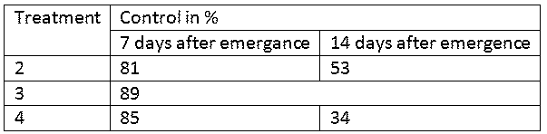

**Description**

**Title of Invention: Sample with tables with and without captions**

- This is a sample document to show how to insert tables in a docx document.
- Tables in the description, claims or abstract sections can be inserted as images or designed in the document using the text editor’s table feature.
- In the drawings section only images are accepted, so in that section the table must be inserted as an image or conversion will fail with a red error message asking you to insert only images in that section.
- Tables can be inserted with or without caption. Captions are optional, except in the drawings section where the image of the table must be preceded by the indication [Fig. 1] followed by a paragraph break as shown in this sample.
- The examples below show tables with and without captions, with merged cells, inserted as images or designed directly in the text editor.
- [Table 1]
<table>
  <thead>
    <tr>
      <th>Row 1 Column 1</th>
      <th>Row 1 Column 2</th>
      <th>Row 1 Column 3</th>
    </tr>
  </thead>
  <tbody>
    <tr>
      <td>Row 2 Column 1</td>
      <td>Row 2 Column 2</td>
      <td>Row 2 Column 3</td>
    </tr>
    <tr>
      <td>Row 3 Column 1</td>
      <td>Row 3 Column 2</td>
      <td>Row 3 Column 3</td>
    </tr>
  </tbody>
</table>

- Table with cells merged and no caption:
<table>
  <thead>
    <tr>
      <th></th>
      <th></th>
      <th>**ABC**</th>
      <th></th>
      <th></th>
      <th></th>
      <th></th>
      <th></th>
    </tr>
  </thead>
  <tbody>
    <tr>
      <td>NFkB mutation</td>
      <td>NFkB mutation</td>
      <td>**CD79A**</td>
      <td>**CD79B**</td>
      <td>**CD79B**</td>
      <td>TAK1</td>
      <td>A20</td>
      <td>CARD11</td>
    </tr>
    <tr>
      <td>**Target**</td>
      <td>**Compound**</td>
      <td>**OCI-Ly10**</td>
      <td>**HBL1**</td>
      <td>**TMD8**</td>
      <td>**U2392**</td>
      <td>**Su-DHL2**</td>
      <td>**OCI-Ly3**</td>
    </tr>
    <tr>
      <td>PKCb</td>
      <td>AEB071</td>
      <td>**1.3**</td>
      <td>**0.50.2**</td>
      <td></td>
      <td>5</td>
      <td>&gt;20</td>
      <td>&gt;2015&gt;200.412</td>
    </tr>
    <tr>
      <td>PKCb</td>
      <td>Compound D</td>
      <td>ND  **0.5**</td>
      <td>**0.2**</td>
      <td>**0.2**</td>
      <td>3</td>
      <td>&gt;20</td>
      <td>&gt;2015&gt;200.412</td>
    </tr>
    <tr>
      <td>PKCb</td>
      <td>Compound B</td>
      <td></td>
      <td>**0.5**</td>
      <td>**0.2 0.2**</td>
      <td>10</td>
      <td>15</td>
      <td>&gt;2015&gt;200.412</td>
    </tr>
    <tr>
      <td>IKKb</td>
      <td>Compound A</td>
      <td>**0.3**</td>
      <td>**2.5**</td>
      <td></td>
      <td>2.5</td>
      <td>15</td>
      <td>&gt;2015&gt;200.412</td>
    </tr>
  </tbody>
</table>

- A table can also include merged cells.
- Table 2 below has a caption. Captions do no longer require the use of square brackets around the caption.
- Table .... 2
<table>
  <thead>
    <tr>
      <th>Construct</th>
      <th>SEQ ID NO:</th>
      <th>Oligonucleotide pairs used</th>
      <th>Oligonucleotide pairs used</th>
    </tr>
  </thead>
  <tbody>
    <tr>
      <td>Construct</td>
      <td>SEQ ID NO:</td>
      <td>PCR fragment 1</td>
      <td>PCR fragment 2</td>
    </tr>
    <tr>
      <td>HSA DI + DII + MSA DIII</td>
      <td>29</td>
      <td>xAP032 / xAP161 (pDB2305)*xAP032 / xAP091 (pDB2305)xAP032 / xAP121 (pDB2305)xAP032 / xAP162 (pDB3442)xAP032 / xAP092 (pDB3257)xAP032 / xAP120 (pDB3994)xAP032 / xAP087 (pDB3442xAP032 / xAP085 (pDB3257)</td>
      <td>xAP160 / xAP033 (pDB3442)</td>
    </tr>
    <tr>
      <td>HSA DI + DII + RSA DIII</td>
      <td>25</td>
      <td>xAP032 / xAP161 (pDB2305)*xAP032 / xAP091 (pDB2305)xAP032 / xAP121 (pDB2305)xAP032 / xAP162 (pDB3442)xAP032 / xAP092 (pDB3257)xAP032 / xAP120 (pDB3994)xAP032 / xAP087 (pDB3442xAP032 / xAP085 (pDB3257)</td>
      <td>xAP086 / xAP033 (pDB3257)</td>
    </tr>
    <tr>
      <td>HSA DI + DII + SSA DIII</td>
      <td>28</td>
      <td>xAP032 / xAP161 (pDB2305)*xAP032 / xAP091 (pDB2305)xAP032 / xAP121 (pDB2305)xAP032 / xAP162 (pDB3442)xAP032 / xAP092 (pDB3257)xAP032 / xAP120 (pDB3994)xAP032 / xAP087 (pDB3442xAP032 / xAP085 (pDB3257)</td>
      <td>xAP122 / xAP033 (pDB3994)</td>
    </tr>
    <tr>
      <td>MSA DI + DII + HSA DIII</td>
      <td>30</td>
      <td>xAP032 / xAP161 (pDB2305)*xAP032 / xAP091 (pDB2305)xAP032 / xAP121 (pDB2305)xAP032 / xAP162 (pDB3442)xAP032 / xAP092 (pDB3257)xAP032 / xAP120 (pDB3994)xAP032 / xAP087 (pDB3442xAP032 / xAP085 (pDB3257)</td>
      <td>xAP093 / xAP033 (pDB2305)</td>
    </tr>
    <tr>
      <td>RSA DI + DII + HSA DIII</td>
      <td>26</td>
      <td>xAP032 / xAP161 (pDB2305)*xAP032 / xAP091 (pDB2305)xAP032 / xAP121 (pDB2305)xAP032 / xAP162 (pDB3442)xAP032 / xAP092 (pDB3257)xAP032 / xAP120 (pDB3994)xAP032 / xAP087 (pDB3442xAP032 / xAP085 (pDB3257)</td>
      <td>xAP093 / xAP033 (pDB2305)</td>
    </tr>
    <tr>
      <td>SSA DI + DII + HSA DIII</td>
      <td>27</td>
      <td>xAP032 / xAP161 (pDB2305)*xAP032 / xAP091 (pDB2305)xAP032 / xAP121 (pDB2305)xAP032 / xAP162 (pDB3442)xAP032 / xAP092 (pDB3257)xAP032 / xAP120 (pDB3994)xAP032 / xAP087 (pDB3442xAP032 / xAP085 (pDB3257)</td>
      <td>xAP093 / xAP033(pDB2305)</td>
    </tr>
  </tbody>
</table>

- Table 3 below is the image of a table.
- [Table 3]

- The table below has been designed using the text editor:
<table>
  <thead>
    <tr>
      <th>Treatment</th>
      <th>Control in %</th>
      <th>Control in %</th>
    </tr>
  </thead>
  <tbody>
    <tr>
      <td>Treatment</td>
      <td>7 days</td>
      <td>14 days</td>
    </tr>
    <tr>
      <td>2</td>
      <td>81</td>
      <td>53</td>
    </tr>
    <tr>
      <td>3</td>
      <td>89</td>
      <td>89</td>
    </tr>
    <tr>
      <td>4</td>
      <td>85</td>
      <td>34</td>
    </tr>
  </tbody>
</table>

- If you want to insert a table in the Drawings section, it can only be inserted as an image, as only images are supported in that section.
- Fig. 1 of the Drawings is the image of a table.

**Claims**

1. This is a dummy claim.
2. This is another dummy claim.

**Abstract**

This is a sample text used to create the abstract:

Fig. 1

