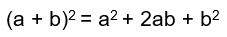
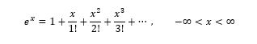
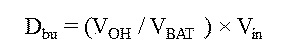

## Description

## Title Of Invention

# Sample Application with mathematical equations

This is a sample application showing how to insert mathematical equations in a docx application.

Mathematical equations can be created directly in the text editor or inserted as images.

This is an example of a paragraph followed by a mathematical equation created in the text editor:

[Math.1]

$$\left(x+a\right)^{n}=\sum_{k=0}^{n}\left(\genfrac{}{}{0pt}{}{n}{k}\right)x^{k}a^{n-k}$$

A caption helps to identify an element such as a mathematical equation in the xml produced during conversion, but captions and square brackets around the captions are optional. The following paragraph contains a mathematical equation with a caption without brackets:

Math.2

$$e^{x}=1+\frac{x}{1!}+\frac{x^{2}}{2!}+\frac{x^{3}}{3!}+ \text{ \textellipsis } , - \infty  < x <  \infty$$

In this paragraph, the following equation  $\left(1+x\right)^{n}=1+\frac{nx}{1!}+\frac{n\left(n-1\right)x^{2}}{2!}+ \text{ \textellipsis }$ has no caption and is in line with the text.

The mathematical equation can also be inserted without caption in a separate paragraph.

$$\left(x+a\right)^{n}=\sum_{k=0}^{n}\left(\genfrac{}{}{0pt}{}{n}{k}\right)x^{k}a^{n-k}$$

A mathematical equation can also be inserted as an image with or without caption as in the examples below

Math.3

:

The following equation is also an image:

Only images are accepted in the Drawings section, so if you need to add an equation as figure of the drawings, please insert it as an image or the document will be rejected with a red error.

Fig. 1 of the drawings is an image of a mathematical equation.

## Claims

This is a sample Claim including a mathematical equation created in the text editor:

[Math. 1]

$$\left(x+a\right)^{n}=\sum_{k=0}^{n}\left(\genfrac{}{}{0pt}{}{n}{k}\right)x^{k}asdaa^{n-k}$$

This is a sample Claim. This claim include a mathematical equation inserted as an image:

Math. 2

This is text.

This is a sample Claim. In principle, under the PCT, any dependent claim which refers to more than one other claim (“multiple dependent claim”) must refer to such claims in the alternative only, and multiple dependent claims cannot serve as a basis for any other multiple dependent claim. However, the national laws of most Contracting States permit a manner of claiming which is different from that provided for in the preceding sentence, and the use of that different manner of claiming is in principle also permitted under the PCT.

## Abstract

This is a sample text. The abstract must consist of a summary of the disclosure as contained in the description, the claims and any drawings. Where applicable, it must also contain the most characteristic chemical formula. The abstract must be as concise as the disclosure permits (preferably 50 to 150 words if it is in English or when translated into English).

[Fig. 1]

