## Health Communication PLAYBOOK

Resources to Help You Create Effective Materials

## About the Playbook

## Health communication can be challenging. This Playbook will make it easier.

When you need to communicate with the public about environmental health, you may be dealing with tight deadlines, complex topics, and distracted or confused audiences. So when you spend the time and resources to develop a new product whether it's a website for consumers (i.e., non-scientific audiences) or a presentation for policymakers - you want to know it will work . You want to feel confident your material will:

- » Resonate with the right audience
- » Provide the right information
- » Be easy to understand

This Playbook will help you get the job done. It covers key communication materials for consumers and professionals and includes practical resources like:

- » Annotated examples of fact sheets, press releases, and more
- » Research-based tips and step-by-step instructions
- » Worksheets to help you get started
- » Checklists to review when you're done

The next time you need to create a communication product, start with the Playbook. You'll save time, reduce frustration, and develop the consistent and effective communication products your audiences need.

Use this Playbook along with Your Guide to Clear Writing. That resource gives you the overarching clear communication strategies - and this one offers practical examples you can learn from and adapt. Check out the Guide.

Use of trade names and commercial sources in the Playbook is for identification only and does not imply endorsement or recommendation by the U.S. Department of Health and Human Services (HHS), the Centers for Disease Control and Prevention (CDC), the Agency for Toxic Substances and Disease Registry (ATSDR), or the National Center for Environmental Health (NCEH).

[To access the Health Communication Playbook online, visit https://www.cdc.gov/ nceh/clearwriting/docs/health-comm-playbook-508.pdf](https://www.cdc.gov/nceh/clearwriting/docs/health-comm-playbook-508.pdf)

## Table of  Contents

<table>
  <thead>
    <tr>
      <th>Communication Strategies</th>
      <th></th>
    </tr>
  </thead>
  <tbody>
    <tr>
      <td>Identify Key Messages and Talking Points..................................................................</td>
      <td>2</td>
    </tr>
    <tr>
      <td>Write Clearly .....................................................................................................................</td>
      <td>9</td>
    </tr>
    <tr>
      <td>Tell a Story .....................................................................................................................</td>
      <td>12</td>
    </tr>
    <tr>
      <td>Use Design and Layout Effectively .............................................................................</td>
      <td>17</td>
    </tr>
    <tr>
      <td>Consumer Communication</td>
      <td></td>
    </tr>
    <tr>
      <td>Fact Sheets......................................................................................................................</td>
      <td>28</td>
    </tr>
    <tr>
      <td>Webpages .......................................................................................................................</td>
      <td>33</td>
    </tr>
    <tr>
      <td>Social Media</td>
      <td>...................................................................................................................38</td>
    </tr>
    <tr>
      <td>Videos ..............................................................................................................................</td>
      <td>48</td>
    </tr>
    <tr>
      <td>Media Communication</td>
      <td></td>
    </tr>
    <tr>
      <td>Press Releases</td>
      <td>............................................................................................................... 63</td>
    </tr>
    <tr>
      <td>Media Advisories............................................................................................................</td>
      <td>69</td>
    </tr>
    <tr>
      <td>Representing Your Organization in Media Interviews ............................................</td>
      <td>73</td>
    </tr>
    <tr>
      <td>Professional Communication</td>
      <td></td>
    </tr>
    <tr>
      <td>Communication Plans...................................................................................................</td>
      <td>79</td>
    </tr>
    <tr>
      <td>Communication Packages ...........................................................................................</td>
      <td>88</td>
    </tr>
    <tr>
      <td>Email.................................................................................................................................</td>
      <td>90</td>
    </tr>
    <tr>
      <td>PowerPoint Presentations............................................................................................</td>
      <td>93</td>
    </tr>
    <tr>
      <td>Poster Presentations ....................................................................................................</td>
      <td>99</td>
    </tr>
    <tr>
      <td>Appendices</td>
      <td></td>
    </tr>
    <tr>
      <td>.................................................... » Appendix A: Clear Writing Resources..........</td>
      <td>105</td>
    </tr>
    <tr>
      <td>» Appendix B: Communication Resources .........................................................</td>
      <td>107</td>
    </tr>
    <tr>
      <td>» Appendix C: Twitter Content Best Practices...................................................</td>
      <td>109</td>
    </tr>
    <tr>
      <td>References</td>
      <td></td>
    </tr>
    <tr>
      <td>» References for Key Recommendations............................................................</td>
      <td>111</td>
    </tr>
  </tbody>
</table>

Communication Strategies

## Identify Key Messages and Talking Points

No matter what you're writing - or who you're trying to reach - you need to start with key messages. What does your intended audience absolutely need to know? Your key messages will guide you as you write - and even help determine the best format to use.

So before you write anything, take the time to identify your messages and talking points (like supporting data and background information).

## Key messages

## What is a key message?

A key message is like your elevator pitch. It's a short, memorable sentence or 2 that conveys exactly what you want your intended audience to know and understand. Every communication product needs at least 1 key message.

## What does a key message look like?

Key messages are:

- » Few in number: Limit your key messages to 3.
- » Short and concise: Each key message should be no more than 1 or 2 sentences.
- » Memorable: Messages should be both simple enough and original enough for the audience to remember.
- »  Focusedonaspecifictopic: Avoid overexplaining or including lots of background information.
- » Consistent: Use repetition to make your key messages stick.

## Identify Key Messages and Talking Points

- » Tailored to the needs of your audience: What does this audience need to hear?
- » Aligned with your overarching communication strategy: Keep the bigger picture in mind.

## Key message examples

The following key messages are related to NCEH/ATSDR's PV investigation in Eastern Pennsylvania:

- 1 ) Protecting public health is NCEH/ATSDR's top priority.
- 2 ) ATSDR identified a cluster of PV cases in Eastern Pennsylvania.
- 3 ) ATSDR is still investigating the cases.

## Talking points

## What is a talking point?

A talking point is a fact, figure, or story that supports a key message.

## When do I use a talking point?

Talking points are developed as needed to help explain a complicated event or issue.

## What does a talking point look like?

## Talking points are:

- » Supported with research or data: Talking points offer numbers, facts, and figures.
- » Limited in number: Keep talking points to 5 or fewer for each key message.
- » Morespecificthankeymessages: Talking points offer more insight.
- » Consistent with the key message: Talking points prove the key message to be true.
- » Easy to understand: The tone is conversational and jargon-free.

## Identify Key Messages and Talking Points

## Talking point examples

The following are talking points to support the key messages related to NCEH/ ATSDR's PV investigation in Eastern Pennsylvania.

- 1) Key message: Protecting public health is ATSDR's top priority.

## Talking points:

- » ATSDR has been investigating PV in Eastern Pennsylvania since 2006.
- » ATSDR responded immediately when the Pennsylvania Department of Health asked us to investigate PV in Eastern Pennsylvania.
- » ATSDR has secured grants and worked with experts to carry out the investigation.
- 2)Keymessage:ATSDRidentifiedaclusterofPVcasesinEasternPennsylvania.

## Talking points:

- » ATSDR is now conducting 14 research projects and 4 non-research projects.
- » The projects are based on the recommendations of an expert panel that identified 4 areas for investigation: epidemiology, genetics, toxicology, and environmental analysis.
- 3) Key message: ATSDR is still investigating the cases.

## Talking points:

- » We expect fieldwork for the projects will be completed in fall 2012.
- » We'll present research findings and reports at future public meetings as the projects are completed.

## Identify Key Messages and Talking Points

## Identify Key Messages and Talking Points

## Worksheet

Use this worksheet as a guide to develop key messages and talking points.

- 1 What is the goal for this communication?

The goal is:

- 2 What are your objectives? What do you want to have happen?

My objectives are:

- 3 Who is your intended audience?

My intended audience is:

## Key Message 1:

- a ) Talking point:

- b ) Talking point:

- c ) Talking point:

## Key Message 2:

- a ) Talking point:

- b ) Talking point:

- c ) Talking point:

## Key Message 3:

- a ) Talking point:

- b ) Talking point:

- c ) Talking point:

## My key messages are:

- 1 )

## 2 )

## 3 )

## 4 What are your key messages?

Limit them to 3 - and refer to the checklist as you write your messages.

## 5 I  f you need talking points, make sure you have at least 1 to support each of your key messages.

Most key messages won't need more than 2 or 3 talking points. Refer to the checklist as you write your talking points.

## Key messages

- [  Few in number - limit key messages to .... 3

- [ ]  Short and concise - no more than 1 or 2 sentences

- [ ]  Memorable

- [  Focused on A. specific top .... IC

- [ ]  Consistent

- [ ]  Targeted for your audience

- [ ]  Based on your overarching communication strategy

- [ ]  Jargon-free

## Talking points

- [ ]  Supported with research or data

- [ ]  Limited in number - 5 or fewer for each key message

- [ ]  Easy to understand

- [  Specif .... IC

- [ ]  Consistent

- [ ]  Jargon-free

## Identify Key Messages and Talking Points

## Write Clearly

Clear writing is the cornerstone of effective health communication. And it's not only important for consumers. According to the National Work Group on Literacy and Health, all patients - regardless of skill level - prefer easy-to-read materials.

Follow these key principles when you write.

## Make your material easy to read

Use the active voice to keep content engaging, clear, and brief.

<table>
  <thead>
    <tr>
      <th>Bad Example</th>
      <th>Good Example</th>
    </tr>
  </thead>
  <tbody>
    <tr>
      <td>It is recommended that a committee be formed.</td>
      <td>Form a committee.</td>
    </tr>
  </tbody>
</table>

Replace technical jargon and scientific terms with simple terms so everyone can easily understand the material.

<table>
  <thead>
    <tr>
      <th>Bad Example</th>
      <th>Good Example</th>
    </tr>
  </thead>
  <tbody>
    <tr>
      <td>Minority</td>
      <td>African Americans, women, refugees (Be specific -who, exactly, are you talking about?)</td>
    </tr>
    <tr>
      <td>Kernicterus</td>
      <td>Jaundice</td>
    </tr>
    <tr>
      <td>Healthy People 2020</td>
      <td>Healthy People 2020, a set of national health goals…</td>
    </tr>
  </tbody>
</table>

## Group information using headings

Keep materials scannable by using meaningful titles, headings, and subheadings. Don't use generic headings like 'overview' or 'recommendations.' Chunk the information into short paragraphs. And whenever possible, use bulleted lists nothing conveys information better or faster.

<table>
  <thead>
    <tr>
      <th>Methodology of Research into Neural Tube Defects in the Hispanic Community</th>
      <th>Studies Link Neural Tube Birth Defects to Low Folic Acid Consumption in Hispanic Americans</th>
    </tr>
  </thead>
</table>

## Why?

Although the first example is accurate, it doesn't provide enough information. The good example makes it explicit - low folic acid consumption in Hispanic Americans has been linked to birth defects. You don't need any further information to understand the main point.

## Make your material look appealing

Dense text, a cramped layout, and small fonts will drive your readers away. So:

- » Make sure your page has lots of white space.
- » Use bullets and headings to 'chunk' (group) information.
- » Use images that support your text.

For detailed information on clear communication strategies, consult Your Guide to Clear Writing on the Clear Writing Hub. It will help guide you at every stage of material development - from thinking through your strategy to final review.

## Tell a Story

Describing the work your organization does can be difficult. When you're talking about complex health topics, it's easy to lose your audience.

Storytelling is one strategy to grab your reader's attention and help them understand your organization's successes. While it works well in consumer products, storytelling is also an effective approach for reaching and persuading professionals, like policymakers.

## Safeguarding Residents from Asbestos in a Mining Community

Date: Month Day, 4-Digit Year

## Asbestos-Related Deaths in Montana

Residents of Libby, Montana, were concerned with the number of asbestos-related deaths happening in their town. Many residents were exposed to asbestos by working in vermiculite mines in and near the town. Vermiculite mining began in the 1920s and continued until 1990.

## Role of ATSDR

Since 1999, ATSDR has been working closely with the community to examine the long-lasting health effects of exposure to Libby amphibole asbestos.

ATSDR worked with multiple partners to screen and identify affected residents. An ATSDR epidemiologist conducted a review of deaths in the community.

## Investigation Helps Residents

ATSDR's investigation revealed that the rate of deaths attributed to asbestosis, a lung disease caused by breathing asbestos particles over a long period of time, was 60 times higher in Libby than the U.S. average. As a result of this investigation, ATSDR:

- » Created a registry of community members affected by asbestos
- » Offered health screenings to community members for early intervention
- » Began a campaign to notify exposed residents to educate them about asbestos
- » Launched a new, five-year initiative to continue to examine the health effects of asbestos

Use positive words that highlight the success and draw the reader in. Avoid jargon.

Include a short synopsis that summarizes the problem that your organization helped to solve.

Briefl y describe  how your organization solved the problem  identifie d above. Use clear communication principles.

- Use bullet points to highlight each success or lesson learned. Bullets should be concise and include simple takeaways.

## Contribution to Public Health

Based on the results of the Libby analyses, ATSDR reviewed more than 200 locations across the nation that received vermiculite from Libby. ATSDR conducted exposure evaluations at 28 of these communities with greater past exposure levels and recommended activities to prevent exposures from any remaining asbestos. Additionally, ATSDR studied the usefulness of CT scans to identify lung problems related to asbestosis and helped to identify tremolite asbestos as a toxic substance.

## Contact Information

NCEH/ATSDR Office of Communication Writer-Editor Services 770-488-0700 wes@cdc.gov

## References

Agency for Toxic Substances and Disease Registry (ATSDR). Asbestos exposure in Libby, Montana, Atlanta, GA. (accessed 2010, July 19)

http://www.atsdr.cdc.gov/asbestos/sites/libby\_montana/

Agency for Toxic Substances and Disease Registry (ATSDR). Safeguarding Communities from Chemical Exposures.  Atlanta, GA.

Make the story relevant on a national level.

Include contact information.

Include additional references and information that may be helpful when developing materials based on this success story.

## What makes a good story?

## Look for:

- » A personal story that helps the audience connect
- » A subject who can tell their own story in their own words
- » A story of triumph and perseverance - a clear victory
- » Stories of of dedication and service - people who are working toward A. public health goa .... L
- » Stories that showcase the impact of your organization's work

## Make it compelling:

- » Tell it like a story, not a report.
- » Begin with an attention-grabbing lead. The first sentence needs to capture the audience.
- » Weave a personal story. Try to include a person or community at the beginning of the story.
- » Build suspense. Define what the person or community had to lose.
- » Teach and inspire at the same time. Share how your organization tackled the obstacle, while also teaching about public health and your organization's work.
- » Make it relevant. Give the story a national perspective.

## Make it easy to read:

- » Keep it conversational - use contractions and words people know.
- » Keep sentences and paragraphs brief - no more than 20 words per sentence and 5 sentences per paragraph.
- » Make sure to have plenty of white space, so it's not overwhelming to the eye.

For examples of good storytelling, visit NCEH/ATSDR's Your Health - Your Environment and Sharing Our Stories websites.

## Use Design and Layout Effectively

## How to create a strong layout

## Use a clear visual hierarchy

A clear visual hierarchy (the order of text and images) can help readers process information.

- » Create an obvious path for the eye - moving from left to right and top to bottom. Most readers start in the left corner, so put your most important information in that quadrant.
- » Use distinct text size, color, and placement to help readers focus on main messages. Bigger text signals importance - so does the order on the page.
- » Emphasize different levels of information by making titles and headings bold or larger. Make the title biggest, then the sub-heading, and then the body text.
- » Group headings and related text together - leaving white space above each heading.

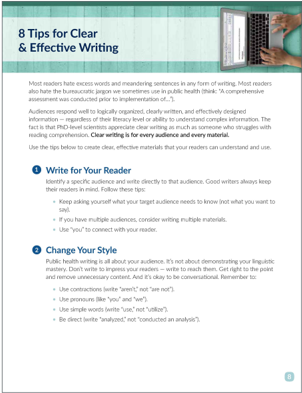

Attribution: CDC NCEH/ATSDR

Compare the 2 examples to the right. The second one is easier to understand and look at because it groups the question with the correct answer and the questions are in bold.

Who should get the flu shot? Everyone age 6 months or older. When should I get the flu shot? As soon as possible, typically in the fall.

Are there side effects? Soreness or redness where the shot was given.

## Break text into manageable chunks

Instead of dense walls of text, use small, stand-alone chunks of text with lots of headings. This creates white space, which makes your material look uncluttered and easy to read.

- » Go for short simple sentences instead of long ones.
- » Incorporate bulleted lists to break up your content and add white space.
- » Use grids to keep content and images aligned.

## Whoshouldgettheflushot?

Everyone age 6 months or older.

## WhenshouldIgettheflushot?

As soon as possible, typically in the fall.

## Are there side effects?

Soreness or redness where the shot was given.

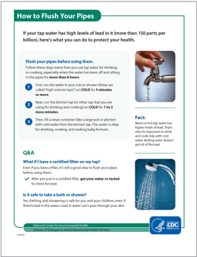

Attribution: CDC NCEH

## How to choose a reader-friendly font

- » Use sans-serif typefaces (like Calibri). They may be easier to read than serif fonts (like Georgia).
- » Make sure the font size is readable. Use 16 pixels (px) or larger for the web and at least 12 point (pt) for the body of a print document. It's better to go too big than too small.
- » Make sure lines of text aren't too close together. Increase line height to between 140% and 160% of the font size.
- » Use fonts with open counter space. Below, the 'e' on the left has more open counter space - the size of the gap between the top half and the bottom - and is easier to read.
- » Avoid condensed or narrow fonts as well as expanded fonts. asthma , asthma , asthma
- » Use fonts with equal stroke widths. They're easier to read than fonts with uneven stroke widths.
- » Limit use of italics and all caps. Use boldface to highlight important text or emphasize the difference between headings.

## Verdana  8  pt

If a radiation emergency occurs, people can take actions to protect themselves, their loved ones, and their pets. Emergency workers and local officials are t r ained to respond to disaster situations and will provide specific actions to help k eep people safe.

## Verdana  12  pt

If a radiation emergency occurs, people can take actions to protect themselves, their loved ones, and their pets. Emergency workers and local officials are t r ained to respond to disaster situations and will  provide specific actions to help k eep people safe.

## How to use images effectively

- » Choose clear images that support the content and help readers understand important concepts.
- » Make sure images are relevant and placed in context.
- » Use icons or images (like stars, arrows, and checkmarks) to highlight important content or group similar content.

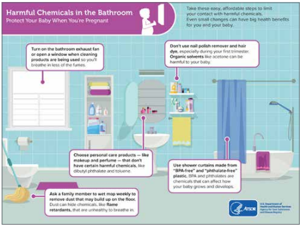

Attribution: CDC ATSDR

Attribution: CDC ATSDR

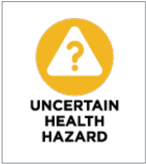

- » Use conceptual cues such as colors to reinforce key messages and recommendations. For example, try using the stoplight framework (e.g., green, yellow, red) to signal level of severity or risk. However, don't rely on color alone to convey meaning. When using the stoplight framework, make sure you also explain the risk with words.
- » Make sure images with people show positive, healthy behaviors (e.g., people in a car are wearing seatbelts or a medical professional touching a patient is wearing latex gloves).

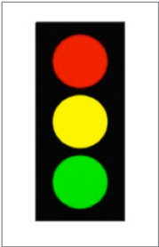

## How to create clear visual representations of data

- » Help your readers understand data by using graphical displays.
- » Explain or support numbers and calculations with text or visuals.
- » Use whole numbers instead of decimals, percentages, and fractions.

Bad Example

30% of Americans have high blood pressure.

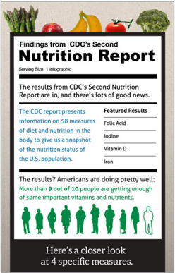

Attribution: CDC NCEH

## Good Example

## 3 out of 10 Americans have high blood pressure.

## How to enhance content with color

- » Use appropriate contrast. Make sure images and text are easy to see against backgrounds.

Hard to read Easy to read

- » Choose friendly colors. Color choice can help complex topics seem more approachable.

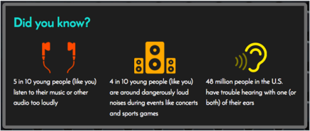

Attribution: CDC NCEH

## Layout

- [ ]  Has a clear visual hierarchy (distinct text size, color, and placement emphasize main messages, headings, and titles)

- [ ]  Has an obvious path for the eye to follow

- [ ]  Has plenty of white space (isn't overwhelming to the eye)

- [ ]  Includes more white space above headings than below

- [ ]  Includes extra space around images, call-out boxes, and sections of text

- [ ]  Content is organized into manageable chunks

- [ ]  Related text and objects are grouped together

## Font

- [ ]  Fonts are easy to read (not script, decorative, or elaborate)

- [ ]  Uses sans-serif fonts (like Calibri) instead of serif fonts (like Georgia)

- [ ]  Font size is at least 16 pixels for web or 12 point for print

- [ ]  Limits use of italics and all caps

## Images

- [ ]  Images are easy to understand

- [ ]  Images are relevant (it's clear why they're included)

- [ ]  Images include descriptive captions or alt text (text descriptions of images)

- [ ]  Images with people show positive, healthy behaviors (e.g., people in a car are wearing seatbelts)

- [ ]  Icons are used appropriately (to highlight content or group similar content)

## Use Design and Layout Effectively

## Charts, graphs, and tables

- [ ]  Charts, graphs, and tables are easy to understand

- [ ]  Charts, graphs, and tables only explain 1 concept

- [ ]  Components of charts, graphs, and tables are clearly labeled

- [ ]  Numbers and calculations of charts, graphs, and tables are supported with visuals or text

- [ ]  Charts, graphs, and tables include whole numbers (not percentages, decimals, or other complex numbers)

## Color

- [ ]  Includes appropriate color contrast (images and text are easy to see against background)

- [ ]  Uses friendly colors that help content feel approachable

- [ ]  Doesn't rely solely on color to convey meaning

To access the Health Communication Playbook online, visit https://www.cdc.gov/ nceh/clearwriting/docs/health-comm-playbook-508.pdf

Consumer Communication

## Fact Sheets

## Why use a fact sheet?

Fact sheets give the public information about a specific topic in a quick, easy-toread format. They often include action steps, too - so readers know what to do next.

## Fact sheets may include:

- » Frequently asked questions
- » General information
- » Little known but useful facts
- » Instructions and action items

## Tips for writing a fact sheet

## Before you start writing, ask yourself 4 questions:

- 1 ) Who's my intended audience?

Be as specific as you can. The more precise you are, the more tailored and effective your fact sheet will be.

- 2 ) What do you know about their health literacy skills?

How much background knowledge will they have about the topic? What level of detail do they need?

- 3 ) What's my goal?

What do you want people to think, feel, or do

- 4 ) What's my main message?

What's the 1 thing

- you want your audience to remember?

When you have clear answers to all 4 questions, you're ready to start.

- after they've finished reading?

## As you write:

## State your main message at the top of the page

- » Keep it short - no more than 1 to 3 sentences.
- » Make sure the rest of the information in the fact sheet supports that main message.

## Offer the information your intended audience needs - and that's it

- » Include the need-to-know information - skip the nice-to-know.
- » Have a clear call to action so your audience knows what to do.

## Make it easy to read

- » Use the active voice and conversational language.
- » Avoid jargon and technical terms.
- » If you have to use an unfamiliar term, define it in plain language.

## Keep it organized and concise

- » Make sure headings are clear - and consider making them questions to engage your audience.
- » Use chunked text, bullets, and call-out boxes.
- » Aim for 1 to 2 pages - any longer than that, and people might not read it.
- » Keep sentences short - ideally no more than 20 words.

When you're writing about a complex health topic, you may not have all the answers . That's okay - just be up front about it with your readers. It's better to admit what you don't know than dodge the issue. Being honest and transparent will help build trust.

## Sample

- Make the title clear, so the reader knows what to expect.

Put the most important information in the firstsections.

Include a visual that supports your message.

Number action steps clearly, so the reader knows what to do.

Use a text box or graphic to call out important information.

Leave lots of white space so the fact sheet is easy to read.

Use chunking and subheadings to break up the text and make it scannable.

If you use the Q&amp;A format, include questions your audience would actually ask.

Checklist

## Branding

- [ ]  Includes your organization's logo

- [ ]  Uses your organization's fonts and color palette

## Layout

- [ ]  Has sufficient white space (isn't overwhelming to the eye)

- [ ]  Is no longer than 2 pages

- [ ]  Has at least 1-inch margins

- [ ]  Includes a full line between paragraphs

- [ ]  Font size is 12 point or larger

- [ ]  Uses bullets

- [ ]  Text boxes call out specific information

- [ ]  Sentences in text boxes are short

## Title and headings

- [ ]  Are descriptive and brief

- [ ]  Grab your reader's attention

- [ ]  Are jargon-free

- [ ]  Are bold and easy to identify

## Content

- [ ]  Main message is at the top and highlighted (e.g., larger font, bold, color block)

- [ ]  First section includes the most important information

- [ ]  Additional sections answer frequently asked questions

- [ ]  Fact sheet is self-contained - doesn't refer to other documents

- [  Language is simple and conversationa .... L

- [ ]  Uses the active voice

- [ ]  Defines acronyms

- [ ]  Defines challenging words in plain language

- [ ]  Uses images, tables, graphs, and charts to support main messages

- [  Includes at least 1 clearly defined action ite .... M

## Contact information

- [ ]  Includes contact information (e.g., phone, email, website) for the public if appropriate

- [ ]  Includes a link to additional information if appropriate

To make sure your fact sheet is clear and easy to understand, consider scoring it with the CDC Clear Communication Index. You'll get a more objective assessment if you ask a colleague to score it - preferably someone who hasn't worked on the material.

## Webpages

On the web, readers are generally looking for quick answers to their questions. They're scanning for the information they need - often on their phones - and they'll go somewhere else if they don't find it quickly.

Use these techniques to capture their attention and keep them reading.

## Tips for writing webpages

## Make your content easy to understand

Web writing is a conversation. Your readers have come with questions and you're answering them. So make sure to:

- » Use the active voice and conversational language.
- » Avoid jargon and technical terms.
- » Define any unfamiliar terms (if you absolutely have to use them).
- » Keep sentences to 20 words or fewer.

## Have a clear layout

Remember that your readers are scanning quickly for the information they want. Make it easy for them to find it:

- » Use bullets and headings to 'chunk' (group) information.
- » Include lots of white space.
- » Use call-out boxes to emphasize important information.
- » Avoid blinking icons, moving text, and aggressive colors.
- » Consider using graphics, maps, charts, and interactive content to convey main messages - don't rely on words alone.

## Start with the conclusion

Present the conclusion and emphasize the key messages first, using the inverted pyramid style. This allows readers to see the most important information as soon as they land on the page, without having to scroll.

## Be brief

Keep pages and paragraphs short. Include links to additional content for readers who want more information instead of reprinting it in your content.

## Use links strategically

In your copy, you can include a few relevant links to external sites and crosslinks to other pages of your own site - they're a useful way of directing readers to a deeper level of information.

But don't overdo it - and try to avoid including links at the very beginning of your content. Why? Your readers might click on them and never come back to your page.

## Keep your resources page short

While resources pages - with links to related websites and additional information - can be helpful, they can get overwhelming quickly. Curate your list of resources carefully:

- » Keep the overall number of resources low.
- » Break them into sections with clear headings.
- » Make sure each link serves a specific purpose.

## Keep your content up to date

Create a schedule to review your content regularly. Is it still accurate or does it need tweaks? Do the links still work?

Always include a 'last reviewed' or 'last updated' date at the bottom of your webpage, too. That way, readers will know the information is still trustworthy.

## Sample

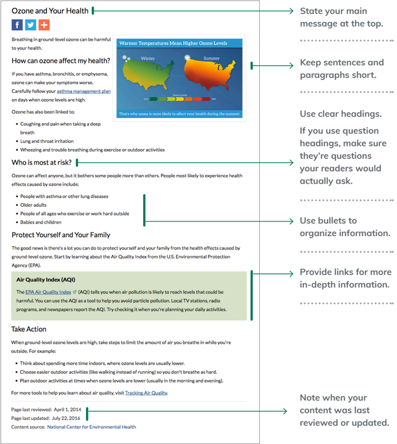

Checklist

## Branding

- [ ]  Includes your organization's logo

- [ ]  Uses your organization's fonts and color palette

## Layout

- [ ]  Has sufficient white space (isn't overwhelming to the eye)

- [ ]  Uses your organization's fonts and color palette

- [ ]  Uses images, tables, graphs, and charts if appropriate

- [ ]  Uses bulleted lists

- [ ]  Text boxes call out specific information

## Headings and subheadings

- [ ]  Are descriptive and brief

- [ ]  Are jargon-free

- [ ]  Are bold and easy to identify

## Content

- [ ]  Key message is easy to identify from the title or first sentence

- [ ]  Most important information is in the first paragraph

- [ ]  Uses the active voice

- [ ]  Uses plain language

- [ ]  Uses images, tables, graphs, and charts to support main messages

- [ ]  Includes date content was last updated or reviewed

- [ ]  Paragraphs are short (no more than 3 lines)

- [ ]  Uses sentence and title case where appropriate (does not use all caps)

## Links

- [ ]  Limited number of links in your copy

- [ ]  Limited number of links on your resource page (if applicable)

- [ ]  All links are working correctly

## Social Media Platforms and Tools

This guidance walks you through some of the social media platforms and new media tools you can use to engage your audiences.

## What is social media?

Social media refers to the use of online and electronic tools to create, share, and exchange content and ideas in communities and networks.

Social media offers public health professionals a cheap and effective way to communicate with a large audience. With smart use of social media, you can encourage participation, conversation, and a sense of community - and help spread key messages, influence decision-making, and promote behavior change.

## Social media platforms

## Social networking

Social networking services allow users to create online profiles and build social networks with others who share similar personal or professional interests and activities.

## » Facebook

Facebook remains the most popular social media platform 2 out of 3 adults report they use it. Users interact with friends, family, and others with similar interests.

## » X,

X, formerly Twitter , is a news and social networking service that uses short messages (280 characters) called tweets. One out of 4 adults use it, and it's particularly popular among younger adults. To learn more about developing X content, see Appendix C.

## » LinkedIn

LinkedIn is a social networking service that helps professionals connect. You can create a career-oriented profile including information about your education, job history, and skill sets. You can also create company pages or groups.

## Image sharing

Image sharing is an engaging way to present content. Remember to use copyright-free images when possible.

## » Instagram

Use Instagram to share pictures and videos publicly or privately. You can also share media from your Instagram account on Facebook, Twitter, and Tumblr. This platform is especially popular with younger audiences - 71% of people ages 18 to 24 use it.

## » Pinterest

Pinterest is a visual discovery tool you can use to create and share collections of visual bookmarks called 'boards.' Pinterest users 'pin' visuals to boards and share them with followers. This platform is more than twice as popular with women than men.

## » Snapchat

Snapchat is a social messaging application that lets users personalize and share photos and video clips with friends. Like Instagram, Snapchat is most popular with younger adults - 78% of people ages 18 to 24 use it.

## Online video sharing

While not always classified as social media, online video platforms are a great way to share tailored health messages.

- » YouTube

YouTube is the number 1 site for sharing and watching videos 3 out of 4 adults use it. It's great for reaching a large audience quickly.

- »  Vimeo

Vimeo works similarly to YouTube. It has a smaller archive of videos, but they tend to be more targeted for specific audiences.

## Blogs

Use blogs to discuss a topic in a personal and conversational way.

## New media tools

You can share these tools on social media to link to relevant resources.

## Buttons and badges

These are small web graphics or images that you can use to share health information about campaigns and causes. You can place them on websites and social media posts, and they link to a webpage. Go to the CDC Buttons and Badges Gallery for graphics on a number of health topics.

## Content syndication

This is an easy and no-cost way to share and distribute health information. To use CDC's Content Syndication tool, register, search available syndication topics, and download the syndication code for your website. When CDC makes changes, the content on your website will update automatically.

## Podcasts

Similar to radio programs, podcasts can be an effective way to deliver health information to intended audiences. Visit the CDC podcasts page to browse hundreds of podcasts on a variety of health and safety topics.

## Widgets

You can use widgets to display featured health content directly on a website or social media site. To see examples, check out the CDC Widget page - you can search for widgets by health topic. To add a widget to your site, cut and paste the HTML code into your webpage.

## eBooks

eBooks are digital full-length books or long-form text documents that can include text, hyperlinks, images, video, and more. You can develop eBooks for a variety of platforms including eBook readers and e-reader apps for tablets, mobile phones, and desktop devices.

## Infographics

These are visual representations of data, which can make complex information much easier to understand. For examples, check out the CDC Infographic page.

## Tools to support social media

You can use these helpful tools to coordinate and enhance your social media use.

## Hootsuite

Hootsuite is a social media management tool that features a dashboard-style interface. You can manage multiple social media profiles with 1 account including Twitter, Facebook, LinkedIn, Instagram, and other platforms. Hootsuite helps you keep your social media efforts up to date and organized, and it allows you to schedule posts in advance. It also offers basic analytics for the accounts you've synced.

## TweetDeck

TweetDeck is a dashboard-style interface that helps you manage your Twitter accounts. It features customizable columns that let you filter content by lists, mentions, trends, favorites, particular hashtags of interest, and more. Like Hootsuite, you can also use TweetDeck to schedule tweets in advance.

## Bitly

Bitly is a link-managing tool you can use to shorten URLs for Twitter, text, or other forms of social networking. You can also track basic analytics for the links you create. It's particularly useful when developing Twitter content, but be aware that bitlinks no longer distinguish between government and nongovernment links.

## Social Media Strategies and Calendars

## Why do I need a social media strategy?

Social media is a powerful tool to reach your audiences. But without a clear plan and approach, you run the risk of posting content that is redundant, inconsistent, or irrelevant - and that could drive away your followers.

Developing a social media strategy and calendar helps prevent this problem. You'll have clear goals and an efficient, coordinated process for updating your posts.

## Developing a strategy

## Step 1: Determine who you're trying to reach and why.

Who is your intended audience? What kind of information are they looking for? Check out CDC's Guide to Writing for Social Media [PDF] to help you get started.

## Step 2: Decide which social media platforms you want to use.

Where are the conversations taking place that you want to be involved in? Facebook, Twitter, Instagram, or somewhere else?

## Step 3: Identify goals for each platform.

What are you ultimately trying to accomplish by posting to a particular platform? For example, do you want to increase traffic to your website, have people post web badges on their blogs, or increase awareness about a certain health problem?

## Step 4: Develop your voice and tone.

Decide up front if you're going to write from the perspective of your organization ('we') or as a more neutral third person without the use of a pronoun (e.g., CDC). Consider the tone of your content. What's your program's social media personality - light and friendly or a bit more serious and informative?

## Step 5: Create a content strategy.

Identify 3 to 4 themes that you want to focus on for the entire year (like emergency preparedness) and 1 to 2 special topics to highlight each month (like Asthma Awareness Month). Make sure the topics resonate with your intended  audience and align with your program and campaign's goals.

## Step 6: Develop a content calendar.

Build a 3-month calendar of content and proactive messages including posts, imagery, and publish date.

## Developing content for a social media calendar

Because your intended audience receives so many messages from other sources every day, it's important to make your messages relevant, useful, and interesting. To get ideas for posts, you can:

- » Look at what's going on inside and outside your organization - in the news, health trends, and blogs.
- » Create a list of online tools and resources that match your themes - know what resources, people, and events you can promote.

Remember, this is just a plan - topics and posts may (and should!) change based on current news or updates.

Using a spreadsheet or a table in a Word document, create monthly schedules. If you're just getting started with social media, try for 3 posts per week. As you get more comfortable, you can post more often.

<table>
  <thead>
    <tr>
      <th>Proposed Post Date</th>
      <th>Content Theme</th>
      <th>Twitter</th>
      <th>Facebook</th>
    </tr>
  </thead>
  <tbody>
    <tr>
      <td>June 18, 2018</td>
      <td>Emergency Response</td>
      <td>In the path of #wildfires? Learn what to do before, during, and after an #emergency evacuation: [abbreviated link]</td>
      <td>Learn what to do before, during, and after an emergency evacuation. Visit http://emergency.cdc.gov/ disasters/affectedpersons.asp</td>
    </tr>
    <tr>
      <td>June 20, 2018</td>
      <td>ALS</td>
      <td>Living with #ALS? Help ATSDR collect data to support ALS research. Sign up for the Nat'l ALS Registry [abbreviated link]</td>
      <td>The National ALS Registry is the first database to collect and analyze data to support ALS research. It's a private, simple, and secure way to be counted and make a difference. Find out more at http://www.cdc.gov/als/</td>
    </tr>
  </tbody>
</table>

## Best practices for social media

- » Do your homework. Check out what hashtags (e.g., #HealthTalk) people are using for your topic, conversations they're having about similar subjects, and who's leading the conversation.
- » Be consistent when writing posts and responding to follower feedback or questions - follow your organization's guidelines when making these decisions.
- » Use plain language and write in the active voice.
- » Use social media to direct followers to your online resources.
- » Create content that makes the follower want to know more or take action.
- » Make sure you have a process for planning, creating, posting, monitoring, and responding to social media content - it's best to designate 1 person to manage this.
- » Develop content in advance around upcoming events, deadlines, and holidays.

## Addressing sensitive topics

The conversation on social media platforms can get heated quickly. Even a seemingly innocent post has the potential to be misinterpreted or taken out of context. So before you hit 'post,' ask yourself: 'What if this becomes a headline? What if it goes viral?'

## These tips can help prevent unintentional controversy:

- » Avoid posing challenging questions on difficult topics that could spark conversations.
- » Don't imply endorsement of private, fundraising, or policy entities by pointing to them, including media outlets.
- » Avoid personal pronouns like 'I' in social media accounts that are not specifically individual accounts.

- » Don't retweet or repost third-party messages that take a controversial policy or advocacy position - or even seem like they're taking that position - if your organization doesn't support it.

## Responding to comments

When you respond to comments on a tweet or post, make sure to sound calm, compassionate, and credible. Don't improvise - develop a consistent policy for how to respond and stick to it. Decide what makes the most sense for your organization. Ask yourself:

- » How often should your organization respond - is 1 comment enough? Several?
- » What do you consider an effective response - what are the characteristics?
- » When should your organization not respond?
- » Consider whether social media content is quotable and could be used against you.
- » You may inadvertently invite controversy by giving an activist something to forward to a reporter.
- » Are tweets on Twitter or comments on Facebook really a big deal? What's the worst that could happen?

## Evaluating your social media strategy

How many engagements did your latest tweet get? Did you gain more followers on Twitter this month than last? How many new users liked your page on Facebook? The answers to questions like these help you measure the success of social media activities.

Some social media platforms - like Twitter, Facebook, and LinkedIn - offer free, basic analytics:

- » Twitter analytics give you a run-down of tweet impressions, profile visits, mentions, followers, and more.
- » Facebook tracks likes, reach, page views, actions on a page, and more.
- » LinkedIn tells you who's following and engaging with your page's updates, as well as how your group page is performing.

There are also more comprehensive ways to look at analytics. For example, the social media analytic software Sysomos offers a variety of social media analytics and monitoring tools to get an even closer look at social media performance.

Be sure to look into the platform you're using and the kind of analytics it may offer.

47

## Videos

Online videos can be a powerful way for your organization to share messages with the public. Use this resource to learn some video basics and understand the 3 main stages - pre-production, production, and post-production.

## Pre-production

This is the first stage of making a video. It's when you plan every aspect of the video - from gathering resources to writing a script. Making a successful video takes a lot of work.

## Determine your objectives

How does a video fit into your overall communication plan? Do you want to highlight content, spark action, or encourage awareness of an issue? Do you plan to make a live-action video, or would an animated video better suit your strategy and audience?

Make sure that video is really the right medium for your goals. Videos are great for:

- » Showing a process (like how to wash your hands)
- » Explaining a concept (like how radon gets into homes)
- » Sharing testimonials (like showcasing an interview with a community member who benefited from your organization's work)

But they're not a great way to convey a lot of detailed information. If that's what you have, you might want to reconsider and go with a website or fact sheet instead. And since they're expensive and hard to update, videos are often best suited to evergreen topics.

## Know your intended audience

Define your intended  audience(s) in order to develop and communicate messages that will resonate with them and prompt them to take action.

## Write a script and create a storyboard

A solid script is crucial to developing an effective video on time and within your budget. Spend time thinking through key messages and images. When you're writing a script:

- » Keep it short - aim for 1 to 3 minutes at most.
- » Focus on a single main message and a clear intended audience.
- » Avoid jargon, technical information, and detailed charts and graphs.
- » Use simple, easy-to-follow 'stories.'
- » Give people an action step - like visiting your website to follow up.
- » Read through your script out loud to make sure it sounds conversational.

## Keep some technical constraints in mind, too:

- » Design for mobile - remember that many viewers will be watching on their phones.
- » Make sure the video makes sense without sound, since many people watch them muted.

Once you have a script, the next step is to develop storyboards. You pair the script with images - even very rough sketches - to help visualize how the video will look and feel. Storyboards will help you figure out details like:

- » Pacing and length
- » Shots, graphics, and animations
- » Locations and actors
- » Whether you need a narrator
- » Music and sound effects

See how a concept evolved from script to storyboard in the next section starting on page 53.

## Set a budget

Make sure you understand the full costs of your video. Are they definitely within budget? If not, now is the time to make changes to your script (or find additional funding). Once you've started production, it's hard to scale back - and easy to go over budget.

## Keep in mind the costs of:

- » Renting or buying film equipment, lighting equipment, and microphones
- » Hiring professional videographers and editors
- » Hiring an animator (for animated videos)
- » Hiring actors
- » Buying music and sound effects
- » Renting a location for filming

## Gather your resources

Get everything you need to make your video a reality. Scout out and secure your filming location. Create your set. Will you need a green screen? Actors? A boom mic? Special lighting? Props? Do you need to rehearse? Do all of this during the pre-production phase.

## Production

This is the second phase of making a video - filming it. Ideally, an experienced videographer does the camera work. There are many different types of videos, including:

This style of video is staged on a set with subjects who have prepared for the

- » Interviews in a studio conversation.

## »  Interviewsinthefield

This style catches the subject(s) on location or (e.g., at a conference or walking on the street) to ask a few specific questions. This can include testimonials.

## » Talking head

This is a basic 'head and shoulders' direct shot with 1 person speaking directly to the camera/audience. This is ideal for short, personable, promotional videos.

- » How to

This style offers tips and teaches the audience how to do something.

## Best practices:

- » Capture high-quality sound. Avoid scratchy, muffled sounds and hisses and pops by using the right microphones.
- » Use a tripod. Camera work should be steady and in focus.
- » Get a variety of shots. Shooting a combination of tight close-ups, medium shots (from the head to the waist), and wide shots will give you choices when it comes to editing.
- » Avoid extremely wide shots. Most people will watch videos on their computers, laptops, or mobile devices - very wide shots aren't compatible with computer screens.
- » Capture enough b-roll (extra footage you intercut with the main story to make the video engaging, like shots of locations or scenery).
- » When filming 'in the field,' use best practices, including proper lighting and high-quality audio.

## Post-production

This is the final stage, which includes editing, promotion, and evaluation.

## Edit your video

Ideally, an experienced videographer will edit the film. This process includes:

- » Arranging footage in the correct order
- » Removing footage you don't want or need
- » Adding music, titles, transitions, and possibly other effects
- » Converting (encoding) into the correct format(s)

## Promote your video

Establishing a promotional plan helps ensure that your video reaches the intended audience. Without a plan, your video may not get many views. Consider:

- » Embedding the video on high-profile, topic-specific pages, campaign materials, or blogs
- » Sending promotional emails to partners
- » Cross-promoting the videos on other social media channels related to your organization

## Evaluate the results

How did your video do? How many people viewed it? How many people took action because of it? Evaluation is an integral component of measuring the success of all social media activities, including video.

Basic YouTube metrics include monitoring the number of times each video has been viewed and reviewing viewer comments and questions that have been posted to the video. YouTube Insights is an analytics and reporting product that provides additional metrics about uploaded videos.

## Sample: Script and Storyboard

## Script

Subject:

ATSDR's Choose Safe Places for Early Care and Education Call to Action

Video length:

1:45

Visual approach:

Animated video using 2D silhouetted figures

<table>
  <thead>
    <tr>
      <th>Time</th>
      <th>Visuals</th>
      <th>Narration (voiceover)</th>
    </tr>
  </thead>
  <tbody>
    <tr>
      <td>0:00</td>
      <td>Lead-in screen displays the words 'Choose Safe Places for Early Care and Education,' the subtitle 'How state licensing and health agencies can help,' and theATSDR logo. [Cheerful, upbeat music plays.]</td>
      <td></td>
    </tr>
    <tr>
      <td>0:03</td>
      <td>Animated text says '8.3 Million.' A silhouetted child appears and jumps onto the '8.3 Million' number as she's chasing a butterfly.</td>
      <td>There are up to 8.3 million children in daycares, preschools, and other early care and education centers in the U.S.</td>
    </tr>
    <tr>
      <td>0:10</td>
      <td>The child jumps to catch the butterfly as blue silhouettes of daycare buildings appear, surrounded by flowers.</td>
      <td>And people assume that these early care and education centers are safe places for children to learn and grow.</td>
    </tr>
  </tbody>
</table>

<table>
  <thead>
    <tr>
      <th>Time</th>
      <th>Visuals</th>
      <th>Narration (voiceover)</th>
    </tr>
  </thead>
  <tbody>
    <tr>
      <td>0:15</td>
      <td>The blue daycare center silhouettes turn orange and the flowers wilt. The girl runs off screen to the right. [Music fades out.]</td>
      <td>But what if we told you... that's not always true?</td>
    </tr>
    <tr>
      <td>0:20</td>
      <td>8 children illustrate the '1 in 8' statistic -1orange child and 7 blue children. The words 'Harmful Chemicals' appear.</td>
      <td>Because right now, up to 1 in 8 children could be in a child care building that hasn't been properly assessed for harmful chemicals.</td>
    </tr>
    <tr>
      <td>0:25</td>
      <td>An orange map of the United States appears, and question marks appear on the map. The words 'No Clear Process' appear.</td>
      <td>In most states, there's no clear process to make sure early care and education centers are located safely.</td>
    </tr>
    <tr>
      <td>0:31</td>
      <td>Drops of orange chemicals fall from above and form into the shapes of a factory, gas station, and dry cleaning facility.</td>
      <td>So they've been in or near some pretty dangerous places -like factories, old gas station sites, and dry cleaners.</td>
    </tr>
    <tr>
      <td>0:37</td>
      <td>The words 'Mercury,' 'Lead' and 'Radon' appear in blocks.</td>
      <td>Children may be at risk of contact with some very harmful materials -like mercury, lead, and radon.</td>
    </tr>
    <tr>
      <td>0:45</td>
      <td>The child (blue) watches as other children (orange) play on the ground.</td>
      <td>Children are more sensitive to these materials than adults because their bodies are still growing...</td>
    </tr>
  </tbody>
</table>

<table>
  <thead>
    <tr>
      <th>Time</th>
      <th>Visuals</th>
      <th>Narration (voiceover)</th>
    </tr>
  </thead>
  <tbody>
    <tr>
      <td>0:49</td>
      <td>The child grows up into an adult.</td>
      <td>...and they can have serious and irreversible health effects. . .</td>
    </tr>
    <tr>
      <td>0:52</td>
      <td>The words 'Kidney Damage,' 'Learning Difficulties' and 'Cancer' appear.</td>
      <td>...including kidney damage, learning difficulties, and cancer.</td>
    </tr>
    <tr>
      <td>0:57</td>
      <td>A shift in tone -anew map of the United States appears, but now it's blue. States turn green, one by one. The butterfly reappears and flutters across the screen. [Cheerful music returns.]</td>
      <td>We know you already work hard to protect children's health in your state...</td>
    </tr>
    <tr>
      <td>1:01</td>
      <td>The camera follows the butterfly right, as it flies away. The words 'Early Care and Education Centers Are Located Safely' appear.</td>
      <td>...and you can build on those efforts to make sure that early care and education centers are located safely.</td>
    </tr>
    <tr>
      <td>1:07</td>
      <td>Childcare buildings pop up one by one with a green 'safe' checkmark on each one.</td>
      <td>We have resources that can help your state develop an action plan...</td>
    </tr>
    <tr>
      <td>1:11</td>
      <td>Camera pans right and towers illustrating specificsectors (state health agencies, policymakers, licensing agencies) pop up. Bridges appear that connect the different towers.</td>
      <td>...and build important partnerships between different sectors, like state health agencies, policymakers, and licensing agencies. . .</td>
    </tr>
  </tbody>
</table>

<table>
  <thead>
    <tr>
      <th>Time</th>
      <th>Visuals</th>
      <th>Narration (voiceover)</th>
    </tr>
  </thead>
  <tbody>
    <tr>
      <td>1:18</td>
      <td>Camera pans right to show the child with other children playing in a safe, clean outdoor area.</td>
      <td>...so together, you can make environmental safety a key consideration when a new center is being approved.</td>
    </tr>
    <tr>
      <td>1:24</td>
      <td>Camera pans right to show the girl chasing the butterfly.</td>
      <td>Partnering together can prevent potential tragedies -and has other big benefits...</td>
    </tr>
    <tr>
      <td>1:29</td>
      <td>An arrow rises up from below labeled 'Trust,' (indicating increased trust) while an arrow drops down from above labeled 'Costs' (indicating lowered costs).</td>
      <td>..., like building trust in communities, and lowering legal and liability costs.</td>
    </tr>
    <tr>
      <td>1:34</td>
      <td>Camera pans right and the girl runs past a computer screen, showing checkmarks (indicating an action plan.)</td>
      <td>Learn how to protect children in early care and education centers and create an action plan for your state.</td>
    </tr>
    <tr>
      <td>1:40</td>
      <td>Girl and butterfly come to a halt. The words 'Because Our Kids Are Worth It' appear.</td>
      <td>Because our kids are worth it</td>
    </tr>
    <tr>
      <td>1:43</td>
      <td>Visit ATSDR's Choose Safe Places for Early Care and Education website.</td>
      <td></td>
    </tr>
  </tbody>
</table>

## Storyboards

Subject: ATSDR's Choose Safe Places for Early Care and Education Call to

Action Video  length:

1:45

Visual 

approach: Animated video using 2D silhouetted figures

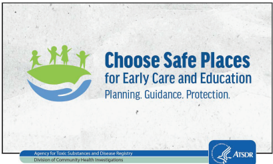

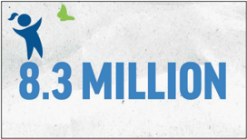

...children in...

(A child jumps onto '8.3 Million' from the left and chases a butterfly across the words.)

There are up to 8.3 million...

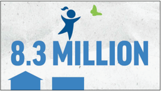

('8.3 Million' appears on-screen.)

...daycares, preschools...

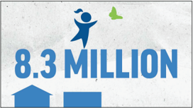

(Daycares, preschools, and other buildings pop up below the words as they are said.)

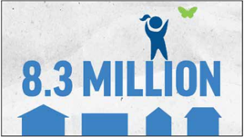

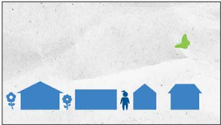

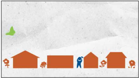

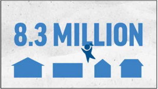

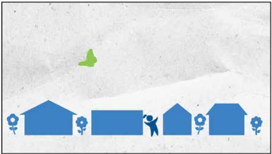

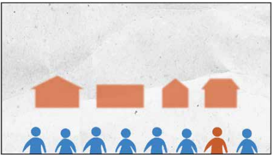

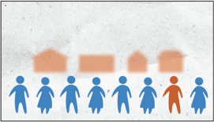

...up to 1 in 8 children...

(8 children appear beneath the orange buildings and illustrate the '1 in 8' statistic - 1 orange child and 7 blue children)

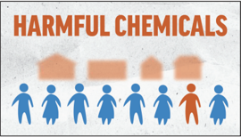

... could be in a child care building that hasn't been properly assessed for harmful chemicals.

(The words 'harmful chemicals' appear when the words are said)

[To see the finalized and published video, visit ATSDR's Choose Safe Places for Early Care and Education website.](https://www.atsdr.cdc.gov/safe-places/index.html)

## Branding

- [ ]  Includes your organization's logo in title or ending slide

- [ ]  Includes your organization's tagline in title or ending slide

- [ ]  Uses your organization's fonts and color palette

## Script/Storyboard

- [ ]  Video is simple, short, and engaging - 1 to 3 minutes at most

- [ ]  Avoids jargon, technical information, and detailed charts and graphs

- [ ]  Uses a simple, easy-to-follow 'story' with a single message or call to action

- [ ]  Sounds conversational (read the script out loud to check)

- [ ]  Main message is in the first 30 seconds of the video

## Production

- [ ]  Captures high-quality sound

- [ ]  Camera work is steady and in focus

- [ ]  Shots have proper lighting

- [ ]  Includes a variety of shots to keep the video engaging

- [ ]  Avoids extremely wide shots

- [ ]  There's enough b-roll to help support the video

- [ ]  Footage from interviews 'in the field' cites facts, not opinions

## Post-production

- [ ]  Video is properly edited

- [ ]  Music is arranged

- [ ]  Video has been submitted for approval at rough draft and final edit stages

- [ ]  Video is shared on approved channels

- [ ]  There are plans in place to promote and evaluate the video

To access the Health Communication Playbook online, visit https://www.cdc.gov/ nceh/clearwriting/docs/health-comm-playbook-508.pdf

## Media Communication

## Press Releases

A press release notifies the media about something newsworthy, like an important topic or event. You might use a press release to share new findings, announce a public health advisory, promote a new resource, or invite people to a public meeting.

For Immediate Release: Month Day, 4-Digit Year Media Inquiries: envhealthmedia@cdc.gov or 770-488-0700

## ATSDR Releases Information on Drinking Water for Millsboro, DE

ATLANTA, GA - In the health consultation released today, the Agency for Toxic Substances and Disease Registry (ATSDR) reviewed available data to find out if coming in contact with trichloroethylene (TCE) in the Millsboro, DE, drinking water could cause adverse health effects.

A former poultry vaccine manufacturing plant was the source of the TCE. It was used within a closed refrigeration system. A release from this system led to TCE contamination in the soil and eventually in the shallow groundwater. TCE contaminated two of the three Millsboro water system wells between water tests in October 2004 and October 2005, possibly for as long as one year.

ATSDR estimated past exposures and possible health effects by using test results from pre-filtered municipal well water. Test results covered samples taken between October 2005 and October 2006.

-more- If embargoed, replace with: Hold For Release Until: Month Day, 4-Digit Year.

Always include contact information.

Your headline should capture the reader's attention. Ask yourself, 'If I saw this headline, would I read the article?'

Your slug line (subtitle) can provide further description.

Always include the location to orient the reader.

Always include the most important information in thefirst2paragraphs- and make sure it comes before information about your organization.

Ask: If people don't read past the second paragraph, will they still understand what the press release is about?

After the contamination was discovered, the Millsboro Water Treatment Facility installed a granulated activated carbon filtration system to remove TCE before the water enters the distribution system. Since the filters were installed, the water treatment facility has conducted weekly sampling to ensure that levels of TCE meet federal standards.

To read the health consultation, go to: https://www.atsdr.cdc. gov/HAC/pha/millsboro/millsboro%20tce\_hc\_final\_02-13-13. pdf

A copy of the health consultation is also available at the Millsboro Public Library during regular business hours at the following location:

Millsboro Public Library, 217 W. State Street, Millsboro, DE 19966

For more information about the health consultation, community members can call 1-800-CDC-INFO (1-800-232-4636).

To learn more about TCE, visit: https:

$$//www.atsdr.cdc.gov/ toxfaqs/tf.asp?id=172&amp;tid=30.$$

###

ATSDR, a federal public health agency of the U.S. Department of Health and Human Services, evaluates the human health effects of exposure to hazardous substances.

Press Releases

Provide relevant links to consumer content.

If appropriate, provide contact information for the public.

## 3 pound signs mark the end of the press release.

Always include 'About Us' language.

## More tips for writing a press release

- » Keep paragraphs brief (no more than 5 sentences). Use audience-appropriate plain language.
- » Make it easy for the journalist to write a story. If possible, include quotes from experts.
- » Your press release should read like a news article, not a scientific article or marketing piece.
- » Make sure there's enough white space. If you can't fit it into 2 pages, you're probably saying too much. A journalist can always contact you if they need more information.
- » When you read each sentence in your first draft, ask yourself, 'Is this newsworthy?'
- » Only send a press release when you really have something important to say. If you send too many, journalists may get overwhelmed and ignore them.

## Checklist

## Branding

- [ ]  Includes your organization's logo

- [ ]  Uses your organization's fonts and color palette

## Layout

- [ ]  Has sufficient white space (isn't overwhelming to the eye)

- [ ]  Has at least 1-inch margins

- [ ]  Includes a full space between paragraphs

- [ ]  Body ends with '###'

- [ ]  Includes 'About Us' language after the '###'

- [ ]  Font size is 12 point or larger

## Heading

- [ ]  Includes 'For Immediate Release:' or 'Hold For Release Until:'

- [ ]  Has correct date for release

- [ ]  Heading grabs your reader's attention

- [ ]  Heading is jargon-free

- [ ]  Slug line (subtitle) enhances understanding of the heading

- [ ]  Slug line is in italics

## Content

- [ ]  First sentence grabs your reader's attention

-  First paragraph does not describe your organization and its mission

-  Most important information is in the first 2 paragraphs

-  Language is simple and clear

-  Acronyms are defined

-  Challenging words are defined in plain language

-  Reads like a news article (not a scientific article or marketing piece)

-  Includes facts, quotes, and numbers where appropriate

-  Includes links to relevant consumer resources

-  Is at least 2 paragraphs long

-  Is no longer than 2 pages

-  Sentences are brief (ideally no more than 20 words)

-  Paragraphs are brief (no more than 5 sentences)

## Contact Information

- [ ]  Includes contact information (e.g., phone, email, website)

- [ ]  Provides the name of an actual person if possible

## Media Advisories

A media advisory is a time-sensitive, 1-page document that alerts the press to an upcoming event. It's always titled 'Media Advisory.'

## Media Advisory

For Immediate Release: Month Day, 4-Digit Year Media Inquiries: envhealthmedia@cdc.gov or 770-488-0700

ATSDR Information Session on Rare, Local Illness Agency Will Provide Updates on Polycythemia Vera Research in Eastern Pennsylvania

The Agency for Toxic Substances and Disease Registry will update the community on its research into polycythemia vera (PV), a rare illness found in the tri-county area of Schuylkill, Luzerne, and Carbon Counties, PA, that causes the body to make too many red blood cells.

WHO: Lora Werner, Regional Director, ATSDR, and Elizabeth Irvin-Barnwell, Epidemiologist, ATSDR

WHEN: Thursday, September 20, 2012. Experts will present updates at 6 p.m. and 7 p.m., with an opportunity for questions.

Always include a date at the top of the advisory.

Use a short, clear headline explaining the event. Avoid jargon. Use action-oriented copy that will make a journalist want to attend.

Include a slug line (subtitle) that enchances the reader's understanding of the headline.

Thefirstparagraphis short and provides the 'what.' Write in future tense - the event hasn't happened yet.

WHERE: Tamaqua Public Library, 30 South Railroad Street. For directionsto the library, visit www.taplpa. info/?page-directions.

WHY: In 2008, an ATSDR investigation identified a cluster of PV cases in Eastern Pennsylvania. ATSDR is currently conducting 14 research projects and four non-research projects to look at any potential causes of the cluster. The projects are based on four focus areas: epidemiology, genetics, toxicology, and environmental analysis. Some of the research projects are evaluating risk factors associated with the development of PV, essential thrombocytosis (ET), and primary myelofibrosis (PMF) in the tricounty area.

###

ATSDR, a federal public health agency of the U.S. Department of Health and Human Services, evaluates the potential for adverse human health effects of exposure to hazardous substances in the environment.

The 'why' should convince the reporter to attend. Use your best storytelling skills here.

## 3 pound signs mark the end of the press release.

Always include 'About Us' language.

## Checklist

## Branding

- [ ]  Includes your organization's logo

- [ ]  Uses your organization's fonts and color palette

## Layout

- [ ]  Has sufficient white space (isn't overwhelming to the eye)

- [ ]  Is no longer than 1 page when possible

- [ ]  Has at least 1-inch margins

- [ ]  Includes a full space between paragraphs

- [ ]  Body ends with '###'

- [ ]  Includes 'About Us' language after the '###'

- [ ]  Font size is 12 point or larger

## Heading

- [ ]  Includes 'For Immediate Release' at the top

- [ ]  Has correct date for release

- [ ]  Heading grabs your reader's attention

- [ ]  Heading is jargon-free

- [ ]  Heading is in bold

- [ ]  Slug line (subtitle) enhances understanding of the heading

- [ ]  Slug line is in italics

## Content

- [ ]  First sentence grabs your reader's attention

- [ ]  First paragraph does not describe your organization and its mission

- [ ]  First paragraph briefly explains the event (in other words, acts as the 'what')

-  Content is broken up by 'who,' 'what,' 'when,' 'where,' and 'why' as appropriate

- [ ]  'Why' section convinces reporters to attend the event

- [ ]  Language is audience appropriate (simple and clear)

- [ ]  Acronyms are defined

- [ ]  Challenging words are defined in plain language

- [ ]  Reads like a news article (not a scientific article or marketing piece)

- [ ]  Includes any relevant time restrictions

-  Includes information about public availability or times that staff are available to answer media inquiries

- [ ]  Sentences are brief (ideally no more than 20 words)

- [ ]  Paragraphs are brief (no more than 5 sentences)

## Contact Information

- [ ]  Includes contact information (e.g., phone, email, website)

- [ ]  Provides the name of an actual person if possible

## Representing Your Organization in Media Interviews

## Tips

You may need to give media interviews in person, on the phone, or over email. Or, you may need to serve as a spokesperson in other capacities (for example, sitting on an expert panel or providing social media messaging). It's an important role. Effective media coverage will boost the visibility of your organization and inspire trust.

Note: Tips for giving effective media interviews may also be useful when giving presentations.

## Before the interview

Having a solid understanding of the topic is crucial, of course. But it's not enough you also need to go into your interview with a strategy.

Message mapping can help. It's a way of determining the information your audience really needs . Vincent T. Covello, PhD, Founder and Director of the Center for Risk Communication, developed the technique. He lays out 5 steps:

- 1 ) Identify the stakeholders. Who will be reading or watching? Who's most affected by the topic you're discussing?
- 2 ) Identify their questions and concerns. What specific information do

stakeholders want?

- 3 ) Find the underlying themes. Sort through their questions and concerns and identify a few overarching concepts.
- 4 ) Develop key messages. Base these messages on both the specific concerns and the underlying

themes.

- 5 ) Find supporting evidence. Carefully pick a few key facts that back up each message.

## As part of your preparation, you can also:

- » Ask the reporter, blogger, or panel coordinator to provide questions ahead of time. If you can't get specific questions, ask for information about the general direction of the interview
- » Practice what you plan to say several times. Ask a collegue to play the role of the reporter to help you practice.
- » Create a handout for the reporter that includes your key messages. Make sure the reporter has a copy to take with them after the interview.

## Creating Effective Key Messages

- » Aim for no more than 3 key messages.
- » Keep messages brief 9 words or fewer (or 3 seconds spoken aloud).
- » Make sure they're easy for your intended audience to understand.
- » Have 3 pieces of supporting evidence for each message.

## Create a Q &amp; A to help spokespeople prepare

If you're helping a colleague get ready for an interview, press conference, or public event, create a Q&amp;A. It's a short, internal document that will give your spokesperson confidence and help them stay on message.

- » Come up with a list of questions - what are people likely to ask?
- » Include the exact answers you want your audience to hear.
- » Make sure the answers are easy to understand (no jargon!).

## During the interview

## Set a positive tone:

- » Relax and be yourself. Take deep breaths to stay calm.
- » Be friendly. You don't want to come across as argumentative or defensive.
- » Maintain eye contact with the person you're speaking to. If you're being filmed, talk to the person, not the camera

## Communicate effectively:

- » Speak slowly and clearly. Be careful not to mumble or rush your answers.
- » Use plain language. Avoid using jargon that may not be familiar to your audience.
- » Listen carefully during the interview. Pay especially close attention to multipart questions, so you don't miss anything.
- » If you misspeak, acknowledge the mistake. Restate your point.
- » If you don't know the answer to a question, say so. Don't try to evade or bluff - just offer to follow up with an answer after the interview.

## Representing Your Organization in Media Interviews

During media interviews, there's no such thing as 'off the record.' Only say things you're comfortable having quoted.

## Focus on key messages:

- » Keep responses brief. Try to answer questions in 10 to 15 seconds long-winded responses can bury key points.
- »  Avoidtalkingtofilldeadair. Speak only when you have something on message to say.
- » Repeat key messages. Aim to state key messages 3 times during the interview.
- » Avoid yes or no answers. Instead, use a key message to explain your position.
- » Remember that you're speaking for the agency, not yourself. Leave your personal opinions out of the interview.

## Representing Your Organization in Media Interviews

## Preparation

- [ ]  Request questions in advance (or general scope of questions) from the interviewer or moderator

- [ ]  Clarify the intended audience for the interview

- [ ]  Research the interview subject matter - collect relevant facts or statistics

- [ ]  Use message mapping to develop 3 clearly-defined key messages

- [ ]  Find 3 pieces of supporting evidence for each key message

- [ ]  Consider creating a Q&amp;A - a list of anticipated difficult questions and appropriate answers

- [ ]  Practice stating key messages

- [ ]  Practice planned answers

- [ ]  Prepare handout of key points for the reporter or panel moderator

To access the Health Communication Playbook online, visit https://www.cdc.gov/ nceh/clearwriting/docs/health-comm-playbook-508.pdf

## Professional Communication

## Communication Plans

For successful communication activities, you need a clear strategy. A communication plan serves as a guiding document to help you establish objectives, audiences, messages, tools, and timelines.

## Polycythemia Vera (PV) Research

Public Availability Session, September 20, 2017

## Background

ATSDR is planning an informal public availability session to update the public on our polycythemia vera (PV) research projects. The session will take place on September 20 in Tamaqua, PA. Two ATSDR experts will present the updates to the public and answer questions from the community and the press.

ATSDR is currently conducting 14 research projects and four non-research projects about PV. In 2008, ATSDR confirmed a cluster of PV in northeast Pennsylvania at the request of the Pennsylvania Department of Health (PADOH). In 2006, PADOH asked ATSDR to help study patterns of PV in the area after identifying clusters using state cancer registry records.

The projects are based on the recommendations of an expert panel that identified four areas for investigation: epidemiology, genetics, toxicology, and environmental analysis. PADOH, the Pennsylvania Department of Environmental Protection, and various universities and private organizations are working with ATSDR on these PV- related projects.

## Communication Objective(s)

- » To build trust with community members by sharing project updates, timelines, and next steps.
- » To impart knowledge to community members and stakeholders by explaining the four research areas of investigation.
- » To share knowledge with the press so they will carry ATSDR's key messages about the research projects.

Include the project name, the product, and the intended release date.

The goal of this section is to define your project.

Include the most important information at the beginning.

Background information and detailed explanations shouldn't be included in the first paragraph.

Ask: If readers only see the first paragraph, will they understand what you're trying to say?

Explain what you want to achieve. Objectives should be action oriented, measurable, and achievable.

Ask: What do we want to accomplish by undertaking this communication activity?

## Audiences

<table>
  <thead>
    <tr>
      <th>Category</th>
      <th>Audience(s)</th>
      <th>List the intended</th>
    </tr>
  </thead>
  <tbody>
    <tr>
      <td>Non-governmental</td>
      <td>Persons who live in Schuylkill, Luzerne, and Carbon counties Academic institutions » Drexel University » University of Pittsburgh » Mt. Sinai School of Medicine Private entities » Geisinger Health Systems » Equity Environmental Engineering Press » Local newspapers, TV stations, radio</td>
      <td>audiences for your key messages. Be specific. Ask: Who most needs to receive this information?</td>
    </tr>
    <tr>
      <td>Governmental/ Internal</td>
      <td>CDC/ATSDR OD CDC Washington CDC's National Program of Cancer Registries HHS</td>
      <td></td>
    </tr>
    <tr>
      <td>Governmental/ External</td>
      <td>Interested members of Congress State and local officials PADOH PADEP U.S. EPA Region III Local/state public health entities</td>
      <td></td>
    </tr>
  </tbody>
</table>

## Strategy

ATSDR will use a multi-pronged approach to communicate the availability session and key messages.

## Methods

- » Conduct a public availability session to provide information about ongoing research projects related to PV.
- » Share a summary fact sheet at the public availability session.
- » Send a media advisory to invite reporters to the meeting.
- » Send a press release about the meeting.
- » Engage third parties in sharing information with key audiences.
- » Use social media to share updates.
- » Respond to media inquiries as they arise.

## Tools

- » Key messages
- » Press release
- » ATSDR PV website
- » Fact sheet
- » Federal/state/local partners' emails and/or website postings

Outline how you'll communicate your key messages to the identified audiences.

## Key Messages

## Protecting public health is ATSDR's top priority.

- » ATSDR is working diligently to investigate the tri-county PV cluster.
- » This investigation remains important to ATSDR.
- » We are sharing our findings as they become available.

ATSDR is conducting 18 different projects to learn more about PV and related diseases in the tri-county area.

The projects are based on the recommendations of an expert panel.

- » They cover 4 areas: epidemiology, genetics, toxicology, and environmental analysis.
- » Some projects compare the tri-county area with similar areas of Pennsylvania.
- » Some projects will help improve reporting and tracking of PV and related diseases.

Our research will help people in Pennsylvania and across the Nation.

When all the projects are completed, we hope to have a clearer picture of PV and its causes.

Keep your key messages to 3 main points to make them more memorable.

Include supporting messages that will enhance and frame your key messages.

Developing key messages can be challenging, so it may be helpful to work with a colleague.

## Timeline

NOTE: Dates are approximate only. Dates may change based on developments or new requirements.

<table>
  <thead>
    <tr>
      <th>Date</th>
      <th>Action</th>
      <th>Lead/ Responsible Party</th>
      <th>Status</th>
    </tr>
  </thead>
  <tbody>
    <tr>
      <td>09/18/17</td>
      <td>Issue news release to select media contacts via ATSDR distribution system</td>
      <td>Betty Anderson</td>
      <td>Completed</td>
    </tr>
    <tr>
      <td>09/18/17</td>
      <td>Post news release in ATSDR press room site on internet</td>
      <td>Betty Anderson</td>
      <td>Completed</td>
    </tr>
    <tr>
      <td>09/18/17</td>
      <td>Email PDF of press release to partners</td>
      <td>Ken Johnson and Toby Wright</td>
      <td>Completed</td>
    </tr>
    <tr>
      <td>09/20/17</td>
      <td>Hold a public availability session Tamaqua, PA</td>
      <td>Ken Johnson and Toby Wright</td>
      <td>Completed</td>
    </tr>
    <tr>
      <td>09/20/17</td>
      <td>Distribute fact sheet</td>
      <td>Ken Johnson and Toby Wright</td>
      <td>Fact sheet will be distributed on 9/20 to those on ATSDR's mailing list and made available at the public availability session on 9/20</td>
    </tr>
    <tr>
      <td>Ongoing</td>
      <td>Respond to new inquiries</td>
      <td>Betty Anderson</td>
      <td>Ongoing</td>
    </tr>
    <tr>
      <td>Ongoing</td>
      <td>Respond to public inquiries</td>
      <td>Ken Johnson and Toby Wright</td>
      <td>Ongoing</td>
    </tr>
  </tbody>
</table>

Use a timeline to stay on schedule, identify responsible staff members, and track progress.

## Worksheet

Communication plans serve as a guide to help you establish objectives, audiences, messages, tools, and timelines. Use this worksheet to get started on a plan.

- 1 Define your project. Give a brief summary.

A brief summary of my project:

- 2 Determine your communication objectives. What do you want to accomplish?

Make sure they're action oriented, measurable, and time focused:

Sample Objectives: To create awareness about X; to shape attitudes about X; to impart knowledge about X.

My communication objectives are:

Communication Plans

## Establish your intended audience. Who will receive your message?

- » Be specif i c. A intended audience can be policymakers, stakeholders, the press, consumers, or people of a certain geographic area, age group, profession, etc.
- » If you have multiple audiences, identify how you will tailor messages to each.

Sample Intended Audience: Concerned community members in Eastern Pennsylvania.

My intended audience is:

## 4 Define your key messages. What are the most important messages you want to convey?

- » The key messages are your 'elevator pitch' for this product the main takeaways.
- » The key messages support your communication objectives.
- » Keep your key messages to 3 main points to make them more memorable.
- » Messages are short, digestible, jargon-free, and conversational.
- » Messages tell a story.

Sample Key Message: Protecting public health is ATSDR's top priority.

My key messages are:

Action Lead/Responsible Party Communication Plans

- 5 Outline your communication strategy. How will you convey your message? What methods will you use?

- [ ]  Hold a public availability session

- [ ]  Issue a media advisory

- [ ]  Distribute a summary fact sheet

- [ ]  Post supporting materials on your organization's website

- [ ]  Use social media

- [ ]  Notify expert panel members and federal, state, and local partners via email or listservs

- [ ]  Provide a press release to media outlets

- [ ]  Respond to media inquiries as they arise

Other communication methods I will use include:

## 6 Set a timeline.

Use a timeline to stay on schedule, identify team members, and track progress. Include dates, action items, responsible parties, and status:

My timeline:

Date Status

## Communication Packages

Sometimes, you may want to develop a communication package. They're a way to combine a suite of related documents on a topic - both internal and public facing.

## Internal-facing documents

Materials that help you establish a clear framework for successful communication:

- » Communication Activities Timetable
- » Background
- » Key Messages
- » Talking Points

## Public-facing documents

Materials you use to implement your communication activities:

- » Press Releases
- » Media Advisories
- » Consumer Summary Fact Sheets

## Sample

Make sure the topic is clear.

Provide the dates the package was finalized and cleared - and when it should be released.

List each document, and distinguish which are internal facing and which public facing.

## Emails

The most important step in writing effective emails is determining your desired outcome. Do you just need a quick question answered, or are you asking a colleague to do something? Thinking through the purpose in advance will help keep your emails clear and to the point.

The 6 tips below will help you clearly communicate the purpose of your email and that will help you get the outcome you want.

## 1) Start with a descriptive and direct subject line.

Want to make sure your email isn't lost in your colleague's inbox? Write a clear subject line that includes the email's most important information. If you want the reader to do something, say so in the subject line.

<table>
  <thead>
    <tr>
      <th>Bad Example</th>
      <th>Good Example</th>
    </tr>
  </thead>
  <tbody>
    <tr>
      <td>Info for Meeting</td>
      <td>Friday's All Hands Meeting Agenda</td>
    </tr>
    <tr>
      <td>ToxFAQs Draft</td>
      <td>Action Item -ToxFAQs Draft for Your Review (Due Tuesday, September 3)</td>
    </tr>
  </tbody>
</table>

Keep your subject lines short and to the point. Aim for 55 characters or fewer.

## 2) State your purpose up front.

Get straight to the point. If you need someone to do something or alert them to an important deadline, say so in the first few sentences of the body. You can be polite while being concise.

## Making the Most of Preview Panes

Many people use the preview function in Outlook, which allows users to preview emails without actually opening them. If you put the most important information at the beginning of the email, it'll show up in the preview. Your colleagues will understand the purpose of your email before they even open it.

## 3) Keep it brief.

Nobody likes dense, long emails. If you have a lot to say, give your colleague a call instead or consider setting up a meeting. When you write emails:

- » Keep sentences short (ideally no more than 20 words)
- » Keep paragraphs short, too (ideally no more than 3 to 5 sentences)

Think of it this way: The less time your colleagues spend reading lengthy emails about the work you need them to do, the more time they'll have to do the work.

## 4) Use bulleted lists.

If you're writing about a series of steps, requirements, or pieces of information, put them in a bulleted list. They'll be much easier to understand in bullets than buried in a block of text. Bullets are easier to scan too, so your reader will be able to pick out the key information.

## 5) Don't be afraid to repeat important information.

Include call-in numbers and the dates and times of meetings in your emails. It might feel repetitive if you've already made a calendar invite, but those reminders are often more helpful than they are annoying.

## 6) Be thoughtful about who you copy on emails.

Don't hit 'reply all' automatically. Often, only a few people need to be included on an email chain. Your colleagues will thank you for being selective (and reducing inbox clutter).

## Sample

Subject: Inquiry and Action Item about 10/3 Version of Asbestos Fact Sheet

Attachment: Asbestos-Fact-Sheet\_2013.10.3.doc

Hi Tim,

I reviewed the 10/3 version of the asbestos fact sheet today (attached), and I have a few quick questions for you. It'd be great if you could respond to my questions by noon tomorrow, October 13, so I could get my edits/ comments over to the rest of the team by the end of the week.

If this doesn't seem doable, please let me know as soon as you can so we can discuss an alternate time frame.

- 1.) Can you send me the original source (or sources) that you used when drafting the fact sheet?
- 2.) I'm not sure if the material is intended for homeowners or asbestos professionals as it includes action steps for both audiences. Can you clarify the main intended audience? (We may want to consider creating 2 separate fact sheets if we have enough clear action steps for each group.)

Also, Nancy is going to be our SME for this. Can you reach out to her today and let her know that we'll be sending the fact sheet early next week for her review?

Please let me know if you have any questions - and thanks again!

Best, Sam The subject line:

- » Has fewer than 55 characters
- » Shares the most important information and details
- » Is categorized as an inquiry email that requires action

The author is emailing just 1 colleague instead of the whole team.

The first sentence states the main purpose of the email.

Important dates are in the first paragraph.

The numbered list organizes the author's questions and helps the reader identify next steps.

The author plans ahead for next steps by stating actions and follow-up items.

The author writes in short sentences and paragraphs to keep the email brief and to the point.

## PowerPoint Presentations

PowerPoint (PPT) slides can visually enhance your presentations. You can use them at community meetings to discuss an environmental health concern, at conferences for other health professionals, or during any presentation that needs a visual aid. Remember, PPT supplements your presentation - it doesn't replace it.

## Fonts

Use fonts that are reader friendly and sans serif, like Calibri.

## Type

- » Use fonts consistent with your organization's branding.
- » Avoid distracting decorative fonts (like Bradley Hand, Comic Sans, or Papyrus).

## Size

- » Check that the slide title is larger than the slide text.
- » Use 18-point font size or larger so the text is easy to read from a distance. If it doesn't all fit at 18 point, break up your text over multiple slides.

## Color

- » Use a color scheme consistent with your branding guidelines.
- » Make sure colors contrast appropriately - use light color text on dark backgrounds.

## Layout

Design your presentation with a consistent look to engage your audience and help them follow along.

## General

- » Use the 6x6 rule - use about 6 words per line and 6 lines per slide.
- » Check that slide titles are in the same position on each slide.
- » Align text boxes and graphics across slides.
- » Make sure each slide has sufficient white space (it isn't overwhelming to the eye).

## Bullets

- » Use the same icon for bullets and sub-bullets (e.g., all circles or all squares).
- » Make sure the sub-bullet text is a smaller font size than the bullet text.

## Content

Keep it short and concise. Remember that the focus of the presentation is your message to the audience - you want them to listen to you, not just read your slides.

## What to Say

- » Slide content should reinforce what you're saying and support the message you want to get across.
- » Stay focused on 'need-to-know' information.
- » If you have extra information, put it in the Notes section instead of in the slides.

## How to Say It

- » Use the active voice.
- » Use incomplete sentences - this is a best practice in PPT even though it's advised against in other communication products.
- » Use plain language and replace jargon with more common terms.
- » Use sentence case (i.e., don't use all caps).
- » Proofread your content and double check words that wouldn't be caught by spellcheck (e.g., lose vs. loose, compliment vs. complement).

## Images

Use images and graphics to support the content. Well-chosen images can help keep your audience's interest and reinforce your messages.

## General

- » When possible, use images as a substitute for copy.
- » Use photos where appropriate.
- » Avoid clip art.
- » Use consistent color on all images.
- » Use a consistent border with rounded corners on all images (to do this, use the crop tool).
- » Make sure the image is visible from a distance.
- » If using captions, use a consistent tone, style, and sentence structure.

## Graphs and Charts

- » Use simple 2-dimensional graphs and charts.
- » Make sure to label data.
- » Don't include gridlines.
- » Keep tables brief and easy to read from a distance.
- » Use simple, contrasting backgrounds.

## Animation

- » Use animation sparingly or not at all.
- » Stick to 1 animation effect throughout the presentation.

## Copyrights

- » Use copyright-free images when possible.
- » Under copyright law, you can grab images from the internet for educational purposes. Caution: If your organization posts your presentation to its website, then you've made copyrighted images available to the public and violated copyright law.

## Finding Photos

- » Check out websites with stock photography - for example, Shutterstock or iStock.

## Layout

- [ ]  Uses a color scheme consistent with your branding guidelines

- [ ]  Content looks easy to read

- [ ]  Uses consistent, easy-to-read fonts

- [ ]  Uses consistent bullets

- [ ]  Uses the 6x6 rule - 6 words per line and 6 lines per slide

- [ ]  Slide titles are in the same position on each slide

- [ ]  Text boxes and graphics are aligned across slides

- [ ]  If there are slide transitions, they are consistent

## Fonts

- [ ]  Uses your organization's fonts and color palette

- [ ]  Text is large enough to read from a distance (at least 18 point)

- [ ]  Colors contrast appropriately

## Content

- [ ]  Focuses on a main message and 'need-to-know' information

- [ ]  Uses active voice

- [ ]  Uses incomplete sentences

- [ ]  Uses sentence case (i.e., doesn't use all caps)

- [ ]  Doesn't have spelling errors or typos

## Images

- [ ]  Uses images to enhance content and hold audience attention

-  Uses photos where appropriate

-  Avoids clip art

-  Uses a consistent border and rounded corners

- [ ]  Images are visible from a distance

-  Graphic captions use a consistent tone, style, and sentence structure

- [ ]  Uses simple 2-dimensional graphs and charts with labeled data

-  Tables, graphs, and charts are brief and easy to read from a distance

- [ ]  Backgrounds on tables, graphs, and charts are contrasted and simple

- [  Uses animation sparingly or not at A. .... LL

- [ ]  Uses copyright-free images

## Scientific Poster Presentations

A poster serves as a designed abstract of your research that you can use to share findings and methods with other health professionals. Posters are often helpful when you're presenting at a conference. Keep in mind that even though posters are usually intended for a professional audience, they still need to be clear and easy to understand for readers outside your field.

Additionally, if you're designing your poster for a conference, be sure to check the specific conference's standards for posters . Most of the time, there will be rules and guidelines for posters that you'll need to follow (e.g., about poster size, fonts, and font size).

## Content

A poster is a visual representation of your research - so try not to let it get too text heavy. Include a brief summary of each aspect of your research. You may want to follow the same structure as a scientific paper.

Your poster should function as a stand-alone presentation, understandable to a reader even if you're not there to explain it. Make sure your subject is clear when readers see the poster from a distance.

## What to Say

- » Briefly summarize your purpose, methods, findings, and conclusions.
- » Stay focused on 'need-to-know' information - don't include unnecessary details.
- » Use your title and headings to quickly orient the reader.

## How to Say It

- » Use the active voice.
- » Use plain language and replace jargon with more common terms.
- » Use sentence case (i.e., don't use all caps).
- » Proofread your content and double check words that spellcheck won't catch (e.g., lose vs. loose, compliment vs. complement)

## Fonts

Use sans-serif fonts that are reader friendly. Always check conference standards for rules about fonts and follow them consistently.

## Type

- » Use fonts consistent with your organization branding.
- » Don't use decorative or distracting fonts.

## Size

- » Confirm that text is large enough to read from a distance. Aim for the title to be readable from 5 feet away and the body text from 2 feet away.
- » Check that the poster title is larger than the body text.
- » Make sure that headings and text of equal importance are the same size.

## Color

- » Use a color scheme consistent with your branding guidelines.
- » Make sure colors contrast appropriately - use dark color text on light backgrounds.

## Layout

## Bullets

- » Use the same icon for bullets and sub-bullets (e.g., all circles or all squares).
- » Make sure the sub-bullet text is a smaller font size than the bullet text.

## Layout

- » Center the title and authors at the top of the poster.
- » Make all headings and body text left aligned.
- » Use a statement or graphic as a focal point to attract attention.
- » Make sure text boxes and graphics are consistent.
- » Make specific sections easy to locate and read.
- » Use a simple background that isn't distracting.
- » Avoid dense sections of text.
- » Make sure there's sufficient white space.

## Graphics

- » Include your organization's logo.
- » Use round corners on all images, tables, and charts.
- » Have a consistent border size and color on all graphics.
- » Make sure the image border color is in the same palette as the background and text.
- » Avoid clip art.
- » Make sure all graphics are captioned.

## Images

Be sure images and graphics support your poster's content. Keep in mind that your visuals should both enhance the reader's understanding of your content and make it more engaging. A centrally located image can be used as a focal point to attract attention to the poster and visually represent your main message. Remember to caption all images appropriately.

## Photos

- » When possible, use images as a substitute for copy.
- » Use a border and round the corners (to do this, use the crop tool).
- » Make sure images are visible from a distance.

## Graphs and Charts

- » Use simple 2-dimensional graphs and charts.
- » Make sure to label data.
- » Don't include gridlines.
- » Keep tables brief and easy to read from a distance.
- » Use simple, contrasting borders and backgrounds.

## Copyrights

- » Use copyright-free images when possible.
- » Under copyright law, you can grab images from the internet for educational purposes. Caution: If your organization posts your presentation to its website, then you've made copyrighted images available to the public and violated copyright law.

## Branding

- [ ]  Uses your organization's logo

## Layout

- [ ]  Content is easy to read

- [ ]  Uses consistent, easy-to-read fonts

- [ ]  Poster title and authors are centered at the top

- [ ]  All headings and body text are left aligned

- [ ]  Uses consistent bullets

- [ ]  Sub-bullet text is a smaller size than bullet text

- [ ]  Specific sections are easy to locate and read

- [ ]  Text boxes and graphics are aligned throughout

- [ ]  Graphic captions use a consistent tone, style, and sentence structure

## Fonts

- [ ]  Uses your organization's fonts and color palette

- [ ]  Text is large enough to read from a distance

- [ ]  Headings and text of equal importance are the same size

## Content

- [ ]  Briefly summarizes purpose, methods, findings, and conclusions

- [ ]  Subject of the poster is clear from a distance

- [ ]  Focuses on 'need-to-know' information

- [ ]  Avoids dense sections of text

- [ ]  Uses active voice

- [ ]  Uses sentence case (i.e., doesn't use all caps)

- [ ]  Doesn't have spelling errors or typos

## Images

- [ ]  Uses images to enhance content and hold audience attention

- [ ]  Avoids clip art

- [ ]  Uses a border and rounded corners

- [ ]  Images are visible from a distance

- [ ]  Uses simple 2-dimensional graphs and charts with labeled data

- [ ]  Tables, graphs, and charts are brief and easy to read from a distance

- [ ]  Backgrounds on tables, graphs, and charts are contrasted and simple

- [ ]  All images are captioned

- [ ]  Uses copyright-free images

Tip : Make sure the poster complies with the conference's standards.

To access the Health Communication Playbook online, visit https://www.cdc.gov/ nceh/clearwriting/docs/health-comm-playbook-508.pdf

Appendices

## Writing resources

- [» United States Government Printing Office Style Manual 2008](https://www.govinfo.gov/content/pkg/GPO-STYLEMANUAL-2008/pdf/GPO-STYLEMANUAL-2008.pdf)
- [» NCEH/ATSDR's Clear Writing Hub](https://www.cdc.gov/nceh/clearwriting/)

## Dictionaries/thesauruses

- [» American Heritage Dictionary](https://ahdictionary.com/)
- [» Dictionary.com.(https://www.dictionary.com/)
- [» Merriam-Webster Online](https://www.merriam-webster.com/)
- [» Your Dictionary](https://www.yourdictionary.com/)

## Health literacy guidance

- [» CDC Clear Communication Index.(https://www.cdc.gov/ccindex/index.html)
- [» CDC Health Literacy Page](https://www.cdc.gov/health-literacy/)
- [» Health Literacy Online](https://odphp.health.gov/healthliteracyonline/)
- [» The Readability Test Tool.(https://www.webfx.com/tools/read-able/)
- [» Everyday Words for Public Health Communication](https://www.cdc.gov/ccindex/everydaywords/)

## Vocabulary/words

- [» Acronym Finder](https://acronymfinder.com/)

## Formative research

- [» Behavioral Risk Factor Surveillance System (CDC)](https://www.cdc.gov/brfss/)

Consult the world's largest ongoing telephone health survey system.

- » County Health Rankings &amp; Roadmaps (Robert Wood Johnson Foundation) Get a snapshot of U.S. counties, and see how health is influenced by where we live, learn, work, and play.
- » National Center for Health Statistics (CDC) Consult the nation's principal health statistics agency, which provides data that guides national policies to improve health.
- » National Health Interview Survey (CDC) Get data about health status, health care access, and more in the United States - all based on household interviews collected by the U.S. Census Bureau for over 50 years.

## Risk communication

- » Crisis &amp; Emergency Risk Communication (CERC) Training (CDC) Consult this training program, which draws from lessons learned during public health emergencies and incorporates best practices from the fields of
- risk and crisis communication.
- » Gateway to Health Communication &amp; Social Marketing Practice: Risk Communication (CDC) Learn about risk communication and access messages, trainings, and other resources.

## Social media and marketing

- » Gateway to Health Communication &amp; Social Marketing Practice (CDC) Get help building health communication materials, analyzing audiences, choosing appropriate channels and tools, and evaluating the success of messages or campaigns.

Check out these social media guidelines from CDC, which provide critical

- » Social Media Tools, Guidelines &amp; Best Practices (CDC) information on lessons learned, best practices, and more.

## Web design

- » Methods for Designing Usable Websites Learn about essential steps in web development - including user research, designing a sitemap, and testing your site - from a leading resource in user experience best practices.

Get strategies for identifying user needs and developing content they'll be

- » Writing for the Web able to understand and act on.

Use the following information and tips to create effective Twitter content. (Usability.gov )

## Twitter Content Elements

- » Hashtag (#) - categorize or tag content by A. specific top .... IC
- » Handle (@) - tweet at, mention, or credit another Twitter user
- » Reply ( ) - reply directly to another user
- » Retweet ( ) - share another user's tweet with your followers (you can also add your own commentary)
- » Like ( ) - show your support for another user's tweet

You can tweet text (280 characters or less), images, and videos. Additionally, there are:

- » Twitter chats - designated times when users discuss a topic via tweets using a specific hashtag
- » Thunderclaps - followers can sign up for a specific tweet to go out from their account at a designated time (think: Twitter flash-mob)

## Write engaging tweets

- » Keep messages brief! Effective tweets are often even shorter than the 280character limit. Resist the urge to use every character available to you.
- » Lead with a strong hook. It's important to grab users' attention right at t he start. There's a lot of content to choose from on Twitter - set up your t weets so users don't keep scrolling. For example, experiment with language l ike 'Did you know?' or '3 things to help your organization…'
- » Use active language. When sharing links, choose language like 'Checkout…' or 'Learn more about…' to encourage users to click your link.
- » Show your personality. Use a friendly and informal tone so users will get to know you. Have some fun!

## Appendix C: Twitter Content Best Practices

- » Engage others - and always give credit. Include other users' handles when appropriate - for example, a partner's handle when announcing a Twitter chat. Credit sources of content or ideas by adding the user's handle to your tweet.
- » Add original commentary when retweeting. When you share someone else's content with your followers, include your own voice by adding original commentary.
- » Use visuals and multimedia. Photos, graphics, and videos make tweets more attractive and engaging. When possible, include a relevant image or video to complement your tweet.

## Reach out to other organizations and programs

- » Retweet other users' content to your own followers.
- » Respond to other handles directly.
- » Share other users' content (and of course credit them using their handle!).
- » Partner to host Twitter chats or co-sponsor a Thunderclap.
- » Encourage others to follow partners on Fridays using the #FF hashtag.

## Use hashtags wisely

- » Hashtag only key words or phrases in tweets.
- » Always include the relevant hashtag when marking a National Health Observance or participating in a chat.
- » Try not to include more than 2 hashtags in a tweet.
- » Choose hashtags that are in regular use - tagging tweets with popular hashtags will get your content seen by more users. Do some informal research before you commit to a hashtag. Put some options into Twitter to check out who's using them and how often. You can also get some very basic analytics on a hashtag by typing it into hashtags.org.
- » For readability, use title case in hashtagged phrases (for example, #EnvironmentalHealth not #environmentalhealth).

References for Key Recommendations

## Fonts

- [» Centers for Disease Control and Prevention. (2009). Simply Put: A guide for creating easy-to-understand materials. p. 9. Retrieved from https://www.cdc. gov/healthliteracy/pdf/Simply\_Put.pdf](https://www.cdc.gov/healthliteracy/pdf/Simply_Put.pdf)
- [» Office of Disease Prevention and Promotion. (2016). Health Literacy Online: A Guide for Simplifying the User Experience. Retrieved from https://health. gov/healthliteracyonline](https://health.gov/healthliteracyonline)
- [» U.S. Department of Health and Human Services. (n.d.). Writing for the Web. Retrieved from http://www.usability.gov/how-to-and-tools/methods/writingfor-the-web.html.(http://www.usability.gov/how-to-and-tools/methods/writingfor-the-web.html)

## Paragraphs

- » Centers for Disease Control and Prevention. (2009). Simply Put: A guide for creating easy- to-understand materials. pp. 17, 18, 19, 20, 21. Retrieved from https://www.cdc.gov/healthliteracy/pdf/Simply\_Put.pdf
- » National Center for Education Statistics. (2003). National Assessment of Adult Literacy: Key findings. Washington, DC: U.S. Department of Education.
- [» Office of Disease Prevention and Promotion. (2016). Health Literacy Online: A Guide for Simplifying the User Experience. Retrieved from https://health. gov/healthliteracyonline](https://health.gov/healthliteracyonline)
- » Redish, J. (2007). Letting go of the words: Writing Web content that works. San Francisco: Elsevier, Inc.
- » Summers, K., &amp; Summers, M. (2004). Making the Web friendlier for lowerliteracy users. Intercom.
- [» U.S. Department of Health and Human Services. (n.d.). Writing for the Web. Retrieved from http://www.usability.gov/how-to-and-tools/methods/writingfor-the-web.html.(http://www.usability.gov/how-to-and-tools/methods/writingfor-the-web.html)

## Numbers

- [» Centers for Disease Control and Prevention. (2014). CDC Clear Communication Index: A Tool for Developing and Assessing CDC Public Communication Products. p. 22. Retrieved from https://www.cdc.gov/ ccindex/pdf/clear-communication-user-guide.pdf](https://www.cdc.gov/ccindex/pdf/clear-communication-user-guide.pdf)

## Plain language principles

- [» Centers for Disease Control and Prevention. (2014). CDC Clear Communication Index: A Tool for Developing and Assessing CDC Public Communication Products. pp. 11, 12, 13. Retrieved from: http://www.cdc. gov/ccindex/pdf/clearcommunication-user-guide.pdf](http://www.cdc.gov/ccindex/pdf/clear-communication-user-guide.pdf)
- [» Centers for Disease Control and Prevention. (2009). Simply Put: A guide for creating easy- to-understand materials. pp. 5, 6, 7, 19. Retrieved from https:// www.cdc.gov/healthliteracy/pdf/Simply\_Put.pdf](https://www.cdc.gov/healthliteracy/pdf/Simply_Put.pdf)
- [» Office of Disease Prevention and Promotion. (2016). Health Literacy Online: A Guide for Simplifying the User Experience. Retrieved from https://health. gov/ healthliteracyonline](https://health.gov/healthliteracyonline)
- [» Plain Language Action and Information Network. (2011). Federal Plain Language Guidelines. pp. 20, 35, 58, 66. Retrieved from https:// www.plainlanguage.gov/media/FederalPLGuidelines.pdf](https://www.plainlanguage.gov/media/FederalPLGuidelines.pdf)
- » Redish, J. (2007). Letting go of the words: Writing Web content that works. San Francisco: Elsevier, Inc.
- » Summers, K., &amp; Summers, M. (2004). Making the Web friendlier for lowerliteracy users. Intercom.
- » Summers, K., &amp; Summers, M. (2005). Reading and navigational strategies of Web users with lower literacy skills.
- [» U.S. Department of Health and Human Services. (n.d.). Writing for the Web. Retrieved from http://www.usability.gov/how-to-and-tools/methods/writingfor-the-web.htm.(http://www.usability.gov/how-to-and-tools/methods/writingfor-the-web.htm)

## Writing for the web

- » Erickson, W., Lee, C., &amp; von Schrader, S. (2012). 2010 Disability Status Report: United States. Ithaca, NY: Cornell University Employment and Disability Institute (EDI).
- » Redish, J. (2007). Letting go of the words: Writing Web content that works. San Francisco: Elsevier, Inc.
- » Summers, K., &amp; Summers, M. (2005). Reading and navigational strategies of Web users with lower literacy skills.
- [» U.S. Department of Health and Human Services. (n.d.). Writing for the Web. Retrieved from https://www.usability.gov/how-to-and-tools/methods/writingfor-the-web.html.(https://www.usability.gov/how-to-and-tools/methods/writingfor-the-web.html)

## Social media

- [» Duggan, M. (2015). The demographics of social media users. Retrieved from http://www.pewinternet.org/2015/08/19/the-demographics-of-social-mediausers](http://www.pewinternet.org/2015/08/19/the-demographics-of-social-media-users)
- » Pew Research Center. (2018). Internet/Broadband Fact Sheet. Retrieved from http://www.pewinternet.org/fact-sheet/internet-broadband
- [» Pew Research Center. (2018). Social Media Use in 2018. Retrieved from http://assets.pewresearch.org/wp-content/uploads/ sites/14/2018/03/01105133/PI\_2018.03.01\_Social-Media\_FINAL.pdf](http://assets.pewresearch.org/wp-content/uploads/sites/14/2018/03/01105133/PI_2018.03.01_Social-Media_FINAL.pdf)

## Design

- [» Centers for Disease Control and Prevention. (2014). CDC Clear Communication Index: A Tool for Developing and Assessing CDC Public Communication Products. pp. 14, 15, 16, 17. Retrieved from https://www. cdc.gov/healthliteracy/pdf/clear-communication-user-guide.pdf](https://www.cdc.gov/healthliteracy/pdf/clear-communication-user-guide.pdf)

- » Centers for Disease Control and Prevention. (2009). Simply Put: A guide for creating easy-to-understand materials. pp. 17, 18, 19, 20, 21. Retrieved from https://www.cdc.gov/healthliteracy/pdf/Simply\_Put.pdf
- [» Office of Disease Prevention and Promotion. (2016) Health Literacy Online: A Guide for Simplifying the User Experience. Retrieved from https://health. gov/ healthliteracyonline](https://health.gov/healthliteracyonline)
- [» Plain Language Action and Information Network. (2011). Federal Plain Language Guidelines. p. 88. Retrieved from http://www.plainlanguage.gov/ howto/guidelines/FederalPLGuidelines/FederalPLGuidelines.pdf](http://www.plainlanguage.gov/howto/guidelines/FederalPLGuidelines/FederalPLGuidelines.pdf)
- [» U.S. Department of Health and Human Services. (n.d.). HHS Web Standards and Usability Guidelines. Retrieved from https://webstandards.hhs.gov/ guidelines](https://webstandards.hhs.gov/guidelines)

[To access the Health Communication Playbook online, visit https://www.cdc.gov/ nceh/clearwriting/docs/health-comm-playbook-508.pdf](https://www.cdc.gov/nceh/clearwriting/docs/health-comm-playbook-508.pdf)

