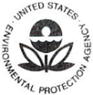
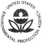

## OCR Extraction Notice

> This document was routed through the scan/OCR path.
> OCR text is preserved below, but it may contain recognition errors.

### Original Scan

> Preserved page/image artifacts detected: 3.

### OCR Risk Notes

> High-risk OCR pages detected: 1, 2, 3.
> These pages were preserved conservatively because OCR confidence appears low.

### OCR Extracted Text

> Treat the text below as OCR-assisted recovery rather than authoritative digital text.

## Dear Commissioner:

There is no higher priority for the U.S. Environmental Protection Agency than protecting public health and ensuring the safety of our nation's drinking water. Under the Safe Drinking Water Act (SDWA), «State» and other states have the primary responsibility for the implementation and enforcement of drinking water regulations, while the EPA is tasked with oversight of state efforts. Recent events in Flint, Michigan, and other U.S. cities, have led to important discussions about the safety of our nation's drinking water supplies. I am writing today to ask you to join in taking action to strengthen our safe drinking water programs, consistent with our shared recognition of the critical importance of safe drinking water for the health of all Americans.

First, with most states having primacy under SDWA, we need to work together to ensure that states are taking action to demonstrate that the Lead and Copper Rule (LCR) is being properly implemented. To this end, the EPA's Office of Water is increasing oversight of state programs to identify and address any deficiencies in current implementation of the Lead and Copper Rule. EPA staff are meeting with every state drinking water program across the country to ensure that states are taking appropriate actions to address lead action level exceedances, including optimizing corrosion control, providing effective public health communication and outreach to residents on steps to reduce exposures to lead, and removing lead service lines where required by the LCR. I ask you to join us in giving these efforts the highest priority.

Second, to assure the public of our shared commitment to addressing lead risks, I ask for your leadership in taking near-term actions to assure the public that we are doing everything we can to work together to address risks from lead in drinking water. Specifically, I urge you to take near-term action in the following areas:

- (1) Confirm that the state's protocols and procedures for implementing the LCR are fully consistent with the LCR and applicable EPA guidance;
- (2) Use relevant EPA guidance on LCR sampling protocols and procedures for optimizing corrosion control;
- (3) Post on your agency's public website all state LCR sampling protocols and guidance for identification of Tier 1 sites (at which LCR sampling is required to be conducted);
- (4) Work with public water systems — with a priority emphasis on large systems — to increase transparency in implementation of the LCR by posting on their public website and/or on your agency's website:

## UNITED STATES ENVIRONMENTAL PROTECTION AGENCY

WASHINGTON, D.C. 20460

## SAMPLE LETTER

## Office Of Water

- othe materials inventory that systems were required to complete under the LCR, including the locations of lead service lines, together with any more updated inventory or map of lead service lines and lead plumbing in the system; and
- o LCR compliance sampling results collected by the system, as well as justifications for invalidation of LCR samples; and
- (5S) Enhance efforts to ensure that residents promptly receive lead sampling results from their homes, together with clear information on lead risks and how to abate them, and that the general public receives prompt information on high lead levels in drinking water systems.

These actions are essential to restoring public confidence in our shared work to ensure safe drinking water for the American people. I ask you for your leadership and partnership in this effort and request that you respond in writing, within the next 30 days, to provide information on your activities in these areas.

To support state efforts to properly implement the LCR, the EPA will be providing information to assist states in understanding steps needed to ensure optimal corrosion control treatment and on appropriate sampling techniques. I am attaching to this letter a memorandum from the EPA's Office of Ground Water and Drinking Water summarizing EPA recommendations on sampling techniques. We will also be conducting training for state and public water systems staff to ensure that all water systems understand how to carry out the requirements of the LCR properly. Finally, we are working to revise and strengthen the LCR, but those revisions will take time to propose and finalize; our current expectation is that proposed revisions will be issued in 2017. The actions outlined above are not a substitute for needed revisions to the rule, but we can and should work together to take immediate steps to strengthen implementation of the existing rule.

While we have an immediate focus on lead in drinking water, we recognize that protection of the nation's drinking water involves both legacy and emerging contaminants, and a much broader set of scientific, technical and resource challenges as well as opportunities. This is a shared responsibility involving state, tribal, local and federal governments, system owners and operators, consumers and other stakeholders. Accordingly, in the coming weeks and months, we will be working with states and other stakeholders to identify strategies and actions to improve the safety and sustainability of our drinking water systems, including:

- e ensuring adequate and sustained investment in, and attention to, regulatory oversight at all levels of government;
- e using information technology to enhance transparency and accountability with regard to reporting and public availability of drinking water compliance data;
- e leveraging funding sources to finance maintenance, upgrading and replacement of aging infrastructure, especially for poor and overburdened communities; and
- e identifying technology and infrastructure to address both existing and emerging contaminants.

As always, the EPA appreciates your leadership and engagement as a partner in our efforts to protect public health and the environment. Please do not hesitate to contact me, or your staff may contact Peter Grevatt, Director of the Office of Ground Water and Drinking Water at grevatt.peter(Wepa.gov or (202) 564-8954.

Thank you in advance for your support to ensure that we are fulfilling our joint responsibility for the protection of public health and to restore public confidence in our shared work to ensure safe drinking water for the American people.

Sincerely,

Joel Beauvais Deputy Assistant Administrator

Enclosure
