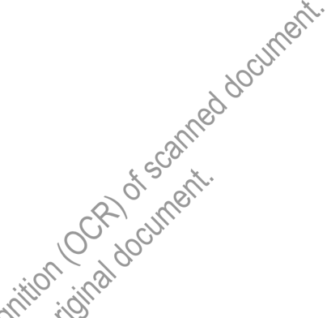

## OCR Extraction Notice

> This document was routed through the scan/OCR path.
> OCR text is preserved below, but it may contain recognition errors.

### Original Scan

> Preserved page/image artifacts detected: 2.

### OCR Extracted Text

> Treat the text below as OCR-assisted recovery rather than authoritative digital text.
TROSTER, SINGER &amp; CO.

571-1780

Securities and Exchange Commission

## 74 Trinity Place New York, N.Y.10006 TELEPHONE(212) May 22, 1974 Mr. Mark Berman Division of Market Regulations 500 North Capitol Street Washington, D.C. 20549

Re:

SEC Rule 240. 15C3-3

Dear Mr. Berman:

Troster, Singer &amp; Co. would appreciate your,interpretation of a particular segment of the SEC's interpretation of Rule 15C3-3 with regard to.the requirement to reduce securities to possession or control. We are particularly interested in paragraph of the interpretation which reads as follows:

A broker or dealer shall be reguited toprint or include in a separate record or listing, the status of those securities Which have'either an excess or a deficit, and shall have available to determine the statu§/of those'se¢urities which are neither in excess or deficit such books and records'as,may.be fiecessary for verification.

With regard to\the'abové paragraph Troster, Singer &amp; Co. follows the policy of checking daily our custamers accounts to determine whether or not an account has an excess or deficit positiomin-a sectrity. We manually record on a sheet, a sample of which is enclosed, each customers account which may have a deficiency.

inva Conversation on May 22nd | explained to Mr. Eng of your office that the NASD has indicated to us that this may not be sufficient to be in compliance with the interpretation of the rule. Troster, Singer &amp; Co. does not maintain any margin accounts and uses a safekeeping system for their customer accounts. There are many other methods which we use to be sure that all of the requirements of the customer rule are complied with.

Specifically with reference to the above paragraph of the rule we would appreciate an opinion if the keeping of the separate record, as enclosed, customers is in compliance with your requirements.

Very truly yours,

TROSTER, SINGER &amp; CO.

(George Hoffman)

J.

## Jan 17

Mr. George J. Hoffman

Director of Operations

Troster Singer &amp; Company

## 74 Trinity

New New York 10006

## 1975 Place York,

Dear Mr. Hoffman:

This is in response to your correspondence of May 22, 1974 in which you request our interpretation of Securities ExchangeAct Release No. 9922 which delineates certain record-keeping guidelines relating to therequirement to reduce securities to possession or control pursuant to Rule 15¢€3=3 undénthe Securities Exchange Act of 1934.

From your letter | understand thatJroster, Singer &amp; Co. ("Troster") does not maintain any margin accounts ahd\performsja daily check on each customer account to determine whether an excéssr deficit position exists and records such positions daily on a separate record. The,sample you enclose lists the security, the customer account number, the deficiency;,and thedate of the calculation. From the information you have provided, It is not possible for uS to determine if your records are adequate. However, the following genéral criteria for record-keeping is provided to assist you.

Securities Exchange Act Release No. 9922 provides in pertinent part that " a broker or dealer shall be required to print or include in a separate record or listing a daily determination of the status of those securities required to be in possession or control which have either an excess or a deficit, and shall have available to determine the status of those securities which are neither In excess or deficit such books and records as may be necessary for verification."

The Division believes the records which must be maintained by a broker-dealer to appropriately discharge his responsibilities under Rule 15c3-3 and as set forth in Securities Exchange Act Release No. 9922 to promptly obtain and thereafter maintain possession or control of customers' fully paid and excess margin securities will, of necessity, be reflective of the degree of complexity of the broker-dealer's operations. Accordingly, we do not believe a uniform recordkeeping format can be set forth at this time. In general, however,lt is our view that the records which must be prepared and maintained by a broker-deater are those which he will utilize on a daily basis to:

- (1) identify fully paid and excess margin securities;
- (2) Identify fully paid and excess margin securities which are in his physical possession or control;
- (3) determine any deficiency of fully paid or excess margin séctirities which are not in his physical possession or control;
- (4) determine the location of fully paid and excess mafgin securities which are notin physical possession or control; and,
- (5) record any action taken to reduce fully paicsand excess margin securities to physical possession or control or to locations designated byparagraph (c) of the rule when paragraphs (d) or (m) of the rule requires that speGified action be taken.

Thus, a separate record or listing.asset forth In Release No. 9922 may not be necessary for some broker-dealers who canscomplywith the rule's provisions If the records outlined above or these maintained-by*him readily enable a broker or dealer (a) to issue instructions to acquire physical possession or control of fully paid or excess margin securities within the time frames set forth in Rate 5c3-3 or (b) to determine the amount of any excess or deficiency of fullypaid anesexcess margin securities either in or required to be in physical possession or\control.and'the location of any such securities in deficiency, daily as of the close of busineSsofthe preceding day. Where a separate listing must be maintained, such listing.@USst include any deficiency or excess of fully paid for and excess margin securities as determined from Troster's records, which records should meet criteria (1) through (5) above.

If there are any further questions, please do not hesitate to contact us.

Sincerely,

Marc L. Berman, Chief

Branch of Rules and Interpretations
