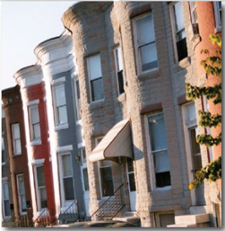
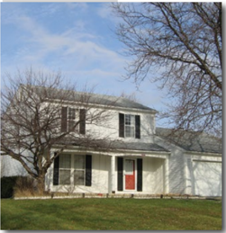
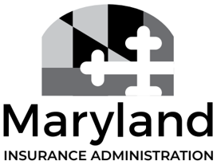

## OCR Extraction Notice

> This document was routed through the scan/OCR path.
> OCR text is preserved below, but it may contain recognition errors.

### Original Scan

> Preserved page/image artifacts detected: 9.

### OCR Risk Notes

> High-risk OCR pages detected: 1, 2, 3, 15.
> These pages were preserved conservatively because OCR confidence appears low.

### OCR Extracted Text

> Treat the text below as OCR-assisted recovery rather than authoritative digital text.
## A CONSUMER GUIDE TO

## TITLE INSURANCEE

## A Consumer Guide To

## TITLE INSURANCEE

## TABLE OF CONTENTS

| Introduction. ....c.ceeeeesecsessssesesesesesesesesesesescsescscscsescscsesescsesesesesescsssescacacscscaeacacscaesesasseseeesesnenssesesaeas 1                                                                       |
|-----------------------------------------------------------------------------------------------------------------------------------------------------------------------------------------------------------------------|
| What Is Title Insurance, and What Does it Cover?......cccccssssessesescscsescsesessseseseseseseseseseeseseeseeee 1                                                                                                    |
| Who Is Protected By Title Insurance?. .......ccccssssssesesssseseseseseesesesesesssesesesessesesssssssssesesesesssseesseeneees 2                                                                                      |
| How Is A Title Insurance Policy Different From Other Types Of Insurance? ......csesesssssseseseseeeeeees 3                                                                                                            |
| Who Sells Title Insurance? ......cceeeesesesesssesesesesesesescsesescscscscscscseseseseeeseeesessscesasacacacseaeaeseeeeeeeeeeeees 3                                                                                  |
| Who Chooses the Title Company? ........cccceseseeseeseseseseseesesesesenssssssssscssssssssssseseseseseseseseseesseseeae 3                                                                                             |
| When do I Shop for Title Insurance? .......cccesessesesesesseseeseseseeesesesessesesssssesssesssssssseesesesssseeesseseeees 4                                                                                         |
| What Happens After I’ve Chosen a Title Company?......cccssssssessssssssescsesessssscsesnssesescsesnseseaeseeeeees 5                                                                                                   |
| Who Pays for Title Insurance? ......c.ccessesssesesessssescsesessesesesesessesssesessssesesesesessesesesesessesesesesnsssseesseeeenes 5                                                                               |
| What does Title Insurance Cost? ....c.ccccsssssssssesesssesssseseesessssesesssesessenesssesesseenssesesseseasseseseesenssesesees 6                                                                                    |
| Ask if You're Eligible for Discount.......c.cscsssssesessssesesesessssesesesesessssesesessssesesesesssesesesesessesesssesessenegs 6                                                                                   |
| The Title Insurance Consumer’s Bill of Rights — 9 Things You Should Know Before Signing a Contract Of Sale or Refinancing Your Property .....c.scsssssssseseseesesesesesessescseseessescsesssnsnesesssssneneseseaes 6 |
| Other Information That You Need To Know About The Settlement Process.........ceceseseeseeteseeeeees 7                                                                                                                 |
| Contact Information for Maryland Consumers. ........c.sssssssesesessesesesesesescscssseseacsesssesnescseaseneneseasees 9                                                                                              |
| Filing A Complaint. ......c.cccccsssssesssesssessesesesesseesesesessssesssesnssesesesesessssesesesnsesesesssnsesssesesssseseaeees 10                                                                                  |

## INTRODUCTION

The Maryland Insurance Administration (MIA) is an independent state agency that regulates Maryland's insurance marketplace and protects consumers by ensuring that insurers and insurance producers (agents and brokers) act in accordance with insurance laws. In Maryland, all insurance companies must have a certificate of authority from the MIA to conduct insurance business lawfully in the state.

Most title insurance companies appoint producers (agents or brokers) to underwrite the risks, collect the premiums and issue the title insurance policies. These producers must be licensed by the MIA. The title producers usually conduct the settlement, file the deed, and pay any liens, such as the seller's mortgage. Title insurance premiums are regulated by the Maryland Insurance Administration. The title company also charges the buyer for various settlement services, such as document preparation, conducting the settlement, or other title agent charges which are not regulated and which will differ between title agents.

The MIA is also responsible for investigating and resolving complaints and questions concerning insurers and producers that do business in Maryland, including those who sell title insurance.

## WHAT IS TITLE INSURANCEE, AND WHAT DOES IT COVER?

## A title documents your legal ownership or interest in property.

Title insurance is an insurance policy that covers past title problems that come up after you buy or refinance a property.

Lost, forged or incorrectly filed deeds, property access issues and liens on a property are just a few of the title problems that could come up after you buy or refinance a home or piece of land.

For example, if you received a letter telling you there's an unpaid mortgage on the property you just bought, you could submit a claim to your title insurance company. The title insurance company would pay the legal costs to settle the dispute and/or to resolve the problem.

Without title insurance, you might have to pay all of the legal costs to settle the dispute. And if you lose the dispute, you could lose money, the equity you have in your home, and possibly ownership.

## WHO IS PROTECTED BY TITLE INSURANCE?

## That depends on the policy that is purchased.

There are two types of title insurance policy, Lender's title insurance and Owner's title insurance.

An owner' policy protects you for the full price you paid for the home plus legal costs if a past title or ownership issue comes up after you buy your home. An owner's policy is issued for the amount you paid to buy your home, and the policy will cover you as long as you own an interest in the property. You are not required to purchase an owner's policy, but if you choose not to, you may lose the money you've paid for your home.

If a basic owner's policy doesn't cover a specific title issue, often you can add coverage, known as a policy endorsement. For example, if you're buying a new home and the owner's policy doesn't cover claims (often known as a mechanic's lien) filed by a contractor, you can add a policy endorsement to ensure you are covered. Some endorsements are free while others can be added for an additional fee.

An enhanced owner's policy, which has a higher level of coverage than a standard owner's policy, also may be available in your area. Enhanced owner's policies cost about 20% more than a standard owner's policy, but they cover extra risks. An enhanced owner's policy also may continue to provide coverage after a property has been transferred.

If you borrow money to buy your home or property, your lender is likely to require you to buy a lender' policy. A lender's policy only protects the lender if a title or ownership problem comes up after the property is purchased. A lender's policy is issued for the amount of the mortgage, and the coverage goes down as you pay down your loan. Unlike an owner's policy, the lender's policy ends when you pay off your mortgage. You may be expected to pay the premium for a lender's policy.

Because a lender's policy only protects the lender from title problems, you'll also need an owner's policy if you want to protect yourself.

Another benefit of purchasing owner's coverage is being eligible for a reissue rate if you refinance the property in the future. Ifa property owner has an owner's policy and they present a copy of the policy to the title agent conducting their property refinance, they may be eligible for a discounted lender's premium on the new lender's policy.

## HOW IS A TITLE INSURANCE POLICY DIFFERENT FROM OTHER TYPES OF INSURANCE?

Before property is transferred from the seller to the buyer, a title search must be conducted. The title search identifies prior owners, outstanding liens, encumbrances (claims made against the property by a party that is not the owner), encroachments (intrusion onto a neighboring property by a physical structure), rights of way, easements and the like associated with the real property, so that the buyer is aware of them prior to settling on the property. The title search can eliminate most of the risk from the transaction.

However, in rare occasions something may be missed during the search process, resulting in a claim being presented at a later date. Since the defect was not known at the time the title was transferred, coverage for the loss would be provided by the title insurance policy.

In this respect, title insurance is different from all other types of insurance coverage. Property, casualty, life and health insurance policies protect you against events that occur after you purchase the policy.

Title insurance protects you against events that occurred before the policy was purchased, provided the title defect was not discovered at the time of the title search.

Title insurance policies do not cover ownership issues that come about after you've bought a home. For example, if your neighbor builds a fence on your property after you've bought your home, your title insurance policy will not cover the costs to settle the dispute.

## WHO SELLS TITLE INSURANCE?

Only licensed title insurance companies, agencies and producers can sell title insurance in Maryland.

You can buy title insurance directly from a title insurance company or a title agent who sells title insurance for a company.

## WHO CHOOSES THE TITLE COMPANY?

## The buyer chooses the title insurance company.

While the real estate agent or broker may suggest or recommend a title insurance producer, the buyer does not have to hire that company. Some real estate firms and some mortgage companies have "affiliated business arrangements" with certain title insurance producers or insurance companies. If one of these arrangements exists, it must be disclosed to the buyer in writing so that the buyer can make an informed decision. The federal Real Estate Settlement Procedures Act (RESPA) prohibits kickbacks and referral fees among persons involved in real estate settlements.

## WHEN DO I SHOP FOR TITLE INSURANCEE?

A good time to shop for title insurance is when you choose a real estate agent, and a lender has prequalified you for a loan. You'll have an idea of the price you can pay for a home/property and a title insurance agent or company can use that information to estimate your title insurance costs. There are several ways you can find a title insurance agent or company:

- ¢ You can ask the sellers who they used when they bought the home.
- You can check the Maryland Insurance Administration website, insurance.maryland.gov.
- You can look up title insurance agents, agencies and companies in the phone book.
- ¢ You can check online for title insurance agents, agencies and companies in your area.
- ¢ You can ask for recommendations from your real estate agent, attorney, mortgage lender, financial institution or builder.

Before choosing a title company, the buyer should contact the MIA to verify that the title company and/or insurer is licensed. Only licensed producers can conduct settlements in Maryland. This information is available on our website, www.insurance.maryland.gov or you can also call us at 410-468-2000 or 1-800-492-6116.

Since the buyer has the right to choose their own title company, they can shop around by contacting several different agents to compare their fees. Because the fees a title company charges the buyer for various settlement services, such as document preparation, conducting the settlement or other title agent charges which are not title insurance premiums, are not regulated, it is beneficial to contact more than one title insurance agency or producer to ask what the fees will be for the services provided and whether any of those fees can be waived.

Beware of statements such as:

- e "Everyone charges the same price."
- ¢ "We'll give you a discount on something else if you use our title agent."
- ¢ "Tf you choose another title agent, your purchase may be delayed."

These types of statements may be used to convince you to give up your right to choose a title agent or company, and you may pay more for title insurance than if you had shopped around.

## WHAT HAPPENS AFTER I'VE CHOSEN A TITLE COMPANY?

After the title company is chosen, you can contact the agent to discuss the different coverage options.

Most title insurance policies don't cover issues such as easements, boundary line disputes, zoning violations and air or mineral rights. Your title insurance policy may spell out other issues that won't be covered. If there's a title issue specific to the home you're buying or refinancing, your title policy may not cover it. Ask for a list of what will and will not be covered, and be sure to read your policy.

Additionally, the buyer should always ask the seller if they have a title insurance policy on the property. If the same insurance company has already underwritten the risk and has issued the prior policy on the property, the title search can be shortened. Since most of the work was previously done, the cost to underwrite can be less and will be reflected by discounting the premium, known as a "reissue rate." Whether or not a buyer is eligible for a reissue rate depends on the title insurers filed rates and can be subject to certain limitations, such as requiring that the prior policy was issued within the past ten years.

## WHO PAYS FOR TITLE INSURANCE?

If you're buying a home, who pays for title insurance depends in part on local custom. It may be something, however, that you can negotiate with the seller of the property. When buying a home, be sure to ask your real estate agent what the custom is in your area and if you'll likely be the one to pay for title insurance.

If youre refinancing your home, it'll be your responsibility to buy and pay for the title insurance policy.

A title insurance policy is paid for with a one-time premium payment included in the closing costs

The premium(s) owed for title insurance, along with any other fees the title insurance producer or insurer will charge you at closing, will be listed on the settlement sheet the lender or closing company provides you. Depending upon the type of loan you have, the settlement sheet will either be a HUD-1, or a "Closing Disclosure" (which is another name for the TILA-RESPA Integrated Disclosure "TRID"). You may obtain a sample Closing Disclosure by accessing this website: https://tinyurl.com/4aw2ut62.

## WHAT DOES TITLE INSURANCEE COST?

The cost of title insurance is usually tied to the value of the home.

If you're buying an owner's policy, the price of your policy will depend on the home's selling price.

The price of title insurance also can include more than just insurance. One cost included in the price is a title search. When a title search is conducted, a title agent or company reviews local records, such as deeds, mortgages, wills, divorce decrees, court judgments and tax records looking for any title issues with the property. In Maryland, a title search must be done before a company can issue a title insurance policy.

If you're buying a lender's policy, the price of title insurance will depend on your loan amount.

## ASK IF YOU'RE ELIGIBLE FOR DISCOUNTS

When you buy title insurance, ask if youre eligible for any discounts.

If there was a previous title policy on the home (because the home changed owners or youre refinancing), you may get a discount known as a "reissue rate."

If you decide to buy both an owner's and lender's policy, you may get a discount if you buy both policies together.

In the title insurance business, this is known as a "simultaneous issue."

## THE TITLE INSURANCEE CONSUMER'S BILL OF RIGHTS - 9 THINGS YOU SHOULD KNOW BEFORE SIGNING A CONTRACT OF SALE OR REFINANCING YOUR PROPERTY

1. You have the RIGHT to choose your settlement agent and title insurer. (Note: Your settlement agent is responsible for the paperwork necessary for transferring ownership of the property, and does not have to work for the title insurance company)
2. You have the RIGHT to receive settlement cost information early in the real estate settlement process, allowing you to shop for the settlement services that best meet your needs.
3. You have the RIGHT to receive an itemized settlement statement from the settlement agent detailing all fees paid to the settlement agent before you agree to use that settlement agent.

- 4, You have the RIGHT to be informed about the total cost being paid by you to the settlement agent.
5. You have the RIGHT to ask and receive accurate information from your settlement agent about whether there is a ground rent, lien, judgment, or any other impediment to outright ownership of the property.
6. You have the RIGHT to request and receive from your settlement agent the Settlement Statement (HUD-1) the business day before the date of settlement.
7. You have the RIGHT, before you sign, to ask the settlement agent questions and receive clear and complete answers about charges and documents that you do not understand.
8. You have the RIGHT to receive copies from the settlement agent of all documents you signed at the time of closing.
9. You have the RIGHT to have all funds disbursed timely and properly by the settlement agent in accordance with the Settlement Statement (HUD-1) you signed at closing.'

## OTHER INFORMATION THAT YOU NEED TO KNOW ABOUT THE SETTLEMENT PROCESS

## REQUIRED DISCLOSURES

In October of 2015, new federal laws governing the lending and closing process came into effect. This rule is referred to as the TILA-RESPA Integrated Disclosure Rule and is designed to make it easier for consumers to understand and locate key information.

Under federal law, a borrower must be given a copy of the settlement statement prior to settlement; depending upon the type of transaction, the settlement statement will be called a HUD-1 or a Closing Disclosure. Federal law also gives the borrower the right to request that a copy of the HUD-1 settlement statement be provided one business day before closing for noncovered transactions and the Closing Disclosure three (3) business days prior to closing for covered transactions. We encourage you to exercise this right so that you will have time to look over the numbers and make sure that everything is in order before you appear at the settlement table. You should advise your title insurance producer, insurance company or lender that you want a copy of the HUD-1 or Closing Disclosure early in the process so that they are able to comply with the request. For information regarding your type of transaction and which forms are required, please see http://www.consumerfinance.gov/.

The new federal laws change the disclosure of title insurance premiums and fees. Under the new rule, settlement fees are divided into two (2) categories: (1) services the "borrower did not shop for"; and (2) "services the borrower did shop for." In the case of a lender's title policy, since the lender requires the purchase of the policy as a condition of the loan, the lender's policy is listed as a service the borrower did not shop for.

## 1 Source: The Real Estate Settlement Procedures Act (RESPA) of 1974, 12 U.S.C.$2601 et seq.

But since the purchase of the owner's policy is typically not required as a condition of the loan and is listed as optional, it is disclosed as a service the borrower did shop for. If the buyer buys simultaneous title insurance (buying an owner's policy at the same time a lender's policy is purchased), the settlement sheet will include the simultaneous issue charge (i.e. the charge for the lender's policy and the owner's policy together). The sample Closing Disclosure forms on the Consumer Financial Protection Bureau's website, http://www.consumerfinance. govlowning-a-homelclosing-disclosure/, show how these charges will appear on your Closing Disclosure.

Maryland law requires the title company to notify buyers in writing of their right to purchase an owner's policy, and to view a sample copy of the policy. The buyer must also indicate whether or not owner's title insurance is desired and sign the "Statutory Notice" form. This form is required when a real estate transaction involves a purchase money deed mortgage or deed of trust, unless it is a purchase money mortgage granted solely to acquire an interest in or to carry on a business or commercial enterprise, or any purchase money mortgage granted to any business or commercial organization.

If you elect to purchase an owner's policy, the MIA strongly recommends that you also review a sample copy of the policy, including a review of all exceptions listed on the policy. The settlement agent can direct you to the proper portion of the policy. (Providing the buyer with a copy of the title insurance commitment also satisfies the requirements of this statute.) This is important because it allows a purchaser to verify if there are any exceptions, restrictions, encumbrances or other matters not covered by the owner's policy.

Note that the title company is not required to separately notify buyers of any exceptions and their impact upon the purchase of the property. However, if a buyer asks, the title company may explain any exceptions in the policy.

## ADDITIONAL QUESTIONS ABOUT BUYING A HOUSE AND SETTLEMENT PROCEDURES

Additional information regarding buying a house and settlement procedures can be found on the Consumer Financial Protection Bureau's (CFPB) website at http://www.consumerfinance.gov/. The CFPB provides helpful information regarding loan options, as well as information about the closing process. Please review their section on mortgages at https://www.consumerfinance.gov/know-before-you-owe prior to applying for a loan and choosing a settlement or title agency. This site provides a sample Loan Estimate and a sample Closing Disclosure as well as many other tools to assist you in the loan and closing process. You can also learn more about buying a house on the Department of Housing and Urban Development's website, Attps:/www.hud. govitopics/buying\_a\_home.

## ADDITIONAL QUESTIONS ABOUT BUYING A HOUSE

The Maryland Insurance Administration has only the authority to regulate the business practices of the title insurance producers and title insurance companies. The majority of producers and insurers follow the insurance laws and regulations; however, from time to time, problems arise after a settlement is conducted. Examples include the failure to pay off a prior mortgage, other lien or encumbrance; record the deed, deed of trust, mortgage or mortgage release; charge and collect the appropriate premiums; issue the title insurance policies; and provide copies of legal documents to the buyer. In other cases, there may be a theft of escrow funds or a falsification, or forgery of closing documents. If you believe that anything like this has occurred, please contact the Maryland Insurance Administration's Enforcement Tip Line at 410-468-2200 or toll free at 1-800-492-6116 and ask to speak to an enforcement officer in the Market Regulation &amp; Professional Licensing Division. You may be asked to mail a letter that explains your concerns and attach all documents related to your concerns. You can also email the complaint to enforcement.mia@maryland.gov and attach any documents.

## CONTACT INFORMATION FOR MARYLAND CONSUMERS

There are many other players in any real estate transaction, such as real estate agents or brokers, buyer's agents, attorneys, mortgage brokers, banks, lenders, loan officers (mortgage originators) and sellers. If you encounter any problems with those entities, there may be other state and federal agencies that can assist you. You may also contact a lawyer to learn about your specific rights.

The Consumer Financial Protection Bureau (CFPB) provides general information about a wide variety of consumer financial products, including, for example, mortgage loans, and enforces RESPA and other federal consumer financial laws. CFPB also investigates consumer complaints about federal financial products or services, including, for example, complaints that: a settlement service provider has violated RESPA by engaging in kickbacks, feesplitting or charging unearned fees; a seller required a particular title insurer as a condition of sale; or a lender charged excessive amounts for the escrow account. If you have questions about a federal consumer financial product or service, or you want to submit a complaint, you can contact:

## Consumer Financial Protection Bureau

Headquarters address: 1700 G Street, Washington, DC 20552 Mailing address: PO. Box 4503, Iowa City, IA 52244 (855)729-2372 | Fax: (855)237-2392 | TTY/TDD: (855) 729-2372 http://www.consumerfinance.gov/!

The Department of Labor, Licensing and Regulation regulates Maryland's financial services industry, as well as the real estate industry. For information on, or to file a complaint against state chartered banks, credit unions, mortgage brokers, lenders and loan officers (mortgage originators) you can contact:

## Department of Labor, Licensing and Regulation

Commissioner of Financial Regulation 1100 North Eutaw Street, Baltimore, MD 21201 (410) 230-6100 | Fax: (410) 333-3866 or (410) 333-0475 DLFRFinReg-LABOR@maryland.gov

Attps:/hwww.dllr.state.md.us/finance!

For information on, or to file a complaint against Maryland real estate agents or brokers, you can contact:

## The Maryland Real Estate Commission

## 1100 North Eutaw Street, Baltimore, MD 21202 (410) 230-6230 | Fax (410) 333-0023 dlmrec-labor@maryland.gov www.dllr.state.md.us/license/mrec If your problem involves a federally-licensed lender, you must determine which agency has jurisdiction. If the lender is a national bank or a federal savings association, you may contact:

## Office of the Comptroller of the Currency

Consumer Assistance Group 1301 McKinney Street, Suite 3450, Houston, TX 77010 1-800-613-6743 | Fax: (713) 336-4301 www.oce.treas.gov or www.Help WithMyBank. gov

If the lender is a federal credit union, you may contact:

## National Credit Union Administration

Consumer Assistance Hotline 1755 Duke Street, Suite 6043, Alexandria, VA 22314-3428 (800) 755-1030 www.ncua.gov or www.MyCreditUnion. gov

If you are unsure which agency regulates your lender, you may be able to determine this by going to the Federal Deposit Insurance Corporation's web site at https://www.fdic.gov and entering the name of the institution into its bank finder search. You can also contact one of the above agencies, and a staffer may be able to direct you to the proper agency.

## FILING A COMPLAINT

## CONSUMERS MAY FILE COMPLAINTS WITH THE MARYLAND INSURANCE ADMINISTRATION. THE MIA CAN ONLY INVESTIGATE COMPLAINTS CONCERNING POLICIES ISSUED INMARYLAND OR TO A MARYLAND RESIDENT.

Complaints must be received in writing. Please provide as much detail as possible, including copies of pertinent documents. A trained, professional investigator will handle your complaint. The investigator will contact the insurer/producer to try to resolve the issue. Meanwhile, you will be advised of the steps being taken on your behalf. Complaint files are not closed until the MIA has made a determination regarding the complaint.

You may find complaint forms on the MIA's website, www. insurance.maryland.gov. Once completed, these should be mailed to the MIA along with copies of any relevant correspondence. For further assistance, call the MIA at 800-492-6116.

This consumer guide should be used for educational purposes only. It is not intended to provide legal advice or opinions regarding coverage under a specific policy or contract; nor should it be construed as an endorsement of any product, service, person, or organization mentioned in this guide.

This publication has been produced by the Maryland Insurance Administration (MIA) to provide consumers with general information about insurance-related issues and/or state programs and services. This publication may contain copyrighted material that was used with permission of the copyright owner. Publication herein does not authorize any use or appropriation of such copyrighted material without consent of the owner.

All publications issued by the MIA are available free of charge on the MIA's website or by request. 'The publication may be reproduced in its entirety without further permission of the MIA provided the text and format are not altered or amended in any way, and no fee is assessed for the publication or duplication thereof. The MIA's name and contact information must remain clearly visible, and no other name, including that of the company or agent reproducing the publication, may appear anywhere in the reproduction. Partial reproductions are not permitted without the prior written consent of the MIA.

People with disabilities may request this document in an alternative format. Requests should be submitted in writing to the Chief, Communications and Public Engagement at the address listed below.

## 200 St. Paul Place, Suite 2700 Baltimore, MD 21202 410-468-2000 800-492-6116 800-735-2258 TTY

www.insurance.maryland.gov

www .facebook.com/MdInsuranceAdmin www.twitter.com/MD\_Insurance www.instagram.com/marylandinsuranceadmin
