## OCR Extraction Notice

> This document was routed through the scan/OCR path.
> OCR text is preserved below, but it may contain recognition errors.

### Original Scan

> Preserved page/image artifacts detected: 30.
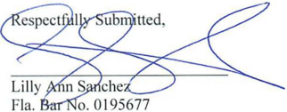
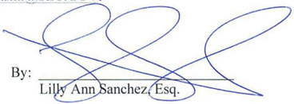

### OCR Extracted Text

> Treat the text below as OCR-assisted recovery rather than authoritative digital text.
## COPY

## UNITED STATES OF AMERICA Before the SECURITIES AND EXCHANGE

ADMINISTRATIVE PROCEEDING File No. 3-17180

In the Matter of:

ELLIOT R. BERMAN, CPA and BERMAN &amp; COMPANY, P.A.,

Respondents.

## COMMISSION

RESPONDENTS' MOTION FOR SUMMARY DISPOSITION

## Received

## May 27 2016

## TABLE OF CONTENTS

- TABLE OF AUTHORITY .........ccccsssssssssssssssesseseseessseesesssesesseseseseseseneseseaseeseeseat .... 3
- INTRODUCTION ..0.... es escscssssesessssssevesvssssseessesesseseseessseesensasseseeseseseseseseseneseseseneecsnseteesaees .... 4
- STATEMENT OF FACTS .....ccccssssssssssssssesssesssesssssssssssssssssssssseseesesesaseesea .... 6
- ARGUMENT... cscssssssscsesesesseesssescsssscsssnsssssssssessensscssessssessssseassesssessssessusessessseva .... 9
- I. LEGAL STANDARD .... 9
- II. A. PCAOB STANDARDS EXPLICITLY PERMIT INDEMNIFICATION CLAUSES FOR LIABILITY AND COSTS RESULTING FROM KNOWING MISREPRESENTATIONS AND FRAUD BY MANAGEMENT .........c.cesssessssssesssssssscscssssscscscscerer .... 11
- B. SEC RULES AND REGULATIONS ONLY PROHIBIT INDEMNIFICATION CLAUSES THAT INDEMNIFY AUDITORS FROM THEIR OWN NEGLIGENCE, BUT DO NOT DISALLOW INDEMNIFICATION FOR MANAGEMENT’S KNOWING MISREPRESENTATIONS AND FRAUD uu. cscessessssssssesscnescessesensensessesasesescssscacasassesenenaees .... 13
- II. &#124; THE OTHER SERVICES PROVISION IS NOT AN INDEMNIFICATION CLAUSE, AND IN ANY EVENT, IS PERMISSIBLE BECAUSE IT DOES NOT INDEMNIFY BERMAN & CO. FOR ITS OWN NEGLIGENCE .........c .... 17
- A. THE CONTRACT’S PLAIN LANGUAGE BELIES THE CONCLUSION THAT THE OTHER SERVICES PROVISION IS AN INDEMNIFICATION CLAUSE AGAINST BERMAN & CO.’S OWN LIABILITY .....eecsecssssssesessceesecscssesessa .... 17
- B. THE OTHER SERVICES PROVISION DOES NOT — AND CANNOT -- INDEMNIFY BERMAN & CO. FOR ITS OWN NEGLIGENT CONDUCT...
- CONCLUSION

## Cases

| Jay T. Comeaux, 2014 WL 4160054 at *3 (S.E.C. Aug. 21, 2014). cccccccseseseseesees 10                                                                         |
|---------------------------------------------------------------------------------------------------------------------------------------------------------------|
| Whitley v. Royal trails Prop. Owners’ Ass'n, Inc., 910 So. 2d 381, 383 (Fla. Dist. Ct. App. 2005) ........ssesessssseessensecsssnnecsssnnesssane 17           |
| BKD Twenty-One Mgmt. Co., Inc. v. Delsordo, 127 So. 3d 527, 530 (Fla. Dist. Ct. App. 2012)... essessssssssectssececesseseeeceeseeneees 18                     |
| Cox Cable Corn v. Gulf Power, 591 So. 2d 627, 269 (Fla. 1992)... .csssessssssesssesecsssssssesessscsssesscasseeecsseees 19-20                                 |
| Kitchens of the Oceans, Inc. v. McGladrev & Pullen, LLP., 832 So. 2d 270, 272 (Fla. Dist. Ct. App. 2002) ........secsssssssssssseeecsesseeesenseeeseseenes 19 |
| Univ. Plaza Shopping Ctr. V. Stewart, 272 So. 2d. 507, 511 (Fla. 1973)... sescssesesssscsessessseseesssessessesssssssssesssesseseneseeseees 20                |

## TABLE OF AUTHORITY

Elliot R. Berman, CPA ("Berman") and Berman &amp; Company, P.A. ("Berman &amp; Co." and collectively with Berman, the "Respondents"), by counsel, pursuant to Rule 250 of the Securities and Exchange Commission's Rules of Practice ("Rules of Practice"), 17 C.F.R. §201.250, move for an order of summary disposition of the claims relating to Respondents' alleged lack of independence in the Order Instituting Proceedings ("OIP") in this matter against them.' As discussed in more detail below, there is "no genuine issue with regard to any material fact and the party making the motion is entitled to summary disposition as a matter of law." Rule of Practice 250(b)."

## INTRODUCTION

By instituting these proceedings, the Division of Enforcement (the "Division") is seeking, for the very first time, to sanction an auditor for including indemnification provisions in its engagement letters, as such terms — according to the Division — impair independence. Specifically, the Division alleges that by including in the engagement letter with their client, MusclePharm Corporation ("MSLP"), three provisions that would indemnify or reimburse Respondents in certain limited circumstances, Respondents violated the general independence requirements for auditors found in SEC rules and PCAOB standards. In two of those provisions, MSLP agreed to "indemnify and hold Berman &amp; Company P.A.... harmless" in the limited circumstances "resulting from known misrepresentations by management" (OIP 18(a)), and

- Those claims are based on violations of Rule 2-01(b) of Regulation S-X, PCAOB Auditing Standard No. 9 "Audit Planning" and PCAOB Interim Auditing Standard AU § 220 "Independence." (OIP 457-60).

" Although Rule of Practice 250(a) requires leave for filing a motion for summary disposition "[i]f the interested division has not completed presentation of its case in chief," such leave was already granted in ALJ Patil's Scheduling Order dated May 3, 2016 (see fn. 1 of the Scheduling Order).

"fraud caused by or participated in by the management." (OIP 418(b)). In the third provision, MSLP agreed to pay for "reasonable costs and time spent in legal matters arising from [Berman &amp; Co.'s] engagement...at your [MSLP's] request or by subpoena." (OIP 418(c)). Unlike the two other provisions, the third provision did not include the phrase "hold harmless" but, just like the other two provisions, it did not require MSLP to pay or indemnify Berman &amp; Co. for its own negligent conduct.

While the Division has taken the expansive view in its OIP that all indemnification provisions are impermissible, a review of the authoritative Public Company Accounting Oversight Board ("PCAOB") standards and Securities and Exchange Commission ("SEC" or "Commission") rules and regulations reveal that they do not contain a blanket prohibition on indemnification provisions and, in fact, allow for limited indemnification provisions, such as the ones included here. As discussed in more detail below, the PCAOB Standards explicitly permit indemnification clauses for liability and costs resulting from knowing misrepresentations and fraud by management -similar to those included by Respondents in their engagement letters with MSLP. (See Section II.A, infra). Moreover, while the SEC rules and regulations may serve to restrict the PCAOB standards (id), the only formal and authoritative (as opposed to informal and non-authoritative) guidance that the SEC has issued on the topic of auditor indemnifications is found in its Codification of Financial Reporting Policies (the "Codification"), which provides that only an indemnification from an auditor's own negligence would impair independence. (See Section II.B, infra). The Codification does not, however, prohibit indemnification clauses based on management fraud or knowing misrepresentations. (/d.).

Because, as detailed below, all three provisions cited in the OIP provide for indemnification or payment only in limited circumstances and do not seek to indemnify Respondents for their own negligence, and because Florida law, which governs the interpretation of these agreements, supports this conclusion (see Section III, infra), the provisions do not impair Berman &amp; Co.'s independence in violation of SEC rules and regulations and/or PCAOB standards. With no genuine issue with regard to any material fact, the OIP's claims based on Respondents' lack of independence should be dismissed.

## STATEMENT OF FACTS

1. Elliot R. Berman has been a CPA licensed in Florida since 2005. (OIP 41). Berman is the sole owner of Berman &amp; Co., which he founded in 2006. (/d.)
2. Berman &amp; Company, P.A. is an accounting and auditing firm based in Florida. (/d. 2). Berman &amp; Co. has been registered with the Public Company Accounting Oversight Board since 2006. (/d.)
3. MusclePharm Corporation is a Nevada corporation with its principal place of business in Denver, Colorado. (Jd. §3)
4. In January 2011, MusclePharm Corporation engaged Berman &amp; Co. as its auditor and executed an engagement letter according to which Berman &amp; Co. will audit MSLP's consolidated balance sheet as of December 21, 2010 and the related consolidated statements of operations, stockholders' deficit and cash flows for the year then ended. (OIP 43; see also Engagement Letter dated January 5, 2011, attached as Exhibit A). In January 2012, MSLP engaged Berman &amp; Co. again to conduct an audit for the year that ended on December 31, 2011. (OIP 3; see also Engagement Letter dated January 1, 2012, attached as Exhibit B).
5. The Engagement Letters included specific provisions recognizing the importance of Berman &amp; Co. maintaining its independence, as well as its overall understanding of

independence rules, and provided specific examples of impermissible conduct. For example, the Engagement Letters stated the following:

- ¢ "We understand that such an arrangement could violate the independence of Berman &amp; Company. P.A. and this violation could potentially be a breach of professional ethics. As a result, we agree to pay in full, the balance of such professional fees prior to the release of the signed audit opinion." (Ex. A at 6, Ex. B at 6, emphasis added).
- ¢ "If a situation arises, in which it may appear that our independence would be questioned because of significant unpaid bills; we may be prohibited from signing our audit report and consent." (Ex. A at 6, Ex. B at 6, emphasis added).
- ¢ "We also reserve the right to terminate your account for any unforeseen situations that could have a bearing on our independence. An example of this would be your Company has provided financial statements for our review but there is a lack of underlying supporting documentation. The lack of documentation is significant as we cannot be in a position to provide bookkeeping services to assist in the completion of whatever may be needed, this would be a clear violation of our independence pursuant to the PCAOB rules as regulations." (Ex. A at 7, Ex. B at 7, emphasis added).
6. The 2011 and 2012 Engagement Letters also included specific provisions that allowed for indemnification in limited circumstances resulting from management's fraud or known misrepresentations. Specifically, the Engagement Letters included the following language:
- ¢ "The Company agrees to release, indemnify, and hold Berman &amp; Company, P.A. (its partners, affiliates, heirs, executors, personal representatives, successors, and assigns) harmless from any liability and costs resulting from known misrepresentations by management."
- ¢ "The Company agrees to release, indemnify, and hold Berman &amp; Company, P.A. (its partners, affiliates, heirs, executors, personal representatives, successors, and assigns) harmless from any liability and costs resulting from fraud caused by or participated in by the management of the Company."

(See Ex. A at 7; Ex. B at 7, collectively referred to as the "Indemnification Provisions.)

7. The 2011 and 2012 Engagement Letters also contained a provision for payment for Berman &amp; Co.'s time and costs incurred in legal matters or proceedings as a result of MSLP's request or a subpoena. Specifically, the provision provided that:
2. e "This engagement includes only those services specifically described in this letter. Reasonable costs and time spent in legal matters or proceedings arising from our engagement, such as subpoenas, testimony or consultation involving private litigation, arbitration or government regulatory inquiries at your request or by subpoena will be billed to you separately and you agree to pay the same."

(See Ex. A at 7; Ex. B at 7, emphasis added. This clause will hereinafter be referred to as the "Other Services Provision".)

8. Unlike the Indemnification Provisions, the Other Services Provision did not use the phrase "hold harmless." It also explicitly stated it would be invoked only at MSLP's request or by subpoena, and thereby was clearly intended to cover expenses in legal matters incurred for the benefit of MSLP — not to cover expenses in proceedings against Berman &amp; Co. Nonetheless, the OIP incorrectly contends that this provision too is an impermissible indemnification provision (See OIP 418(c)).
2. Following the execution of the Engagement Letters and the audit work, Berman &amp; Co. issued audit reports containing unqualified opinions on MSLP's financial statements for fiscal years ended December 31, 2010 and December 31, 2011. (OIP 95). In each of the audit reports, Berman &amp; Co. represented that the audits were conducted by an independent auditor in accordance with PCAOB standards. (OIP 7).
10. In connection with the SEC's investigation of MSLP, Berman provided testimony to the SEC, pursuant to subpoena, on April 2, and April 3, 2014. (OIP 23). In August 2014, Berman &amp; Co. asked MSLP to pay for the time Berman spent responding to the SEC's document subpoena, preparing for his testimony, and providing the testimony. (/d.); see

also, Exhibit C, SEC's letter requesting production of documents In The Matter of MusclePharm Corp. (MD-03309) dated November 2012, and subsequent Subpoena dated July 29, 2013; and Exhibit D, SEC's Subpoena for testimony In The Matter of MusclePharm Corp. (D-03309) dated February 11, 2014. In particular, Berman &amp; Co. sought reimbursement from MSLP of $272,000. (Id.) This payment was requested pursuant to the Other Services Provision and in connection with the Subpoena issued to MSLP by the SEC, as evidenced by the letter dated October 18, 2013, from Berman &amp; Co, to the Board of Directors of MSLP (attached hereto as Exhibit E).

## ARGUMENT

## I. LEGAL STANDARD

Under Rule of Practice 250(b), a "hearing officer may grant the motion for summary disposition if there is no genuine issue with regard to any material fact and the party making the motion is entitled to a summary disposition as a matter of law." 17 C.F.R. §201.250(b). Although generally the "facts of the pleadings of the party against whom the motion is made shall be taken as true," the allegations of the OIP may be overcome by "admissions made by that party, by uncontested affidavits, or by facts officially noted pursuant to Rule 323," — namely judicially noticeable facts. Jd. §201.250(a); see also id. §201.323 ("Official notice may be taken of any material fact which might be judicially noticed by a district court.")

- The OIP states that "Berman &amp; Co. invoked the indemnification provisions in the MSLP Engagement Letters and required MSLP to pay approximately $272,000 of costs Berman &amp; Co. incurred related to an SEC investigation." (OIP 423). While the OIP does not specify which SEC investigation it is referring to, it is evident based on the time sequence, the October 2013 letter (Ex. E), and the transcripts of the testimony provided then, that the investigation referred to is that of MSLP (Ex. C and D). Indeed, the testimony provided in April 2014, and in connection with which Berman &amp; Co. sought payment, occurred prior to any accusation levied at Berman &amp; Co. and long before the issuance of the SEC's Wells notice.

Notably, the Division cannot merely rest on its bare allegations when Respondents make a preliminary showing that the factual record warrants summary disposition. "Once the moving party has carried its burden of establishing that it is entitled to summary disposition on the factual record, the opposing party may not rely on bare allegations or denials but instead must present specific facts showing a genuine issue of material fact for resolution at a hearing. In the Matter of Jay T. Comeaux, 2014 WL 4160054 at *3 (S.E.C. Aug. 21, 2014).

## II. LIMITED INDEMNIFCATION PROVISIONS DO NOT IMPAIR AN AUDITOR'S INDEPENDENCE

The SEC claims that the two Indemnification Provisions and the Other Services Provision cited above violate the general independence requirements of Rule 2-01(b) of Regulation S-X, PCAOB Auditing Standard No. 9 "Audit Planning" and PCAOB Interim Auditing Standard AU § 220 "Independence". (OIP { 9, 53, 57-60). These authoritative sources, however, only broadly provide that an auditor must be independent when conducting an audit. They do not indicate that indemnification provisions impair an auditor's independence or otherwise forbid such arrangements.' In fact, a review of the specific authoritative SEC Rules and PCAOB Standards reveals that there is nothing prohibiting auditors from including in their engagement letters limited indemnification provisions which indemnify them from knowing misrepresentations or fraud by management and which do not seek indemnification for the auditor's own negligence. (See Sections II.A and II.B, infra).

"Importantly, the final SEC independence rule that was adopted and published into the Code of Federal Regulations (at 17 C.F.R. § 210.2-01) does not even mention the topic of indemnification.

## A. PCAOB STANDARDS EXPLICITLY PERMIT INDEMNIFICATION CLAUSES FOR LIABILITY AND CosTs RESULTING FROM KNOWING MISREPRESENTATIONS AND FRAUD BY MANAGEMENT.

The PCAOB's authoritative guidance on this topic can be found in the PCAOB's Interim Ethics and Independence Standard ET § 191 which clearly concludes that indemnification provisions for liability from known misrepresentation by management are permissible. Specifically, ET § 191 states:

## 94. Indemnification Clause in Engagement Letters

Question—A member or his or her firm proposes to include in engagement letters a clause that provides that the client would release, indemnify, defend, and hold the member (and his or her partners, heirs, executors, personal representatives, successors, and assigns) harmless from any liability and costs resulting from knowing misrepresentations by management. Would inclusion of such an indemnification clause in engagement letters impair independence?

Answer—No.

ET §191 at § 188-189.°

PCAOB's ET § 191 is not the only authoritative PCAOB guidance which permits this type of auditor indemnification. PCAOB Auditing Standard AU 310, Appointment of the Independent Auditor, provides that engagement letters "may include other matters, such as the following: ... Any limitation of or other arrangements regarding the liability of the auditor or the client, such as indemnification to the auditor for liability arising from knowing misrepresentations to the auditor by management (Regulators, including the Securities and Exchange Commission, may restrict or prohibit such liability limitation arrangements.)" AU 301.07.

- PCAOB website, http://pcaobus.org/Standards/EI/Pages/ET191.aspx, last accessed May 6, 2016.

Indeed, both PCAOB's ET § 191 and AU 310, which are formal standards that were adopted through the PCAOB's rulemaking process and approved by the SEC,' permit the inclusion of indemnification clauses such as the ones contained in the Engagement Letters. As described above, the Indemnification Provisions in the Engagement Letters were limited to knowing misrepresentations or fraud by management and, as such, are permitted under the PCAOB standards.

Realizing that relying on the PCAOB standards would lead to the dismissal of all of the auditor-independence-related claims, the Division correctly notes that the SEC's independence rules may be more restrictive than the adopted PCAOB Standards; and that in such circumstances an auditor must comply with the SEC's rules. (OIP 10(b)). Specifically, the Division points to PCAOB Rule 3500T, which states that:

"The Board's Interim Independence Standards do not supersede the Commission's auditor independence rules. See Rule 2-01 of Reg. S-X, 17 C.F.R. §210.2-01. Therefore, to the extent that a provision of the Commission's rule is more restrictive — or less restrictive — than the Board's Interim Independence Standards, a registered public, accounting firm must comply with the more restrictive rule.'

° Note that AU 310 was superseded by AS 16, which first became effective for MSLP 2013 audit, well after Berman &amp; Co. ceased performing services for MSLP. AU 310 was effective for both of the MSLP audits that Berman &amp; Co. performed.

## 7 See SEC adopting release dated April 25, 2003 https://www.sec.gow/rules/other/33-8222.htm, last accessed May 6, 2016.

## 8 PCAOB Rule 3500T, Interim Ethics and Independence Standards, PCAOB website, http://pcaobus.org/Rules/PCAOBRules/Pages/Scction\_3.aspx#rule3500t, last accessed May 6, 2016. (Emphasis added). PCAOB Auditing Standard AU 310 similarly notes that "(Regulators, including the Securities and Exchange Commission, may restrict or prohibit such liability limitation arrangements.)"

The Division similarly cites PCAOB Rule 3520, which provides in Note 1 that the independence obligations of the auditor need not meet only the rules and standards of the PCAOB, "but also... all other independence criteria applicable to the engagement, including the independence criteria set out in the rules and regulations of the Commission under the federal securities laws." (OIP ¥10(b), emphasis added).

As discussed in more detail in Section II.B. below, however, there is no authoritative SEC rule or regulation which contradicts or restricts PCAOB's ET 191 and AU 310, as opposed to informal FAQs or other non-authoritative guidance issued by SEC staff or other views developed outside of the Commission's rulemaking process. Because the SEC rules and regulations do not prohibit indemnification arrangements relating to management's knowing misrepresentations or fraud, the Indemnification Provisions in the Engagement Letters are permissible, and all claims based on the inclusion of those provisions in the Engagement Letters, should be dismissed.

B. SEC RULES AND REGULATIONS ONLY PROHIBIT INDEMNIFICATION CLAUSES THAT INDEMNIFY AUDITORS FROM THEIR OWN NEGLIGENCE, BUT Do NOT DISALLOW INDEMNIFICATION FOR MANAGEMENT'S KNOWING MISREPRESENTATIONS AND FRAUD.

The only formal and authoritative guidance that the SEC has issued on the topic of auditor indemnifications is found in its Codification of Financial Reporting Policies ("the Codification")." The Codification provides that indemnification from an auditor's own negligence would impair independence but it does not prohibit indemnification clauses based on management fraud or knowing misrepresentations. The relevant section of the Codification states:

° See Financial Reporting Release No. 1 (Securities Act Release No. 6395.; Exchange Act Release No. 18648) issued on April 15, 1982.

"Inquiry was made as to whether an accountant who certifies financial statements included in a registration statement or annual report filed with the Commission under the Securities Act or the Exchange Act would be considered independent if he had entered into an indemnity agreement with the registrant. In the particular illustration cited, the board of directors of the registrant formally approved the filing of a registration statement with the Commission and agreed to indemnify and save harmless each and every accountant who certified any part of such statement, "from any and all losses, claims, damages or liabilities arising out of such act or acts to which they or any of them may become subject under the Securities Act, as amended, or at 'common law,' other than for their willful misstatements or omissions."

When an accountant and his client, directly or through an affiliate, have entered into an agreement of indemnity which seeks to assure to the accountant immunity from liability for his own negligent acts, whether of omission or commission, one of the major stimuli to objective and unbiased consideration of the problems encountered in a particular engagement is removed or greatly weakened. Such condition must frequently induce a departure from the standards of objectivity and impartiality which the concept of independence implies. In such difficult matters, for example, as the determination of the scope of audit necessary, existence of such an agreement may easily lead to the use of less extensive or thorough procedures than would otherwise be followed. In other cases it may result in a failure to appraise with professional acumen the information disclosed by the examination. Consequently, the accountant cannot be recognized as independent for the purpose of certifying the financial statements of the corporation. '°

Because the Codification does not prohibit the Indemnification Provisions included in the Berman &amp; Co. Engagement Letters, which merely indemnify Berman &amp; Co. for management's knowing misrepresentations and fraud, the Division resorted to citing in its OIP non-authoritative sources, which do not constitute SEC rules or regulations. Thus, for example, the OIP refers to FAQs released by the SEC's Office of Chief Accountant in 2004 which conclude that indemnity clauses for liability resulting from management's knowing misrepresentations do impair independence. (OJP 412). In particular, the FAQs include the following excerpt:

'° Section 602.02.f.i of the Codification of Financial Reporting Policies. (Emphasis added).

Q: Has there been any change in the Commission's long standing view (Financial Reporting Policies — Section 600 — 602.02.f.i. "Indemnification by Client") that when an accountant enters into an indemnity agreement with the registrant, his or her independence would come into question?

A: No. When an accountant and his or her client, directly or through an affiliate, enter into an agreement of indemnity which seeks to provide the accountant immunity from liability for his or her own negligent acts, whether of omission or commission, the accountant is not independent. Further, including in engagement letters a clause that a registrant would release, indemnify or hold harmless from any liability and costs resulting from knowing misrepresentations by management would also impair the firm's independence.!

The Division neglects to mention, however, that the FAQs are explicitly prefaced by the statement that they "are not rules, regulations or statements of the Securities and Exchange Commission. Further, the Commission has neither approved nor disapproved them."!? Consequently, per PCAOB 3500T and 3520, the FAQs cannot serve to restrict further the PCAOB standards which permit limited indemnification provisions such as the ones included by Berman &amp; Co. in its Engagement Letters, because they do not constitute SEC rules or regulations.

Notwithstanding this fact, and in an attempt to buttress its argument, the Division cites additional non-authoritative sources which refer to the SEC's purported prohibition on all indemnification agreements. All those sources, however, merely refer back to the FAQs released by the SEC's Office of Chief Accountant, which, again, do not constitute SEC rules or regulations and were not approved by the Commission. For instance, the OIP refers to a report release, which is not authorative guidance, by the PCAOB's Office of the Chief Auditor which stated "Because SEC independence requirements prohibit indemnification agreements in audit engagement letters, Ethics Ruling Number 94 has no practical effect with respect to audits of public companies." (OIP §13)'? But the report itself discloses that the basis for its characterization of the SEC's position is the FAQs discussed above that were issued by SEC staff and expressly do not represent Commission rules.'*

"'SEC's Office of Chief Accountant: Application of the Commission's Rules on Auditor Independence Frequently Asked Questions at question 4 of the "Other Matters" section; SEC website, https://www.sec.gov/info/accountants/ocafaqaudind080607.hum, last accessed May 6, 2016.

## 2 Td. at introduction.

Similarly, the Division cites a non-authoritative report issued by the PCAOB in 2007 which summarized various findings resulting from its inspections of audits from 2004-2006 as supporting the argument that indemnification provisions are disallowed (OIP §14). But the only support cited in the report for its conclusion that the SEC prohibits indemnification "from liability arising out of knowing misrepresentations by management" were the Codification and the staff's FAQ.'® As discussed above, the former merely prohibits indemnification for an auditor's own negligence, and the latter has not been approved by the Commission. Consequently, it too cannot serve as a basis to restrict PCAOB's ET 191 and AU 310.

'3 PCAOB Standing Advisory Group briefing paper, titled "Emerging Issue — The Effects on Independence of Indemnification, Limitation of Liability, and Other Litigation Related Clauses in Audit Engagement Letters" dated February 9, 2006 at { 3.

http://pcaobus.org/News/Events/Documents/02092006 SAGMeetiny/Indemnification.pdt '4 Td. at page 2 (footnote 3) and at page 32.

'S See Report on the PCAOB's_{2004,2005}, and 2006 Inspections of Domestic Triennially Inspected Firms. \_ http://pcaobus.org/Inspections/Documents/2007\_10-22 4010 Report.pdf. At 16-17

## Il. THE OTHER SERVICES PROVISION IS NOT AN INDEMNIFICATION CLAUSE, AND IN ANY EVENT, IS PERMISSIBLE BECAUSE IT DOES NOT INDEMNIFY BERMAN &amp; CO. FOR ITS OWN NEGLIGENCE.

In addition to the two Indemnification Provisions discussed above, the Division contends that the Other Services Provision constitutes an impermissible indemnification provision too. (OIP 18(c)). As explained below, the position taken by the Division is neither supported by the language in the Engagement Letters nor by applicable Florida law which governs the provisions of the Engagement Letters.

## A. THE CONTRACT'S PLAIN LANGUAGE BELIES THE CONCLUSION THAT THE OTHER SERVICES PROVISION IS AN INDEMNIFICATION CLAUSE AGAINST BERMAN &amp; Co.'s Own LIABILITY.

The Other Services Provision reads as follows: "This engagement includes only those services specifically described in this letter. Reasonable costs and time spent in legal matters or proceedings arising from our engagement, such as subpoenas, testimony or consultation involving private litigation, arbitration or government regulatory inquiries at your request or by subpoena will be billed to you separately and you will agree to pay the same." (Ex. A at 7, Ex. B. at 7, emphasis added).

Under Florida law, which governs the interpretation of this provision,'® " [t]he parties' intention governs contract construction and interpretation; [and] the best evidence of intent is the contract's plain language." Whitley v. Royal Trails Prop. Owners' Ass'n, Inc., 910 So. 2d 381, 383 (Fla. Dist. Ct. App. 2005) (citations omitted). Contract interpretation should be "consistent with reason, probability, and the practical aspect of the transaction between the parties." Jd.

While the Division argues — without explanation — that the provision cited above provides for indemnification from Berman's own negligence (OIP 4 18(c)), the contract's plain language negates that conclusion. Indeed, in contrast to the two Indemnification Provisions in the Engagement Letters, nowhere does this provision use the phrase "hold harmless." It also does not expressly or even impliedly state that MSLP is required to indemnify Berman &amp; Co. against its own acts or conduct (i.e., hold Berman &amp; Co. harmless). Rather, the clause clearly refers to legal matters arising from the engagement but not legal matters against Berman &amp; Co. or resulting from Berman &amp; Co.'s own negligent acts. Moreover, the provision makes clear that the services provided by Berman &amp; Co. would be "at your request or by subpoena" — thereby clearly benefitting MSLP, not Berman &amp; Co. Accepting the Division's position would lead to the absurd result that MSLP would have to request Berman &amp; Co. to defend itself (or wait to receive a subpoena) before it would be entitled to get paid — a wholly unreasonable interpretation. Indeed, "where one interpretation of a contract would be absurd and another would be consistent with reason and probability, the contract should be interpreted in the rational manner." BKD Twenty-One Mgmt. Co., Inc. v. Delsordo, 127 So. 3d 527, 530 (Fla. Dist. Ct. App. 2012) (citations omitted).

© The Engagement Letters provide that they are governed by Florida law. (See Ex. A at 5, Ex. B at 5).

Further support for the conclusion that the Other Services Provision was not intended to indemnify Berman &amp; Co. from its own liability is found in the opening sentence of the provision, which the Division intentionally omitted from its citation in the OIP. (See OIP §18(c)). The provision begins by stating that "[t]his engagement includes only those services specifically described in this letter." (See Ex. A at 7, Ex. B. at 7). It logically follows that the remainder of the provision discusses other services not described in the letter, such as "consultation involving private litigation" or "arbitration," not indemnity for liability against Berman &amp; Co.'s own conduct. In sum, the plain reading of the provision, which is also consistent with reason, is that it was intended to cover for time and cost in the event that Berman &amp; Co. were asked, by MSLP, or required, by subpoena, to provide services in legal matters arising from the MSLP engagement. It is not — as the Division argues — an indemnification provision against Berman &amp; Co.'s own liability.

## B. THE OTHER SERVICES PROVISION DOES NOT — AND CANNOT --INDEMNIFY BERMAN &amp; Co. For ITs OWN NEGLIGENT CONDUCT.

Even if the Division's interpretation was accepted and the Other Services Provision was construed as an indemnification clause against Berman &amp; Co.'s liability, it could still not be used to indemnify Berman &amp; Co. for its own negligent conduct, which is the only impermissible indemnification provision per the SEC Rules (see discussion in Section II.B supra).

As a matter of law, for an indemnity provision to protect against one's own conduct, the provision must specifically and expressly state in clear and unequivocal terms that the indemnity provision is intended to protect the indemnitee from all liabilities caused by one's own conduct. The use of general indemnity language does not — without specific language clearly stating that one is seeking to be held harmless from one's own conduct — indemnify a party against its own conduct. For example, as explained by the Florida Supreme Court in Cox Cable Corn, v. Gulf Power, indemnification provisions which attempt to indemnify a party against its own acts are viewed with disfavor in Florida, and will only be enforced if they "express an intent to indemnify against the indemnitee's own wrongful acts in clear and unequivocal terms." 591 So.2d 627, 629 (Fla. 1992). See also Kitchens of the Oceans, Inc., v McGladrev &amp; Pullen. LLP. 832 So 2d 270, 272 (Fla. Dist. Ct. App. 2002) (declining to indemnify auditors for their own negligent conduct where indemnity clause provided that "[Client] hereby indemnifies [auditors]... and holds them harmless from all claims, liabilities, losses, and costs arising in circumstances where there has been a knowing misrepresentation by a member of [client's] management" because the court did "not read this provision... to state in 'clear and unequivocal' terms an intent that the auditors were being indemnified for their own negligence in failing to detect a defalcation by one of the client's management").'' Moreover, the Court in Univ. Plaza Shopping Ctr. v Stewart explained that to be enforceable an indemnity provision must contain a "specific provision protecting the indemnitee from liability caused by his own negligence" and that "the use of the general terms 'indemnify ... against any and all claims' does not disclose an intention to indemnify for consequences arising solely from the negligence of the indemnitee." 272 So 2d 507, 511 (Fla. 1973).

Here, the Other Services Provision, just like the clause in Cox Cable, does not purport to expressly indemnify Berman &amp; Co. for its own negligent acts. There is no language even remotely expressing "an intent to indemnify against the indemnitee's [Berman &amp; Co.'s] own wrongful acts in clear and unequivocal terms." Accordingly, the Division's contention that the clause in the Engagement Letter indemnifies Berman &amp; Co. for its own acts or conduct is unsupported by fact or law. Significantly, a court would clearly find, as a matter of law, that the clause does not indemnify Berman &amp; Co. for its own conduct. Therefore, contrary to the Division's position, the Other Services Provision (and the Indemnification Provisions) did not impair Berman &amp; Co.'s independence."®

Lastly, the Division's contention that "Berman &amp; Co., invoked the indemnification provisions in the MSLP Engagement Letters and required MSLP to pay approximately $272,000

" For this reason, the Indemnification Provisions too cannot be read as indemnifying Berman &amp; Co. from liability for its own negligent acts, but rather only for costs arising from management fraud or knowing misrepresentations, which is permissible.

** Similarly, the Indemnification Provisions also do not "express an intent to indemnify against the indemnitee's [Berman &amp; Co's] own wrongful acts in clear and unequivocal terms." As such, none of the provisions included in the OIP impaired independence. To the extent the Division is arguing that these clauses indemnify Berman &amp; Co. for its own acts, such an argument is clearly, as a matter of law, without merit and on this basis alone the Division should not proceed with any such claim.

of costs Berman

unavailing.

&amp;

As the

responding

the SEC

on

supra), and

Services to the April Co., incurred Division related concedes, SEC's an to the invoice document

2-3, subpoena,

2014.

as such,

Provision.

expenses it incurred

provisions

For

motion at issue."

the foregoing

for

(/d.)

investigation,"

## Sec

sought

(OIP

reimbursement

preparing

This

reimbursement testimony was

Accordingly,

in

§23),

for time

his

for

was testimony, provided

allowed

—

Berman

defending

reasons,

summary

**

disposition

Although MSLP

and

paid

Staff's for investigation of

Berman

&amp;

Co.,

has not counsel sought certain expenses MSLP, once it on behalf of further reimbursement is likewise Berman and in the spent testifying before MSLP

requested

and

Co.

&amp;

itself, investigation

—

sought

never

and has this fact

## CONCLUSION

Respondents respectfully

dismiss in accordance

(see

with the Other

indemnification

no bearing costs for on interpretation the request

related and of Court grant that the auditor's the their independence.

all claims to the

Isanchez@thelsfirm.com

The LS

Law Firm

Four Seasons

1441

Brickell

Miami, Tower, Suite Avenue Florida

33131

Telephone:

(305) 503-5503

Facsimile:

(305) 503-6801

incurred by Berman

became clear

Berman

&amp;

Co.

from MSLP

that the

&amp;

## Sec

filed

for Co., was

a

claim

its legal early the in pursuing with fees stages an action its of the against insurance and costs.

carrier and

21

1200

## CERTIFICATE OF SERVICE

EREBY CERTIFY that a true and correct copy of the foregoing was delivered on this day of May 2016 to: Securities and Exchange Commission, Brent Fields, Secretary, 100 F Street, N.E., Mail Stop 1090, Washington, D.C. 20549; ALJ@SEC.GOYV; and Mark L. Williams, Trial Attorney, U.S. Securities and Exchange Commission, Denver Regional Office, 1961 Stout St., Suite 1700, Denver, CO 80294, williamsml@SEC.GOV.

January 5, 2011

The Board of Directors of: MusclePharm Corporation C/o Mr. Brad Pyatt, Chairman of the Board of Directors 4721 Ironton Street Denver, Colorado 90839

Dear Mr. Pyatt:

This agreement is intended to describe the nature and scope of our services.

## Audit

As agreed, we will audit the consolidated balance sheet of MusclePharm Corporation and Subsidiary us of December 31, 2010. and the related consolidated statements of operations, stockholders' deficit and cash flows for the year then ended, in accordance with the standards of the Public Company Accounting Oversight Board (United States) ("*PCAQB™:.

**The year ended December 31, 2009 was audited by other auditors, we will not be opining on their work product. However, we will review their workpapers to ensure that a proper GAAP and GAAS audit was performed, and to establish a starting point for opening balances for our audit. In the event that anything comes to our attention pertaining to their audit we will inform you immediately.**

The financial records and financial statements are the responsibility of your Company's munagement. In that regard, management is responsible for establishing and maintaining effective internal control over financial reporting, eslavitshing and maintaining proper accuunting records, selecting appropriate accounting principles, safeguarding company assets and compiying with relevant laws and regulations. Management is also responsible for making all financial records and related information available to us.

Our responsibility is to express an opinion on the financial starements based on our audit. An audit includes examining, or: 2 test basis, evidence supporting the amounts and disclosures in the financial statements. assessing the accounting principics used and significant estimates made by management and evaiuating the overall! financial satument presentation

At the conclusion of our audit. wwe will submit to you a report containing our opinion as to whether the financial stztements, taken as a whole. are fairly presented based on U.S. generally accepted accounting principles. If during the course of our work it appears for any reason that we will not be in a position to render an unqualified opinion on the financial statements, or that our report will require an explanatory paragraph. we will discuss this with you. It is possible that because of unexpected circumstances, we may determine that we cannot render a report or

## 551 NW 77th Street Suite 201 © Boca Raton, FL 33487 Phone: (561) 864-4444 ¢ Fax: (561) 892-3715 ww.bermancpas.com * info@bermancpas.com Regstered ich the PCAOB © Member AICPA Center for Audit Quality Amenican Institute of Certified Public Accountants Member Flonda Institute of Certified Public Accountants

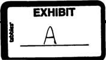

MusclePharm Corporation January 5, 2011 2 of 8

Page

otherwise complete the engagement. If, in our professional judgment, the circumstances require, we may resign from the engagement prior to completion.

We will design our audit to provide reasonable rather than absolute assurance of detecting errors or fraud that would have a material effect on the financial statements. Our work will be based primarily upon selected tests of evidence supporting the amounts and disclosures in the financial statements and, therefore, will not include a detailed check of your Company's transactions for the period. Accordingly, an audit performed in accordance with the standards of the PCAOB is not a guarantee of the accuracy of the financial statements, and there is a risk that material errors, fraud or illegal acts may exist and not be detected by us. Also, an audit is not designed to detect error or fraud that is immaterial to the financial statements. However, we will inform you of any material errors or fraud that come to our attention. We will also inform you of illegal acts that come to our attention, unless they are clearly inconsequential.

An audit includes obtaining an understanding of internal control sufficient to plan the audit and to determine the nature, timing and extent of audit procedures to be performed. An audit is not designed to provide assurance on internal control or to identify reportable conditions, which come to our attention during our engagement.

The working papers prepared in conjunction with our audit is the property of our Firm, constitute confidential information and will be retained by us in accordance with our Firm's policies and procedures.

## Reproduction of Audit Report

If MusclePharm Corporation plans any reproduction or publication of our report, or any portion of it, copies of masters or printers proofs of the entire document should be submitted to us in sufficient time for our review and approval before printing. You also agree to provide us with a copy of the final reproduced material for our approval before it is distributed. In addition, to avoid unnecessary delay or misunderstanding, it is important that you give us timely notice of your intention to issue any such document. Also, our reports should not be included in the SEC's EDGAR electronic filing system until you have received a manually signed report from us, which shall not be unreasonably withheld.

## Communications with Securities and Exchange Commission

The financial statements and supporting schedules included in Form 10-K and 10-Q are subject to review and comment by the staff of the Securities and Exchange Commission and to their interpretation of the applicable rules and regulations. This may involve discussions and communications with them, and/or the submission of supplemental data in connection with their review. We will inform each other of any such discussion, communication or submission which MusclePharm Corporation January 5, 2011 3 of 8

Page

may have bearing on the financial statements, schedules and other financial data in the filings and furnish each other with copies of related written communications. The Private Securities Litigation Reform Act of 1995 (the Act) has imposed additional responsibilities on SEC registrants, their management, audit committees and board of directors as well as independent auditors regarding the reporting of illegal acts that have or may have occurred. During the course of our audit, we will ask you for specific representations about this. To fulfill our responsibilities under the Act, we may need to consult with your Counsel, or counsel of our choosing on a confidential basis only, about any such illegal acts of which we become aware. Additional fees, including reasonable legal fees, if any, will be billed to you. You agree to cooperate fully with any procedures that we may deem necessary to perform.

## Review of Documents for Sale of Securities

In addition, the audited financial statements and our report thereon should not be provided or otherwise made available to recipients of any document to be used in connection with the sale of securities (including securities offerings on the Internet) without first submitting copies of the document to us in sufficient time for our review and approval.

## Filings under the Securities and Exchange Acts of 1933 and 1934

We confirm that our intention is to use these audited financial statements in a Form 10-K.

In the event that these audited financial statements will be used in connection with a registration statement, such as Form S-1, or any other filing that would incorporate this audit by reference, its inclusion in such filings may only occur upon our review and formal consent.

## Management Representations

As required by the standards of the PCAOB and AICPA, we will request certain written representations from management at the close of our audit, SAS No. 100 quarterly reviews and upon the issuance of our consent on any financial statements incorporated in a public filing. These written representations will also be used to confirm oral representations given to us and to indicate and document the continuing appropriateness of such representations and reduce the possibility of misunderstanding concerning matters that are the subject of the representations.

## Availability of Records

You agree that all records, documentation and information we request in connection with our audit will be made available to us (including those pertaining to related parties), and that all information will be disclosed to us and that we will have full cooperation of your personnel.

MusclePharm Corporation January 5, 2011 4 of 8

Page

## Assistance by Your Personnel

We also ask that your personnel, to the extent possible, prepare various schedules and analyses for our staff. This assistance by your personnel will serve to facilitate the progress of our work and minimize costs to you. The personnel you assign to assist in the preparation of schedules and the production of the financial statements preferably should have a background with public companies and related filing requirements. Due to the complex rules and regulations promulgated by the SEC, we believe that such personnel are necessary in order to maintain a high quality product.

***You also \_agree that you will prepare schedules and analysis for each balance sheet account at December 31, 2010. You will also prepare schedules and analysis for certain designated statement of operations accounts for the period ended December 31, 2010.\_These requests will be formalized to management of the organization upon the acceptance of this engagement, ***

## Quarterly Reports on Form 10-Q

We will perform a SAS No. 100 quarterly review of the Company's financial statements to be included in their 10-Q filing for the quarters ending March 31, 2011, June 30, 2011 and September 30, 2011, in accordance with guidelines prescribed by the SEC.

A review of interim financial information generally includes the following matters:

- ¢ The objective of a review of interim financial information is to provide the accountant with a basis for communicating whether he or she is aware of any material modifications that should be made to the interim financial information for it to conform with accounting principles generally accepted in the United States of America.
- Management is responsible for the entity's interim financial information.
- Management is responsible for establishing and maintaining effective internal control over financial reporting.
- Management is responsible for identifying and ensuring that the entity complies with the laws and regulations applicable to its activities.
- Management is responsible for making all financial records and related information available to the accountant.
- At the conclusion of the engagement, management will provide the accountant with a letter confirming certain representations made during the review.
- Management is responsible for adjusting the interim financial information to correct material misstatements. Although a review of interim financial information is not designed to obtain reasonable assurance that the interim financial information is free from material misstatement, management also is responsible for affirming in its representation

MusclePharm Corporation January 5, 2011 ;

Page 5 of 8

letter to the accountant that the effects of any uncorrected misstatements aggregated by the accountant during the current engagement and pertaining to the current-year period(s) under review are immaterial, both individually and in the aggregate, to the interim financial information taken as a whole.

- The accountant is responsible for conducting the review in accordance with standards established by the PCAOB. A review of interim financial information consists principally of performing analytical procedures and making inquiries of persons responsible for financial and accounting matters. It is substantially less in scope than an audit conducted in accordance with generally accepted auditing standards, the objective of which is the expression of an opinion regarding the financial statements taken as a whole. Accordingly, the accountant will not express an opinion on the interim financial information.
- A review includes obtaining sufficient knowledge of the entity's business and its internal control as it relates to the preparation of both annual and interim financial information to:
- o Identify the types of potential material misstatements in the interim financial information and consider the likelihood of their occurrence.
- o Select the inquiries and analytical procedures that will provide the accountant with a basis for communicating whether he or she is aware of any material modifications that should be made to the interim financial information for it to conform with generally accepted accounting principles.
- A
- review is not designed to provide assurance on internal control or to identify reportable conditions. However, the accountant is responsible for communicating, with the audit committee or others with equivalent authority or responsibility, regarding any reportable conditions that come to his or her attention.

## Dispute Resolution Procedure

To be covered under Florida State law as applicable.

## Other representations

Berman &amp; Company, P.A. was informed by you that to the best of your knowledge, that the following exists with respect to MusclePharm Corporation at December 31, 2010 and through the date of your response.

- eeee5e There are no currently outstanding or pending SEC investigations. There are no currently outstanding or pending SEC comment letters. There are no currently outstanding or pending FINRA investigations. There is no current or pending litigation that has not been previously disclosed.
- We are a reporting Company under the rules and regulations of the Securities and Exchange Acts of 1933 and/or 1934.

MusclePharm Corporation January 5, 2011

Page 6 of 8

- e Our Company is currently traded on the OTCBB under symbol MSLP.OB.
- e We do not have any predecessor company relationships that would require an audit in accordance with the Company moving forward.
- e of our officers, directors or &gt;10% stockholders have been convicted of any civil or criminal litigation, that which includes SEC or FINRA enforcement actions.
- ° We will inform you of all press releases intended to be published so that you may review and provide any necessary input. For press releases not involving or mentioning company financial performance, projections, incorporation or reference to audited or reviewed numbers, we will not be required to obtain your approval.
- e Once completed, the audited financial statements will be submitted to the Securities and Exchange Commission pursuant to the 1933/1934 Acts filing requirements.
- e The payment of professional fees to Berman &amp; Company, P.A. is not contingent upon a successful private placement, public offering or any other activity that would first need to be completed in order to raise capital or any other event that would need to occur so that funds would be available to pay for such professional fees. We understand that such an arrangement could violate the independence of Berman &amp; Company, P.A., and this violation could potentially be a breach of professional ethics. As a result, we agree to pay in full, the balance of such professional fees prior to the release of the signed audit opinion.

## Fees

Our fees for these services will be based upon our standard hourly rates, which range from $140 -$350/hr, plus out-of-pocket expenses. These expenses may include copying, printing, FEDEX/DHL, mileage, airfare, lodging, parking, tolls, meals, etc... The fee structure could change pending any unforeseen circumstances such as a material increase in operations, existence of inventory, cash to accrual adjustments, derivative financial instruments, or significant equity based transactions, etc...however, we will discuss any of these matters with you prior to performing any additional work.

At this time, we are requesting a retainer of $15,000 for our audit services. All retainers are nonrefundable.

Our invoices for these fees will be rendered periodically as work progresses and are payable upon presentation. As stated above, the ethics of our profession prohibit the rendering of professional services where the fee for such services is contingent, or has the appearance of being contingent, upon the results of such services. Accordingly, in order to avoid the possible implication that our fee is contingent upon future events, it is important that our bills be paid promptly when rendered. If a situation arises, in which it may appear that our independence would be questioned because of significant unpaid bills; we may be prohibited from signing our audit report and consent.

MusclePharm Corporation January 5, 2011 7 of 8

Page

## Other Services

We are always available to meet with you and/or other executives at various times throughout the year to discuss current business, operational, accounting and auditing matters affecting your Company. Whenever you feel such meetings are desirable, please let us know. We are also prepared to provide services to assist you in any of these areas. We will also be pleased, at your request, to attend to your directors and stockholders' meetings either in-person or via teleconference. Other services also include any fees incurred in connection with the reissuance of our consent on any 1933/1934 Act filings. This typically occurs when filing an unaudited stub update to keep the most recent years audit from becoming "stale", or in response to SEC/NASD comments. Our fees for other requested services will be billed at our standard hourly rates that range from $140 -$350 per hour, plus out-of-pocket expenses (as defined above).

This engagement includes only those services specifically described in this letter. Reasonable costs and time spent in legal matters or proceedings arising from our engagement, such as subpoenas, testimony or consultation involving private litigation, arbitration or government regulatory inquiries at your request or by subpoena will be billed to you separately and you agree to pay the same.

The Company agrees to release, indemnify, and hold Berman &amp; Company, P.A. (its partners, affiliates, heirs, executors, personal representatives, successors, and assigns) harmless from any liability and costs resulting from known misrepresentations by management.

The Company agrees to release, indemnify, and hold Berman &amp; Company, P.A. (its partners, affiliates, heirs, executors, personal representatives, successors, and assigns) harmless from any liability and costs resulting from fraud caused by or participated in by the management of the Company.

We reserve the right, at any time your account is overdue, to terminate or suspend our services hereunder. In the event that we elect to terminate our services, you will be obligated to compensate us for all time expended and to reimburse us for all out-of-pocket expenditures on your behalf through the date of termination. Our charges for other services will be agreed to separately.

We also reserve the right to terminate your account for any unforeseen situations that could have a bearing on our independence. An example of this would be your Company has provided financial statements for our review but there is a lack of underlying supporting documentation. The lack of documentation is significant as we cannot be in a position to provide bookkeeping services to assist in the completion of whatever may be needed, this would be a clear violation of our independence pursuant to the PCAOB rules and regulations.

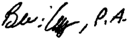

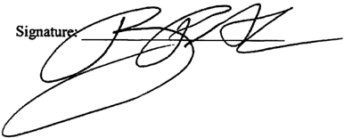

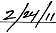

MusclePharm Corporation January 5, 2011 Page 8 of 8

Very truly yours,

buily

AA

Berman &amp; Company, P.A. Certified Public Accountants

## RESPONSE:

This letter correctly sets forth the understanding as delineated on pages 1, 2, 3, 4, 5, 6, 7, and 8 of this document of MusclePharm Corporation

By:

[

y

tact

Title:

## Ceo

(Brad Pyatt — please print)

(Chairman of the Board of Directors)

Signatur

Date:

2fy Ltt

January 1, 2012

The Board of Directors of: MusclePharm Corporation C/O Mr. Brad Pyatt, Chairman of the Board of Directors 4721 Ironton Street Denver, Colorado 90839

Dear Mr. Pyatt:

This agreement is intended to describe the nature and scope of our services.

## Audit

As agreed, we will audit the consolidated balance sheet of MusclePharm Corporation and Subsidiary as of December 31, 2011, and the related consolidated statements of operations, stockholders' deficit and cash flows for the year then ended, in accordance with the standards of the Public Company Accounting Oversight Board (United States) ("PCAOB").

The financial records and financial statements are the responsibility of your Company's management. In that regard, management is responsible for establishing and maintaining effective internal control over financial reporting, establishing and maintaining proper accounting records, selecting appropriate accounting principles, safeguarding company assets and complying with relevant laws and regulations. Management is also responsible for making all financial records and related information available to us.

Our responsibility is to express an opinion on the financial statements based on our audit. An audit includes examining, on a test basis, evidence supporting the amounts and disclosures in the financial statements, assessing the accounting principles used and significant estimates made by management and evaluating the overall financial statement presentation.

At the conclusion of our audit, we will submit to you a report containing our opinion as to whither the financial statements, taken as a whole, are fairly presented based on U.S. generally accepted accounting principles. If during the course of our work it appears for any reason that we will not be in a position to render an unqualified opinion on the financial statements, or that our report will require an explanatory paragraph, we will discuss this with you. It is possible that because of unexpected circumstances, we may determine that we cannot render a report or otherwise complete the engagement. If, in our professional judgment, the circumstances require, we may resign from the engagement prior to completion.

We will design our audit to provide reasonable rather than absolute assurance of detecting errors or fraud that would have a material effect on the financial statements. Our work will be based primarily upon selected tests of evidence supporting the amounts and disclosures in the financial

## 551 NW 77th Street Suite 201 © Boca Raton, FL 33487 Phone: (561) 864-4444 © Fax: (561) 892-3715 rmancpas.com © info@bermancpas.com Registered with ith the PCAOB © Member AICPA Center for Audit Quality Me American Institute of Cert "1 Public Accoun: Member Florida Institute of Certified Public "Accountants.

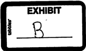

statements and, therefore, will not include a detailed check of your Company's transactions for the period. Accordingly, an audit performed in accordance with the standards of the PCAOB is not a guarantee of the accuracy of the financial statements, and there is a risk that material errors, fraud or illegal acts may exist and not be detected by us. Also, an audit is not designed to detect error or fraud that is immaterial to the financial statements. However, we will inform you of any material errors or fraud that come to our attention. We will also inform you of illegal acts that come to our attention, unless they are clearly inconsequential.

An audit includes obtaining an understanding of internal control sufficient to plan the audit and to determine the nature, timing and extent of audit procedures to be performed. An audit is not designed to provide assurance on internal control or to identify reportable conditions, which come to our attention during our engagement. , \_

The working papers prepared in conjunction with our audit is the property of our Firm, constitute confidential information and will be retained by us in accordance with our Firm's policies and procedures. ;

## Reproduction of Audit Report

If MusclePharm Corporation plans any reproduction or publication of our report, or any portion of it, copies of masters or printers proofs of the entire document should be submitted to us in sufficient time for our review and approval before printing. You also agree to provide us with a copy of the final reproduced material for our approval before it is distributed. In addition, to avoid unnecessary delay or misunderstanding, it is important that you give us timely notice of your intention to issue any such document. Also, our reports should not be included in the SEC's EDGAR electronic filing system until you have received a manually signed report from us, which shall not be unreasonably withheld.

## Communications with Securities and Exchange Commission

The financial statements and supporting schedules included in Form 10-K and 10-Q are subject to review and comment by the staff of the Securities and Exchange Commission and to their interpretation of the applicable rules and regulations. This may involve discussions and communications with them, and/or the submission of supplemental data in connection with their review. We will inform each other of any such discussion, communication or submission which may have bearing on the financial statements, schedules and other financial data in the filings and furnish each other with copies of related written communications. The Private Securities Litigation Reform Act of 1995 (the Act) has imposed additional responsibilities on SEC registrants, their management, audit committees and board of directors as well as independent auditors regarding the reporting of illegal acts that have or may have occurred. During the course of our audit, we will ask you for specific representations about this. To fulfill our responsibilities under the Act, we may need to consult with your Counsel, or counsel of our choosing on a confidential basis only, about any such illegal acts of which we become aware.

MusclePharm Corporation January 1, 2012 3 of 7

Additional fees, including reasonable legal fees, if any, will be billed to you. You agree to cooperate fully with any procedures that we may deem necessary to perform.

## Review of Documents for Sale of Securities

In addition, the audited financial statements and our report thereon should not be provided or otherwise made available to recipients of any document to be used in connection with the sale of securities (including securities offerings on the Internet) without first submitting copies of the document to us in sufficient time for our review and approval.

## Filings under the Securities and Exchange Acts of 1933 and 1934

We confirm that our intention is to use these audited financial statements in a Form 10-K.

In the event that these audited financial statements will be used in connection with a registration statement, such as Form S-1, or any other filing that would incorporate this audit by reference, its inclusion in such filings may only occur upon our review and formal consent.

## Management Representations

As required by the standards of the PCAOB and AICPA, we will request certain written representations from management at the close of our audit, SAS No. 100 quarterly reviews and upon the issuance of our consent on any financial statements incorporated in a public filing. These written representations will also be used to confirm oral representations given to us and to indicate and document the continuing appropriateness of such representations and reduce the possibility of misunderstanding concerning matters that are the subject of the representations.

## Availability of Records

You agree that all records, documentation and information we request in connection with our audit will be made available to us (including those pertaining to related parties), and that all information will be disclosed to us and that we will have full cooperation of your personnel.

## Assistance by Your Personnel

We also ask that your personnel, to the extent possible, prepare various schedules and analyses for our staff. This assistance by your personnel will serve to facilitate the progress of our work and minimize costs to you. The personnel you assign to assist in the preparation of schedules and the production of the financial statements preferably should have a background with public companies and related filing requirements. Due to the complex rules and regulations promulgated by the SEC, we believe that such personnel are necessary in order to maintain a high quality product.

***You\_also\_agree\_ that you will prepare schedules and analysis for each balance sheet account at December 31, 2011. You will also prepare schedules and analysis for certain designated statement of operations accounts for the period ended December 31, 2011. These requests will be formalized to management of the organization upon the acceptance of this engagement, ***

## Quarterly Reports on Form 10-Q

We will perform a SAS No. 100 quarterly review of the Company's financial statements to be included in their 10-Q filing for the quarters ending March 31, 2012, June 30, 2012 and September 30, 2012, in accordance with guidelines prescribed by the SEC.

A review of interim financial information generally includes the following matters:

- e The objective of a review of interim financial information is to provide the accountant with a basis for communicating whether he or she is aware of any material modifications that should be made to the interim financial information for it to conform with accounting principles generally accepted in the United States of America.
- « Management is responsible for the entity's interim financial information.
- ¢ Management is responsible for establishing and maintaining effective internal control over financial reporting. | :
- « Management is responsible for identifying and' ensuring that the entity complies with the laws and regulations applicable to its activities.
- Management is responsible for making all financial records and related information available to the accountant.
- e At the conclusion of the engagement, management will provide the accountant with a letter confirming certain representations made during the review.
- ¢ Management is responsible for adjusting the interim financial information to correct material misstatements. Although a review of interim financial information is not designed to obtain reasonable assurance that the interim financial information is free from material misstatement, management also is responsible for affirming in its representation letter to the accountant that the effects of any uncorrected misstatements aggregated by the accountant during the current engagement and pertaining to the current-year period(s) under review are immaterial, both individually and in the aggregate, to the interim financial information taken as a whole.
- « The accountant is responsible for conducting the review in accordance with standards established by the PCAOB. A review of interim financial information consists principally of performing analytical procedures and making inquiries of persons responsible for financial and accounting matters. It is substantially less in scope than an audit conducted in accordance with generally accepted auditing standards, the objective of which is the expression of an opinion regarding the financial statements taken as a whole. Accordingly, the accountant will not express an opinion on the interim financial information.

January

1,

## Page 5 of 7

- ¢ A review includes obtaining sufficient knowledge of the entity's business and its internal contro} as it relates to the preparation of both annual and interim financial information to:
- o Identify the types of potential material misstatements in the interim financial information and consider the likelihood of their occurrence.
- o Select the inquiries and analytical procedures that will provide the accountant with a basis for communicating whether he or she is aware of any material modifications that should be made to the interim financial information for it to conform with generally accepted accounting principles.
- e A review is not designed to provide assurance on internal control or to identify reportable conditions. However, the accountant is responsible for communicating with the audit committee or others with equivalent authority or responsibility, regarding any reportable conditions that come to his or her attention.

## Dispute Resolution Procedure

To be covered under Florida State law as applicable.

## Other representations

Berman &amp; Company, P.A. was informed by you that to the best of your knowledge, that the following exists with respect to MusclePharm Corporation at December 31, 2011 and through the date of your response.

- There are no currently outstanding or pending SEC investigations.
- There are no currently outstanding or pending SEC comment letters.
- There are no currently outstanding or pending FINRA investigations.
- There is no current or pending litigation that has not been previously disclosed.
- We are a reporting Company under the rules and regulations of the Securities and Exchange Acts of 1933 and/or 1934.
- Our Company is currently traded on the OTCBB under symbol MSLP.
- We do not have any predecessor company relationships that would require an audit in accordance with the Company moving forward.
- of our officers, directors or &gt;10% stockholders have been convicted of any civil or criminal litigation, that which includes SEC or FINRA enforcement actions.
- We will inform you of all press releases intended to be published so that you may review and provide any necessary input. For press releases not involving or mentioning company financial performance, projections, incorporation or reference to audited or reviewed numbers, we will not be required to obtain your approval.
- Once completed, the audited financial statements will be submitted to the Securities and Exchange Commission pursuant to the 1933/1934 Acts filing requirements.
- The payment of professional fees to Berman &amp; Company, P.A. is not contingent upon a successful private placement, public offering or any other activity that would first need to be completed in order to raise capital or any other event that would need to occur so that funds would be available to pay for such professional fees.

2012

MusclePharm Corporation January 1, 2012 Page 6 of 7

We understand that such an arrangement could violate the independence of Berman &amp; Company, P.A., and this violation could potentially be a breach of professional ethics. As a result, we agree to pay in full, the balance of such professional fees prior to the release of the signed audit opinion.

## Fees

Our. fees for these services will be based upon our standard hourly rates which range from $140 -$350/hr for the audit, which will be filed on Form 10-K; and will also be based upon our standard hourly rates for any SAS No. 100 quarterly reviews to be filed on Form 10-Q, respectively, plus out-of-pocket expenses. These expenses may include copying, printing, FEDEX/DHL, mileage, airfare, lodging, parking, tolls, meals, etc... The fee structure could change pending any unforeseen circumstances such as a material increase in operations (which is expected in 2012), existence of inventory or significant equity based transactions, derivative liability accounting, concurring partner fees, etc...however, we will discuss any of these matters with you prior to performing any additional work.

Our invoices for these fees will be rendered periodically as work progresses and are payable upon presentation. As stated above, the ethics of our profession prohibit the rendering of professional services where the fee for such services is contingent, or has the appearance of being contingent, upon the results of such services. Accordingly, in order to avoid the possible implication that our fee is contingent upon future events, it is important that our bills be paid promptly when rendered. If a situation arises, in which it may appear that our independence would be questioned because of significant unpaid bills; we may be prohibited from signing our audit report and consent.

## Other Services

We are always available to meet with you and/or other executives at various times throughout the year to discuss current business, operational, accounting and auditing matters affecting your Company. Whenever you fee] such meetings are desirable, please let us know. We are also prepared to provide services to assist you in any of these areas. We will also be pleased, at your request, to attend to your directors and stockholders' meetings either in-person or via teleconference. Other services also include any fees incurred in connection with the reissuance of our consent on any 1933/1934 Act filings. This typically occurs when filing an unaudited stub update to keep the most recent years audit from becoming "stale", or in response to SEC/FINRA comments. Our fees for other requested services will be billed at our standard hourly rates that range from $140 -$350 per hour, plus out-of-pocket expenses (as defined above).

This engagement includes only those services specifically described in this letter. Reasonable costs and time spent in legal matters or proceedings arising from our engagement, such as subpoenas, testimony or consultation involving private litigation, arbitration or government regulatory inquiries at your request or by subpoena will be billed to you separately and you agree to pay the same.

MusclePharm Corporation January 1, 2012 Page 7 of 7

The Company agrees to release, indemnify, and hold Berman &amp; Company, P.A. (its partners, affiliates, heirs, executors, personal representatives, successors, and assigns) harmless from any liability and costs resulting from known misrepresentations by management.

The Company agrees to release, indemnify, and hold Berman &amp; Company, P.A. (its partners, affiliates, heirs, executors, personal representatives, successors, and assigns) harmless from any liability and costs resulting from fraud caused by or participated in by the management of the Company.

We reserve the right, at any time your account is overdue, to terminate or suspend our services hereunder. In the event that we elect to terminate our services, you will be obligated to compensate us for all time expended and to reimburse us for all out-of-pocket expenditures on your behalf through the date of termination. Our charges for other services will be agreed to separately.

We also reserve the right to terminate your account for any unforeseen situations that could have a bearing on our independence. An example of this would be your Company has provided financial statements for our review but there is a lack of underlying supporting documentation. The lack of documentation is significant as we cannot be in a position to provide bookkeeping services to assist in the completion of whatever may be needed, this would be a clear violation of our independence pursuant to the PCAOB rules and regulations.

Very truly yours,

Berman &amp; Company, P.A. Certified Public Accountants

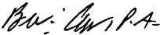

This letter correctly sets forth the understanding as delineated on pages 1, 2, 3, 4, 5, 6, 7, and 8 of this document of MusclePharm Corporation.

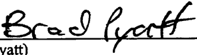

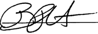

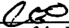

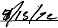

By:

=

a)

(

oct

Title:

LA

## Geo

Grad Pyatt)

(Chairman of the Board of Directors)

seme

DA

Date:

/

p

VA

ZZ

a2

4

'

|

'There is another version of this where | made comments, can't seem to locate. Did | send to Arthur?

## SECURITIES AND EXCHANGE COMMISSION

DENVER REGIONAL OFFICE 1801 Califomia Street, Suite 1500 Denver, Colorado 80202

Date:

November 26, 2012

To:

Arthur G. Jakoby, Esq. Herrick, Feinstein, LLP

Fax Number:

212-545-3340

From:

Kimberly L. Frederick Staff Attomey, Division of Enforcement U.S. Securities and Exchange Commission

Voice Number (Direct):

(303) 844-1034

Voice Number (Main):

(303) 844-1000

Fax Number:

(303) 844-1010

Subject:

In the Matter of MusclePharm Corp. (MD-03309)

Pages (including cover page):

20

Comments:

See attached letter.

This facsimile transmission is intended for the named recipient only and may contain confidential or privileged material. If you receive this transmission in error please notify the sender at the telephone number listed above immediately.

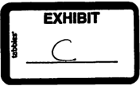

UNITED STATES SECURITIES AND EXCHANGE COMMISSION DENVER REGIONAL OFFICE 1801 CALIFORNIA STREET Surre 1500 DENVER, COLORADO 80202

November 20, 2012

## VIA EMAIL

Arthur G. Jakoby, Esq. Herrick, Feinstein, LLP 2 Park Avenue New York, New York 10016 ajakoby@herrick.com

Re:

In the Matter of MusclePharm Corp. (MD-03309)

Dear Mr. Jakoby:

The Securities and Exchange Commission is conducting an inquiry into MusclePharm Corporation ("MusclePharm"), and is requesting that your client Berman &amp; Company, PA. ("Berman") voluntarily produce documents to the staff. The staff of the Securities and Exchange Commission requests that Berman voluntarily produce the documents listed in Attachment A to my attention at the above address on or before December 7, 2012. This inquiry is non-public and should not be construed as an indication that the Commission or its staff believes any violation of law has occurred, nor should you consider it an adverse reflection upon any person, entity, or security.

The documents requested should be accompanied by a list that briefly identifies each document or each set of data, and the item or items of the request to which it relates. If any of the documents called for are not produced, for any reason, including any withheld because of a claim of privilege, please submit a list stating: (a) the creator(s) of the documents; (b) the date of creation of the documents; (c) their present, or last known, custodian; (d) the subject matter of the documents, including a brief description of any enclosed documents; (e) all persons or entities known to have been furnished the documents or copies of the documents, or information of their substance; and (f) the reason the documents are not produced.

Please have a declaration certifying records of regularly conducted business activity in the form attached hereto completed, executed, and returned to the staff. Please feel free to contact me for an editable, electronic version of the form. Note that execution of the Declaration may allow the Commission to introduce documents provided by Berman in any subsequent judicial proceeding, without requiring the testimony of your custodian of records.

Please produce all data and documents in accordance with the attached SEC Data Delivery Standards, which require production of all data and documents in electronic format, on CD or

In replying Please quotes

Mb-03309

DVD. You should also include an index briefly describing each item you send; and the database should include a reference to the paragraph(s) in Attachment A to which each document responds. The Commission cannot reimburse you for the costs of electronic production or copying costs.

If you have any questions concerning the electronic production of data and documents, please contact me. A conversation between our respective litigation/technical support managers will be the most efficient method of assuring that any data production is in a format acceptable to this office. Please contact me to arrange a mutually convenient time for such conference.

Please note that information you provide is subject to the Commission's routine uses. A list of those uses is contained in the enclosed copy of SEC Form 1662. This form also contains important information for persons requested to supply information to the Commission.

Berman should take all actions necessary to preserve data and documents regarding any of the topics in this voluntary request and refrain from deleting or destroying any documents responsive to this request, even if Berman might otherwise take such actions in the ordinary course of its business. The preservation of data and documents should include preservation of finalized or draft documents that are responsive to this request that may be located on the computers of Berman employees, and all electronic mail (including sent, received and deleted e-mail) of any Berman employee who may have any information relevant to any of the topics discussed in this voluntary document request.

If you have any questions concerning this matter, please call me at (303) 844-1034. Thank you for your cooperation in this matter.

Sincerely,

~

Kimberly L. Frederick Staff Attorney, Division of Enforcement

Enclosures:

Attachment A Draft Business Records Declaration Form 1662 SEC Image and Data Delivery Standards

## ATTACHMENT A DOCUMENT REQUEST FOR BERMAN &amp; COMPANY, P.A.

## In the Matter of MusclePharm Corp. (MD-03309)

## L DEFINITIONS AND INSTRUCTIONS

1. The term "Berman" means Berman &amp; Company P.A. and includes all of its parents, USS. and non-U:S. subsidiaries, divisions, affiliates, predecessors, successors, officers, directors, employees, agents, partners, limited parmers, and independent contractors, as well as aliases, code names, trade names, or business names used by, or formerly used by, any of the foregoing.
2. The term "MusclePharm" means MusclePharm Corporation, and includes all of its parents, U.S. and non-U.S. subsidiaries, including MusclePharm Bank, divisions, affiliates, predecessors, successors, officers, directors, employees, agents, partners, limited partners, and independent contractors, as well as aliases, code names, trade names, or business names used by, or formerly used by, any of the foregoing.
3. The term "document" means all materials in your possession, custody, or control or subject to your custody or control, whether drafts or unfinished versions, originals or nonconforming copies thereof, however created, produced or stored (manually, mechanically, electronically or otherwise), and by whomever prepared, produced, sent, dated or received, including, but not limited to, books, papers, files, notes, minutes, summaries, records, analyses, correspondence, memoranda, working papers, ledger sheets, confirmations, order tickets, floor tickets, invoices, account statements, reports, wires, telegrams, telexes, telephone logs, notes or records of conversations or meetings, contracts, agreements, calendars, date books, work sheets, invoices, bills, records of payment, magnetic tape, tape recordings, disks, diskettes, disk packs, and other electronic media, microfilm, microfiche, storage devices, appointment books, diaries, notices and message slips.
4. The term "communication" means and includes, without limitation, any correspondence, memoranda, notes, summaries, electronic mail, telephone conversations, and other conversations, conferences or meetings. The term "communication" includes documents evidencing communications.
5. A communication or document "concerning," "involving," "relating," "related," or "which relates" to any given subject means any communication or document that constitutes, contains, discusses, embodies, evidences, reflects, identifies, states, refers to, deals with, bears upon, or is in any way pertinent to that subject, including documents concerning the preparation of other documents.
6. Reference to a person shall also include that person's trusts, affiliates, employees, agents, partners, and independent contractors, as well as aliases, code names, trade names, or business names used by, or formerly used by, any of the foregoing.

7. You should produce all documents and other materials described below in your actual or constructive possession or custody or subject to your control, as further described herein.
8. If you claim attorney-client privilege, or any other privilege or protection from production, as to any of the requests below, provide a list of the subject documents, indicating the date prepared, authors, recipients, subjects, and the privilege or protection claimed, sufficiently identifying the documents to which you claim the privilege or protection attaches, in order that the staff may determine whether to request in camera inspection by a federal district court judge.
9. "You" and "your" refer to Berman.
10. "And" and "or" shall be construed either disjunctively or conjunctively as necessary to bring within the scope of this request all documents that might otherwise be construed to be outside the scope.
11. The use of the singular form of any word includes the plural and vice versa.
12. Provide a list of the documents you produce, indicating in each instance the request to which the document is responsive. Also, identify and generally describe all requested documents that you do not produce and indicate the location of each such document and your reason for not producing it.

## I. PRODUCTION

Please produce the following documents (whether maintained in hard copy or in electronic form) beginning with January 1, 2010 and ending with the date of your response to this request, unless otherwise indicated herein:

1. All documents relating to audit and review services performed by Berman for MusclePharm, for fiscal 2010 through the present, including but not limited to, the following:
- a. All workpapers, including but not limited to, any restricted workpapers or tax accrual workpapers, related to annual audits and quarterly reviews;
- b. All documents provided by MusclePharm to Berman that were not included in Berman's formal work papers. This request also includes documents prepared/created by Berman but not included in Berman's formal workpapers;
- c. All indices or legends that describe the referencing system or abbreviations used in the workpapers;
- d. All top files, summary or completion memoranda, matters for the attention of the partner, "To Do" lists, review notes, point sheets, problems memoranda, partner's memoranda, supervisor's memoranda, senior's

.

memoranda, quality control review notes and all other writings or memoranda that summarize, evaluate, highlight or analyze the engagement of specific points, problems or issues that arose during the engagement;

- % All documents concerning planning for any audit or review of MusclePharm's financial statements, including but not limited to planning memoranda, audit programs, audit manuals, materiality assessments, group instructions issued to audits of subsidiaries, and representation letters;
- f. All materials relating to MusclePharm's financial reporting practices, system of internal controls, or internal audits;
- g. Financial statement files supporting MusclePharm's balance sheet, income statement, statement of cash flows, accompanying footnotes, and supplementary schedules;
- a Proposed adjusting journal entries and actual adjusting journal entries and all proposed and/or accepted reclassification entries and consolidations;
- i. All communications between Berman and MusclePharm, including, but not limited to, all engagement letters, contracts, or other documents that define the nature and the scope of work or engagement concerning any work, including consulting work, contemplated or performed by Berman or its affiliates, management representation letters and management letters, email with attachments, memoranda, and documents presented to MusclePharm's Board of Directors, Audit Committee, Disclosure Committee, or any other Board of Director's committee, including but not limited to internal investigations;
- j. All communications between Berman and all prospective and actual successor auditors to MusclePharm.
- k. All intemal communications of Berman relating to MusclePharm, including all letters, e-mails with attachments, and memoranda.
1. All general, permanent, legal, carry forward, bulk, or other files representing documents of an on-going relevance from one year to another, including, but not limited to, contracts, leases and bylaws; and
- m. Copies of predecessor's workpapers and notes related to reviews of such documents.
2. To the extent not produced in response to Item 1 above, produce the following:
- a All personal and desk files of all Berman personnel related to or conceming Berman's audit and review services provided to MusclePharm.

- b. All drafts of financial statements with accompanying footnotes and auditor's reports, as originally drafted, as revised and finalized, and consolidated statements with consolidating and eliminating entries;
- c. All documents relating to presentations to, or communications with, MusclePhann's Board of Directors or any Board of Director's committee conceming MusclePharm's financial statements, disclosures, accounting policies, and/or internal controls;
- d. All documents relating to or memorializing any meetings, telephone conversations or communications with MusclePharm's management, employees, directors, Board of Directors, or any Board of Director's committee;
- e. All documents relating to any possible irregularity, impropriety, or material error involving MusclePharm books and records, financial statements, or internal accounting controls;
- f. All documents and communications relating to or concerning any investigation, inquiry, analysis, in-depth review, or examination of any actual or contemplated accounting or reporting irregularity, error, or restatement of MusclePharm's financial statements, including but not limited to, interviews, analyses, reports, agendas, notes, memoranda, workpapers, and correspondence.
- g. All diaries of senior partners, engagement partners, managers, seniors and staff that relate to meetings, contacts, and conversations with MusclePhann.
- h. All documents and communications related to Berman's dismissal as independent auditor of MusclePharm.

## DECLARATION OF BERMAN &amp; COMPANY, P.A. CERTIFYING RECORDS OF REGULARLY CONDUCTED BUSINESS ACTIVITY

I, the undersigned, [insert name}, pursuant to 28 U.S.C. § 1746, declare that:

1. Tam employed by Berman &amp; Company, P.A. as [insert position} and by reason of my position am authorized and qualified to make this declaration. [if possible supply additional information as to how person is qualified to make declaration, e.g., I am custodian of records, I am familiar with the company’s recordkeeping practices or systems, etc.]

- I further certify that the documents [attached hereto or submitted herewith] and stamped [insert bates range] are true copies of records that were:

- (a) made at or near the time of the occurrence of the matters set forth therein, by, or from information transmitted b_{y,a} person with knowledge of those matters;

- (b) kept in the course of regularly conducted business activity; and

- (c) made by the regularly conducted business activity as a regular practice.

I declare under penalty of perjury that the foregoing is true and correct. Executed on [date].

[Name]

s

¢

## SECURITIES AND EXCHANGE COMMISSION Washington, D.C. 20549

Supplemental Information for Persons Requested to Supply Information Voluntarily or Directed to Supply Information Pursuant to a Commission Subpoena

## A. False Statements and Documents

Section 1001 of Title 18 of the United States Code provides as follows:

Whoever, in any matter within the jurisdiction of any department or agency of the United States knowingly and willfully falsifies, conceals or covers up by any trick, scheme, or device a material fact, or makes any false, fictitious or fraudulent statements or representations, or makes or uses any false writing or document knowing the same to contain any false, fictitious or fraudulent statement or entry, shall be fined under this titte or imprisoned not more than five years, or both.

## B. Testimony

If your testimony is taken, you should be aware of the following:

1. Record. Your testimony will be transcribed by a reporter. If you desire to go off the record, please indicate this to the Commission employee taking your testimony, who will determine whether to grant your request. The reporter will not go off the record at your, or your counse''s, direction.
2. Counsel. You have the right to be accompanied, represented and advised by counse! of your choice. Your counsel may advise you before, during and after your testimony; question you briefly at the conclusion of your testimony to clarify any of the answers you give during testimony, and make summary notes during your testimony solely for your use. If you are accompanied by counsel, you may consult privately.

If you are not accompanied by counsel, please advise the Commission employee taking your testimony if, during the testimony, you desire to be accompanied, represented and advised by counsel. Your testimony will be adjoumed once to afford you the opportunity to arrange to be so accompanied, represented or advised.

You may be represented by counsel who also represents other persons involved in the Commission's investigation. This multiple representation, however, presents a potential conflict of interest if one client's interests are or may be adverse to another's. If you are represented by counsel who also represents other persons involved in the investigation, the Commission will assume that you and counsel have discussed and resolved ail issues conceming Possible conflicts of interest. The choice of counsel, and the responsibility for that choice, is yours.

3. Transcript Availability. Rule 6 of the Commission's Rules Relating to Investigations, 17 CFR 203.6, states:

A person who has submitted documentary evidence or testimony in a formal investigative proceeding shall be entitled, upon written request, to procure a copy of his documentary evidence or a transcript of his testimony cn payment of the appropriate fees: Provided, however, That in a nonpublic formal investigative proceeding the Commission may for good cause deny such request. In any event, any witness, upon proper identification, shall have the right to inspect the official transcript of the witness' own testimony.

If you wish to purchase a copy of the transcript of your testimony, the reporter will provide you with a copy of the appropriate form. Persons requested to supply information voluntarily will be allowed the rights provided by this rule.

4. Perjury. Section 1621 of Title 18 of the United States Code provides as follows:

Whoever . . . having taken an oath before a competent tribunal, officer, or person, in any case in which a law of the United States authorizes an oath to be administered, that he will testify, declare, depose, or certify truly . . . willfully and contrary to such cath states or subscribes any materia! matter which he does not believe to be true . . . is guilty of perjury and shall, except as otherwise expressly provided by law, be fined under this title or imprisoned not more than five years or both... .

5. Fifth Amendment and Voluntary Testimony. Information you give may be used against you in any federal, state, local or foreign administrative, civil or criminal proceeding brought by the Commission or any other agency.

SEC 1662 (09-11)

t

You may refuse, in accordance with the rights guaranteed to you by the Fifth Amendment to the Constitution of the United States, to give any information that may tend to incriminate you.

if your testimony is not pursuant to subpoena, your appearance to testify is voluntary, you need not answer any question, and you may leave whenever you wish. Your cocperation is, however, appreciated.

6. . Formal Order Availability. If the Commission has issued a fermal order of investigation, it will be shown to you during your testimony, at your request. If you desire a copy of the formal order, please make your request in writing.

## C. Submissions and Settlements

Rule 5(c) of the Commission's Rules on Informal and Other Procedures, 17 CFR 202.5(c), states:

Persons who become involved in . . . investigations may, on their own initiative, submit a written statement to the Commission setting forth their interests and position in regard to the subject matter of the investigation. Upon request, the staff, in its discretion, may advise such persons of the general nature of the investigation, including the indicated violations as they pertain to them, and the amount of time that may be available for preparing and submitting a statement prior to the presentation of a staff recommendation to the Commission for the commencement of an administrative or injunction proceeding. Submissions by interested persons should be forwarded to the appropriate Division Director or Regional Director with a copy to the staff members conducting the investigation and should be clearly referenced to the specific investigation to which they relate. In the event a recommendation for the commencement of an enforcement proceeding is presented by the staff, any submissions by interested persons will be forwarded to the Commission in conjunction with the staff memorandum.

The staff of the Commission routinely seeks to introduce submissions made pursuant to Rule 5(c) as evidence in Commission enforcement proceedings, when the staff deems appropriate.

Rule 5(f) of the Commission's Rules on Informal and Other Procedures, 17 CFR 202.5(f), states:

In the course of the Commission's investigations, civil lawsuits, and administrative proceedings, the staff, with appropriate authorization, may discuss with persons involved the disposition of such matters by consent, by settlement, or in some other manner. Itis the policy of the Commission, however, that the disposition of any such matter may not, expressly or impliedly, extend to any criminal charges that have been, or may be, brought against any such person or any recommendation with respect thereto. Accordingly, any person involved in an enforcement matter before the Commission who consents, or agrees to consent, to any judgment or order does so solely for the purpose of resolving the claims against him in that investigative, civil, or administrative matter and not for the purpose of resolving any criminal charges that have been, or might be, brought against him. This policy reflects the fact that neither the Commission nor its staff has the authority or responsibility for instituting, conducting, settling, or otherwise disposing of criminal proceedings. That authority and responsibility are vested in the Attommey General and representatives of the Department of Justice.

## D. Freedom of Information Act

The Freedom of Information Act, 5 U.S.C. 552 (the "FOIA"), generally provides for disclosure of information to the public. Rule 83 of the Commission's Rules cn Information and Requests, 17 CFR 200.83, provides a procedure by which a person can make a written request that information submitted to the Commission not be disclosed under the FOIA. That cule states that no determination as to the validity of such a request will be made until a request for disclosure of the information under the FOIA is received. Accordingly, no response to a request that information not be disclosed under the FOIA is necessary or will be given until a request for disclosure under the FOIA is received. If you desire an acknowledgment of receipt of your written request that information not be disclosed under the FOIA, please provide a duplicate request, together with a stamped, self addressed envelope.

## E. Authority for Solicitation of Information

Persons Directed to Supply Information Pursuant to Subpoena. The authority for requiring production of information is set forth in the subpcena. Disclosure of the information to the Commission is mandatory, subject to the valid assertion of any legal right or privilege you might have.

Persons Requested to Supply information Voluntarily. One or more of the following provisions authorizes the Commission to solicit the information requested: Sections 19 and/or 20 of the Securities Act of 1933; Section 21 of the Securities Exchange Act of 1934; Section 321 of the Trust Indenture Act of 1939; Section 42 of the Investment

'

Company Act of 1940; Section 209 of the Investment Advisers Act of 1940; and 17 CFR 202.5. Disclosure of the fequested information to the Commission is voluntary on your part.

## F. Effect of Not Supplying Information

Persons Directed to Supply information Pursuant to Subpoena. If you fail to comply with the subpoena, the Commission may seek a court order requiring you to do so. If such an order [s obtained and you thereafter fail to supply the information, you may be subject to civil and/or criminal sanctions for contempt of court. In addition, if the subpoena was issued pursuant to the Securities Exchange Act of 1934, the Investment Company Act of 1940, and/or the Investment Advisers Act of 1940, and if you, without just cause, fail or refuse to attend and testify, or to answer any lawful inquiry, or to produce books, papers, correspondence, memoranda, and other records in compliance with the subpoena, you may be found guilty of a misdemeanor and fined not more than $1,000 or imprisoned for a tenn of not more than one year, or both.

Persons Requested to Supply Information Voluntarily. There are no direct sanctions and thus no direct effects for failing to provide all or any part of the requested information.

## G. Principal Uses of Information

The Commission's principal purpose in soliciting the Information is to gather facts in order to determine whether any person has violated, is violating, or is about to viclate any provision of the federal securities laws or rules fer which the Commission has enforcement authority, such as rules of securities exchanges and the rules of the Municipal Securities Rulemaking Board. Facts developed may, however, constitute violations of other laws or rules. Information provided may be used in Commission and other agency enforcement proceedings. Unless the Commission or its staff explicitly agrees to the contrary in writing, you should not assume that the Commission or tts staff acquiesces In, accedes to, or concurs or agrees with, any position, condition, request, reservation of right, understanding, or any other statement that purports, or may be deemed, to be or to refiect a limitation upon the Commission's receipt, use, disposition, transfer, or retention, in accordance with applicable law, of information provided.

## H. Routine Uses of Information

The Commission often makes its files available to other governmental agencies, particularly United States Attomeys and state prosecutors. There is a likelihood that information supplied by you will be made available to such agencies where appropriate. Whether or not the Commission makes its files available to other govemmental agencies is, in general, a confidential matter between the Commissicn and such other govemmental agencies.

Set forth below is a list of the routine uses which may be made of the information furmished.

1. To appropriate agencies, entities, and persons when (a) it is suspected or confirmed that the security or confidentiality of information in the system of records has been compromised; (b) the SEC has determined that, as a result of the suspected or confirmed compromise, there is a risk of harm to economic or property interests, identity theft or fraud, or harm to the security or integrity of this system or other systems or programs (whether maintained by the SEC or another agency or entity) that rely upon the compromised Information; and (c) the disclosure made to such agencies, entities, and persons is reasonably necessary to assist in connection with the SEC's efforts to respond to the suspected or confirmed compromise and prevent, minimize, or remedy such ham.
2. To other federal, state, local, or foreign law enforcement agencies; securities self-regulatory organizations; and foreign financial regulatory authorities to assist In or coordinate regulatory or law enforcement activities with the SEC.
3. To national securities exchanges and national securities associations that are registered with the SEC, the Municipal Securities Rulemaking Board; the Securities Investor Protection Corporation; the Public Company Accounting Oversight Board; the federal banking authorities, including, but not limited to, the Board of Govemors of the Federal Reserve System, the Comptroller of the Currency, and the Federal Deposit insurance Corporation; state securities regulatory agencies or organizations; or regulatory authorities of a foreign goverment in connection with their regulatory or enforcement responsibilities.
4. By SEC personne! for purposes of investigating possible violations of, or to conduct investigations authorized by, the federal securities laws.
5. In any proceeding where the federal securities laws are in issue or in which the Commission, or past or present members of its staff, is a party or otherwise involved in an official capacity.
6. 6, In connection with proceedings by the Commission pursuant to Rule 102(e) of its Rules of Practice, 17 CFR 201.102(e).

f

¢

0012/0020

7. To a bar association, state accountancy board, or other federal, state, local, or foreign licensing or oversight authority; or professional association or self-regulatory authority to the extent that it performs similar functions (including the Public Company Accounting Oversight Board) for investigations or possible disciplinary action.
8. To a federal, state, ocal, tribal, foreign, or intemational agency, if necessary to ebtain information relevant to the SEC's decision concerning the hiring or retention of an employee; the issuance of a security clearance; the letting of a contract; or the issuance of a license, grant, or other benefit.
9. To a federal, state, local, tribal, foreign, or intemational agency in response to its request for information concerning the hiring or retention of an employee; the issuance of a security clearance; the reporting of an investigation of an employee; the letting of a contract; or the issuance of a license, grant, or other benefit by the fequesting agency, to the extent that the information is relevant and necessary to the requesting agency's decision on matter.
10. To produce summary descriptive statistics and analytical studies, as a data source for management information, in support of the function for which the records are collected and maintained or for related personnel management functions or manpower studies; may also be used to respond to general requests for statistical information (without personal identification of individuals) under the Freedom of information Act.
5. 11, To any trustee, receiver, master, special counsel, or other Individual or entity that Is appointed by a court of competent jurisdiction, or as a result of an agreement between the parties in connection with litigation or administrative proceedings involving allegations of violations of the federal securities laws (as defined in section 3(a)(47) of the Securities Exchange Act of 1934, 15 U.S.C. 78c(a)(47)) or pursuant to the Commission's Rules of Practice, 17 CFR 201.100 — $00 or the Commission's Rules of Fair Fund and Disgorgement Plans, 17 CFR 201.1100-1108, or otherwise, where such trustee, receiver, master, special counsel, or other individual or entity is specifically designated to perform particular functions with respect to, or as a result of, the pending action or Proceeding or in connection with the administration and enforcement by the Commission of the federal securities laws or the Commission's Rules of Practice or the Rules of Fair Fund and Disgorgement Plans.
12. To any persons during the course of any inquiry, examination, or investigation conducted by the SEC's staff, or in connection with civil litigation, if the staff has reason to believe that the person to whom the record is disclosed may have further information about the matters related therein, and those matters appeared to be relevant at the time to the subject matter of the inquiry.
13. To interns, grantees, experts, contractors, and others who have been engaged by the Commission to assist in the performance of a service related to this system of records and who nead access to the records for the purpose of assisting the Commission in the efficient administration of its programs, including by performing clerical, stenographic, or data analysts functions, or by reproduction of records by electronic or other means. Recipients of these records shail be required to comply with the requirements of the Privacy Act of 1974, as amended, 5 U.S.C. 552a.
14. In reports published by the Commission pursuant to authority granted in the federal securities laws (as such term is defined In section 3(a)(47) of the Securities Exchange Act of 1934, 15 U.S.C. 78¢(aX47)), which authority shall include, but not be limited to, section 21(a) of the Securities Exchange Act of 1934, 15 U.S.C. 78u(a)).
15. To members of advisory committees that are created by the Commission or by Congress to render advice and recommendations to the Commission or to Congress, to be used solely in connection with their official designated functions.
16. To any person who is or has agreed to be subject to the Commission's Rules of Conduct, 17 CFR 200.735-1 to 200.735-18, and who assists in the investigation by the Commission of possible violations of the federal securities laws (as such term is defined in section 3(a)(47) of the Securities Exchange Act of 1934, 15 U.S.C. 78c(a){47)), in the preparation or conduct of enforcement actions brought by the Commission for such violations, or otherwise in connection with the Commission's enforcement or regulatory functions under the federal securities laws.
17. To a Congressional office from the record of an individual in response to an inquiry from the Congressional office made at the request of that individual.
18. To members of Congress, the press, and the public in response to inquiries relating to particular Registrants and their activities, and other matters under the Commission's jurisdiction.
19. To prepare and publish information relating to violations of the federal securities laws as provided in 15 U.S.C. 78c(a)(47)), as amended.
20. To respond to subpcenas in any litigation or other proceeding.

## 21. To a trustee in bankruptcy.

22. To any governmental agency, govemmental or private collection agent, consumer reporting agency cr commercial reporting agency, govemmenta! or private employer of a debtor, or any other person, for collection, including colfection by administrative offset, federal salary offset, tax refund offset, or administrative wage gamishment, of amounts owed as a result of Commission civil or administrative proceedings.

kkk RK

Small Business Owners. The SEC always welcomes comments on how it can better assist small businesses. If you have comments about the SEC's enforcement of the securities laws, please contact the Office of Chief Counse! in the SEC's Division of Enforcement at 202-551-4933 or the SEC's Small Business Ombudsman at 202-551-3460. If you would prefer to comment to someone outside of the SEC, you can contact the Small Business Regulatory Enforcement Ombudsman at http:/Avww.sba.gov/ombudsman or toll free at 888-REG-FAIR. The Ombudsman's office receives comments from small businesses and annually evaluates federal agency enforcement activities for their responsiveness to the special needs of small business.

## U.S. Securities and Exchange Commission

## Data Delivery Standards

- The following outlines the technical requirements for producing scanned paper collections, email and electronic document/ * ~ native file collections to the Securities and Exchange Commission. The SEC uses Concordance® 2007 v9.58 and Concordance Image® v4.53 software to search, review and retrieve documents produced to us in electronic format. Any proposed production in a format other than those identified below must be discussed with and approved by the legal and technical staff of the Division of Enforcement. We appreciate your efforts in assisting us by preparing data in a format that will enable our staff to use the data efficiently.

'

,

<table>
  <thead>
    <tr>
      <th>Cente Tecate CES cerereenrssnnnssenemncrencersmsoncetnenn nsscunenih wnseiaaes anata ities GAT fiaasnaeatiandiibacoampeennnanensiuseneniisamtineeisinniie</th>
      <th>Cente Tecate CES cerereenrssnnnssenemncrencersmsoncetnenn nsscunenih wnseiaaes anata ities GAT fiaasnaeatiandiibacoampeennnanensiuseneniisamtineeisinniie</th>
    </tr>
  </thead>
  <tbody>
    <tr>
      <td>Jeri tpl ds (11 comet ers Tenor PCT Te oT TYEE TET Teer ir NTE TEEN ey More TE eae Sear rere eee roe 2</td>
      <td>Jeri tpl ds (11 comet ers Tenor PCT Te oT TYEE TET Teer ir NTE TEEN ey More TE eae Sear rere eee roe 2</td>
    </tr>
    <tr>
      <td>Bi</td>
      <td>\ConicordanCe® Prodiictn cin asias essai pssscscccacenssccasssicacesnnascecvuseoncyucenss teavsn ses sekeastsicassscaaeawsas sce ccascacasiaens pw tiepeaanaaceeente 2</td>
    </tr>
    <tr>
      <td></td>
      <td>L</td>
    </tr>
    <tr>
      <td></td>
      <td>2.</td>
    </tr>
    <tr>
      <td></td>
      <td>a</td>
    </tr>
    <tr>
      <td></td>
      <td>4.</td>
    </tr>
    <tr>
      <td></td>
      <td>5. Linked Native Files .</td>
    </tr>
    <tr>
      <td>Il.</td>
      <td>Audio Files .</td>
    </tr>
    <tr>
      <td>IL.</td>
      <td>Video Files...</td>
    </tr>
    <tr>
      <td>IV.</td>
      <td>Electronic Trade and Bank Records</td>
    </tr>
    <tr>
      <td>V.</td>
      <td>Electronic Phone Records.</td>
    </tr>
    <tr>
      <td>VI.</td>
      <td>Adobe PDF File Production.</td>
    </tr>
    <tr>
      <td>VIL, Email Native’ File Production :.:s...cssssossssssccassosesnsosoosnsssciseseastusisccnsenecsbeissnescetaeseseosssgsostnacosesasvsoussssesaususcssansosieveesaécsiavess 7</td>
      <td></td>
    </tr>
  </tbody>
</table>

## General Instructions

1. A cover letter should be included with each production. This letter MUST be imaged and provided as the first record in the load file.

The following information should be included in the letter:

- a. List of each piece of media (hard drive, thumb drive, DVD or CD) included in the production by the unique number assigned to it, and readily apparent on the physical media.
- b. List of custodians, identifying:
- 1) The Bates range (and any gaps therein) for each custodian
- 2) Total number of records for each custodian
- 3) Total number of images for each custodian
- 4) Total number of native files for each custodian
- c. List of fields in the order in which they are listed in the data file.
- d. Time zone in which emails were standardized during conversion (email collections only).
2. Documents created or stored electronically MUST be produced in their original electronic format, not printed to paper or PDF.
3. Datacan be produced on CD, DVD or hard drive; use the media requiring the least number of deliverables.
4. Label all media with the following:
- a. Case number
- b. Production date
- c. Bates range
- d. Disk number (1 of X), if applicable

\_\_n/——OOO

—

vr oovmc——e wv Oooo—S

n

U.S. Securities and Exchange Commission Data Delivery Standards

5. Organize productions by custodian, unless otherwise instructed. All documents from an individual custodian should be confined to a single load file.
2. All productions should be checked and produced free of computer viruses.
3. Passwords for documents, files, compressed archives and encrypted media should be provided separately either via email or in a separate cover letter from the data.
4. All produced media should be encrypted. Cr

## Delivery Formats

## L Concordance® Production

All scanned paper, email and native file collections should be converted/processed to TIFF files, Bates numbered, and include fully searchable text. Additionally, email and native file collections should include linked native files.

## Bates numbering documents:

The Bates number must be a unique, consistently formatted identifier, i.e., an alpha prefix along with a fixed length number for EACH custodian. i.e, ABC0000001. This format MUST remain consistent across all production numbers for each custodian. The number of digits in the numeric portion of the format should not change in subsequent productions, nor should spaces, hyphens, or other separators be added or deleted.

The following describes the specifications for producing image-based productions to the SEC and the load files required for Concordance® and Concordance Image®.

## 1. Images

- Images should be single-page, Group IV TIFF files, scanned at 300 dpi.
- Rendering to images PowerPoint, AUTOCAD? photographs and Excel files:
- File names cannot contain embedded . Bates numbers should be endorsed on the lower right comer of all images. The number of TIFF files per folder should not exceed 500 files. ppogp
- 1) PowerPoint: All pages of the file should be scanned in full slide image format, with any speaker notes following the appropriate slide image.
- 2) AUTOCAD?/ photographs: If possible, files should be scanned to single page JPEG (.JPG) file format.
- 3) Excel: TIFF images of spreadsheets are not useful for review purposes; because the imaging process can often generate thousands of pages per file, a placeholder image, named by the JMAGEID of the file, may be used instead.

2. Concordance Image® Cross-Reference File The image cross-reference file is needed to link the images to the database. It is a comma-delimited file consisting of seven fields per line. There must be a line in the cross-reference file for every image in the database.

## The format is as follows:

ImagelD, VolumeLabel, ImageFilePath, DocumentBreak, FolderBreak, BoxBreak, PageCount

## ImagelD:

The unique designation that Concordance® and Concordance Image® use to identify an image. Note: This imageID key must be a unique and fixed length number. This number will be used in the DAT file as the ImagelD field that links the database to the images. The format of this image key must be consistent across all productions. We recommend that the format be a_7 digit number to allow for the possible increase in the size of a production.

VolumeLabel:

Optional

ImageFilePath.

The full path to the image file.

DocumentBreak.

The letter “Y” denotes the first page of a document. If this field is blank, then the page is not the first page of a document.

FolderBreak.

Leave empty

BoxBreak:

Leave empty

PageCount:

Optional

Sample

é

f

USS. Securities and Exchange Commission Data Delivery Standards

## Eee

IMG0000001, ,E:\001\IMGO00CC0LTIF,Y,,,

iMG0000002, ,E:\001\IMG0000002.TIF,,,,

IMG0000003, ,£:\001\IMG0000003.TiF,,,,

§MiG0000004, ,E:\001\IMG0000003.TIF,Y,,,

'MG0000005, ,E:\001\IMG0000003.TIF,Y,,,

IMGO000006, ,E:\001\IMG0000003.TIF,,,,

## 3. Data File

The data file (.DAT) contains all of the fielded information that will be loaded into the Concordance® database.

- a. The first line of the DAT file must be a header row identifying the field names.
- b. The .DAT file must use the following Concordance® default delimiters:
3. Date fields should be provided in the format: mm/dd/yyyy ae
4. All attachments should sequentially follow the parent document/email.
- e. All metadata associated with email, audio files, and native electronic document collections must be produced (see pages 4-5).
- f. The DAT file for scanned paper collections must contain, at a minimum, the following fields:

Comma

,

ASCII character (020)

Quote

b ASCII character (254)

Newline

©

ASCII character (174)

- 1) FIRSTBATES:

Beginning Bates number

- 2) LASTBATES:

Ending Bates number

- 3) IMAGED:

Image Key field

- 4) CUSTODIAN:

Individual from whom the document originated

- 5) OCRTEXT:

Optical Character Recognition text

## Sample

pFIRSTBATESpbLASTBATESppIMAGEIDppCUSTODIAND

pPC00000001ppPC00000002ppIMG0000001ppSmith, Johnb

pPC00000003pbPC00000003ppIMG0000003ppSmith, Johnb

bPCOC000G04pbPC0000000SphIMG0000004bpSmith, Johnb

## Sample of .DAT file:

pFIRSTBATESppLASTBATESppIMAGEIDppCUSTODIANppOCRTEXTp

pPC00000001ppPC00000002ppIMG000000 1ppSmith, Johnpp*** IMG0000001 ***®@The world of investing is fascinating and complex, and it can be very fruitful. But unlike the banking world, where deposits are guaranteed by the federal government, stocks, bonds and other securities can lose value. There are no guarantees. That's why investing is not a spectator sport. By far the best way for investors to protect the money they put into the securities markets is to do research and ask questions.®® *** IMG0000002 ***®®The laws and rules that govern the securities industry in the United States derive from a simple and straightforward concept: all investors, whether large institutions or private individuals. should have access to certain basic facts about an investment prior to buying it, and so long as they hold it. To achieve this, the SEC requires public companies to disclose meaningful financial and other information to the public. This provides a common pool of knowledge for all investors to use to judge for themselves whether to buy, sell, or hold a particular security. Only through the steady flow of timely, comprehensive, and accurate information can people make sound investment decisions.p

pPC00000003ppPC00000003ppIMG0000003ppSmith, Johnbp***IMG0000003 ***@®The result of this information flow is a far more active, efficient. and transparent capital market that facilitates the capital formation so important to our nation's economy.p

pPC00000004ppPC00000005ppIMG0000004ppSmith, Johnpp *** IMG0000004 ***@@To insure that this objective is always being met, the SEC continually works with all major market participants, including especially the investors in our securities markets, to listen to their concerns and to learn from their experience.@® *** IMG0000005 ***@@The SEC oversees the key participants in the securities world, including securities exchanges, securities brokers and dealers, investment advisors, and mutual funds. Here the SEC is concerned primarily with promoting the disclosure of important market-related information, maintaining fair dealing, and protecting against fraud.pb The text and metadata of Email and the attachments, and native file document collections should be extracted and provided in a DAT file using the field definition and formatting described below:

USS. Securities and Exchange Commission Data Delivery Standards

<table>
  <thead>
    <tr>
      <th>Field Name</th>
      <th></th>
      <th></th>
    </tr>
  </thead>
  <tbody>
    <tr>
      <td>FIRSTBATES</td>
      <td>EDC0000001</td>
      <td></td>
    </tr>
    <tr>
      <td>LASTBATES</td>
      <td>EDC0000001</td>
      <td>Last Bates number of native file document/email **The LASTBATES field should be populated ingle page documents/emails.</td>
    </tr>
    <tr>
      <td>ATTACHRANGE j</td>
      <td>EDC0000001 - EDC0000015</td>
      <td>Bates number of the first page of the parent document to the Bates number of the last page of the last attachment “child” document</td>
    </tr>
    <tr>
      <td>BEGATTACH</td>
      <td>EDC0000001</td>
      <td>First Bates number of attachment rang</td>
    </tr>
    <tr>
      <td>ENDATTACH</td>
      <td>EDC0000015</td>
      <td>Last Bates number of attachment range</td>
    </tr>
    <tr>
      <td>PARENT_BATES &amp;#124;</td>
      <td>EDC0000001</td>
      <td>First Bates number of parent document/Email **This PARENT_BATES field should be populated in each record representing an attachment “child”</td>
    </tr>
    <tr>
      <td>CHILD_BATES</td>
      <td>EDC0000002; EDC0000014</td>
      <td>First Bates number of “child” attachment(s); can be more than one Bates number listed depending on the number of attachments</td>
    </tr>
    <tr>
      <td>CUSTODIAN</td>
      <td>Smith, John</td>
      <td>Email: mailbox where the email resided Native: Individual from whom the document originated</td>
    </tr>
    <tr>
      <td>&amp;#124;</td>
      <td>_</td>
      <td>Native: Author(s) of document **semi-colon should be used to separate multiple entries</td>
    </tr>
    <tr>
      <td>TO ih</td>
      <td>Coffman, Janice; LeeW [mailto:LeeW@MSN.com]</td>
      <td>**semi-colon should be used to separate multiple entries Recipient(s)</td>
    </tr>
    <tr>
      <td>C</td>
      <td>Frank Thompson [mailto:</td>
      <td>Carbon copy recipient(s) **semi-colon should be used to separate multiple entries</td>
    </tr>
    <tr>
      <td>BCC</td>
      <td>John Cain</td>
      <td>Blind carbon copy recipient(s) **semi-colon should be used to separate multiple entries</td>
    </tr>
    <tr>
      <td>srr</td>
      <td></td>
      <td>Native: Title of document (if available:</td>
    </tr>
    <tr>
      <td></td>
      <td></td>
      <td>Native: (empty</td>
    </tr>
    <tr>
      <td>TIME_SENT</td>
      <td>07:05 PM</td>
      <td>Email: Time the email was sent Native: (empty) **This data must be a separate field and cannot be combined with the DATE SENT field</td>
    </tr>
    <tr>
      <td>LINK</td>
      <td>D:\001\ EDC0000001.msg</td>
      <td>Hyperlink to the email or native file document **The linked file must be named per the FIRSTBATES number</td>
    </tr>
    <tr>
      <td>FILE_EXTEN</td>
      <td></td>
      <td>The file type extension representing the Email or native file document; will vary depending on the email format</td>
    </tr>
    <tr>
      <td></td>
      <td>10/10/2010</td>
      <td>Native: Author of the document Email: (empty) created</td>
    </tr>
    <tr>
      <td>DATE_CREATED &amp;#124;</td>
      <td></td>
      <td>Native: Date the document was</td>
    </tr>
  </tbody>
</table>

US. Securities and Exchange Commission Data Delivery Standards

<table>
  <thead>
    <tr>
      <th></th>
      <th></th>
      <th>Native: Time the document was created **This data must be a separate field and cannot be combined with the DATE_CREATED field</th>
    </tr>
  </thead>
  <tbody>
    <tr>
      <td></td>
      <td></td>
      <td>Native: Date the document was last modified</td>
    </tr>
    <tr>
      <td>TIME_MOD</td>
      <td>07:00 PM</td>
      <td>Email: (empty) Native: Time the document was last modified **This data must be a separate field and cannot be combined with the DATE_MOD field</td>
    </tr>
    <tr>
      <td></td>
      <td></td>
      <td>Native: Date the document was last accessed</td>
    </tr>
    <tr>
      <td>TIME_ACCESSD</td>
      <td>&amp;#124; 07:00 PM</td>
      <td>Email: (empty) Native: Time the document was last accessed **This data must be a separate field and cannot be combined with the DATE _ACCESSD field</td>
    </tr>
    <tr>
      <td></td>
      <td></td>
      <td>Native: Date the document was last printed</td>
    </tr>
    <tr>
      <td>[FILE SIZE</td>
      <td>[5,952</td>
      <td>—SSCSC*di«Size of nativeeffile document/emaailin</td>
    </tr>
    <tr>
      <td>a8 UNT</td>
      <td>[1 ~~—~—~—~—S—S—S~™~™~—~—__</td>
      <td>KB &amp;#124; Number of pages in native file document/email</td>
    </tr>
    <tr>
      <td></td>
      <td>Agenda.doc</td>
      <td>Native: Path where native file document was stored including original file name</td>
    </tr>
    <tr>
      <td>INTFILEPATH</td>
      <td>Personal Folders\Deleted Items\Board Meeting Minutes.msg</td>
      <td>ive:</td>
    </tr>
    <tr>
      <td></td>
      <td></td>
      <td>eS Native: (emp</td>
    </tr>
    <tr>
      <td>TEXT</td>
      <td>8306d1@MSN&gt; From: Smith, John Sent: Tuesday, October 12, 2010 07:05 PM To: Coffman, Janice Subject: Board Meeting Minutes Janice; Attached is a copy of the September Board Meeting Minutes and the draft agenda for October. Please let me know if you have any questions. John Smith Assistant Director Information Technology Phone: (202) 555-1111 Fax: (202) 555-1112 Email: jsmith@xyz.com</td>
      <td>Extracted text of the native file document/email</td>
    </tr>
  </tbody>
</table>

4. Text Searchable text of the entire document must be provided for every record, at the document level.

- a. Extracted text must be provided for all documents that originated in electronic format. The text files should include page breaks that correspond to the 'pagination' of the image files. Note: Any document in which text cannot be extracted must be OCR'd, particularly in the case of PDFs without embedded text.

a

f

f

,

- b. OCR text must be provided for all documents that originated in hard copy format. A page marker should be placed at the beginning, or end, of each page of text, e.g. *** IMG0000001 *** whenever possible. The data surrounded by asterisks is the Concordance® ImagelD .

The world of investing is fascinating and complex, and it can be very fruitful. But unlike the banking world, where deposits are guaranteed by the federal government, stocks, bonds and other securities can lose value. There are no guarantees. That's why investing is not a spectator sport. By far the best way for investors to protect the money they put into the securities markets is to do research and ask questions.

## *** IMG0000002 ***

The laws and rules that govern the securities industry in the United States derive from a siraple and straightforward concept: al] investors. whether large institutions or private individuals. should have access to certain basic facts about an investment prior to buying it, and so long as they hold it. To achieve this, the SEC requires public companies to disclose meaningful financial and other information to the public. This provides a common pool of knowledge for all investors to use to judge for themselves whether to buy, sell, or hold a particular security. Only through the steady flow of timely, comprehensive, and accurate information can people make sound investment decisions.

- c. For redacted documents, provide the full text for the redacted version.
2. ad. Delivery

The text can be delivered two ways:

- 1) As multi-page ASCII text files with the files named the same as the ImagelD field. Text files can be placed in a separate folder or included with the .TIF files. The number of files per folder should be limited to 500 files.
- 2) Included in the .DAT file.
5. Linked Native Files

Copies of original email and native file documents/attachments must be included for all electronic productions.

- a. Native file documents must be named per the FIRSTBATES number.
- b. The full path of the native file must be provided in the DAT file for the LINK field.
3. ¢. The number of native files per folder should not exceed 500 files.
- I. Audio Files

Audio files from telephone recording systems must be produced in a format that is playable using Microsoft Windows Media Player™. Additionally, the call information (metadata) related to each audio recording MUST be provided. The metadata file must be produced in a delimited text format. Field names must be included in the first row of the text file. The metadata must include, at a minimum, the following fields:

- 1) CALLER\_NAME or CALLER\_ID:

Caller’s name or identification number

- 2) CALLING\_NUMBER:

Caller’s phone number

- 3) DATE:

Date of call

- 4) TIME:

Time of call

- 5) CALLED\_PARTY:

Name of the party called

- 6) CALLED\_NUMBER:

Called party’s phone number

- 7) FILENAME:

Filename of audio file

## Ill. Video Files

Video files must be produced in a format that is playable using Microsoft Windows Media Player™.

## IV. Electronic Trade and Bank Records

When producing electronic trade and bank records, provide the files in one of the following formats:

1. Delimited text file with header information detailing the field structure.
2. Comma Separated Value file with header information detailing the field structure.

,

3. MS Excel spreadsheet with header information detailing the field structure.

## Y. Electronic Phone Records

1. Delimited text file with header information detailing the field structure.
2. Comma Separated Value file (.csv) with header information detailing the field structure.
3. MS Excel spreadsheet with header information detailing the field structure.

The metadata must include, at a minimum, the following fields:

- 1) ACCT\_NUMBER:

Caller’s telephone account number

- 2) CALLING\_NUMBER:

Caller’s phone number

- 3) CALLED\_NUMBER:

Called party’s phone number

- 4) DATE:

Date of call

- 5) START\_TIME:

Start time of call

- 6) END\_TIME:

End time of call

- 7) DURATION:

Duration in minutes of the call

## Vi. Adobe PDF File Production

When approved, Adobe PDF files may be produced in native file format.

1. PDF files should be produced in separate folders named by the Custodian.
2. All PDFs must be unitized at the document level, i.e. each PDF should represent a discrete document; a single PDF cannot contain multiple documents.
3. All PDF files must contain embedded text that includes all discemable words within the document, not selected text only. This requires all layers of the PDF to be flattened first.
4. IfPDF files are Bates endorsed, the PDF files must be named by the Bates range.

## Vil. Email Native File Production

When approved, Outlook (.PST) and Lotus Notes (.NSF) email files may be produced in native file format. A separate folder should be provided for each custodian.

USS. Securities and Exchange Commission Data Delivery Standards

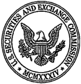

## SUBPOENA

## UNITED STATES OF AMERICA SECURITIES AND EXCHANGE COMMISSION

In the Matter of MusclePharm Corp. (D-3309)

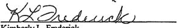

To:

Berman &amp; Company, P.A. c/o Arthur G. Jakoby, Esq. Herrick, Feinstein LLP 2 Park Avenue New York, New York 10016

- x YOU MUST PRODUCE everything specified in the Attachment to this subpoena to officers of the Securities and Exchange Commission, at the place, date and time specified below:

ENF-CPU, Kimberly Frederick, U.S. Securities and Exchange Commission, 100 F St., N.E., Mailstop 5973, Washington, DC 20549-5973, no later than August 12, 2013 at 5:00 p.m.

- [ ] oO YOU MUST TESTIFY before officers of the Securities and Exchange Commission, at the place, date and time specified below:

FEDERAL LAW REQUIRES YOU TO COMPLY WITH THIS SUBPOENA. Fajlure to comply may subject you to a fine and/or imprisonment.

By:

?

a

Du

As

uch

2

Date:

\_July 29, 2013

Kimberly L. Frederick Attorney, Division of Enforcement U.S. Securities and Exchange Commission Denver Regional Office

I am an officer of the U.S. Securities and Exchange Commission authorized to issue subpoenas in this matter. The Securities and Exchange Commission has issued a formal order authorizing this investigation under: Section 20(a) of the Securities Act of 1933 and Section 21(a) of the Securities Exchange Act of 1934.

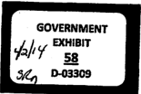

## SUBPOENA ATTACHMENT FOR BERMAN &amp; COMPANY, P.A. July 29, 2013

## In the Matter usclePharm Corp. (D-3309

## DEFINITIONS AND INSTRUCTIONS

- "Berman" means Berman &amp; Co., P.A. including all its parents, subsidiaries, divisions, affiliates, predecessors, successors, officers, directors, employees, agents, general partners, limited partners, partnerships, and aliases, code names, or trade or business names used by any of the foregoing.
- "MusclePharm" means MusclePharm Corporation including all its parents, subsidiaries, divisions, affiliates, predecessors, successors, officers, directors, employees, agents, general partners, limited partners, partnerships, and aliases, code names, or trade or business names used by any of the foregoing.
- "Document" means all materials in your possession, custody, or control or subject to your custody or control, whether drafts or unfinished versions, originals or nonconforming copies thereof, however created, produced or stored (manually, mechanically, electronically or otherwise), and by whomever prepared, produced, sent, dated or received, including, but not limited to, books, papers, emails, files, notes, minutes, summaries, records, analyses, correspondence, memoranda, working papers, ledger sheets, confirmations, order tickets, floor tickets, invoices, account statements, reports, wires, telegrams, telexes, telephone logs, notes or records of conversations or meetings, contracts, agreements, calendars, date books, work sheets, invoices, bills, records of payment, magnetic tape, tape recordings, disks, diskettes, disk packs, and other electronic media, microfilm, microfiche, storage devices, appointment books, diaries, notices and message slips.
- "Communication" means and includes, without limitation, any correspondence, memoranda, notes, summaries, electronic mail, telephone conversations, and other conversations, conferences or meetings. The term "communication" includes documents evidencing communications.
- A communication or document "conceming," "involving," "relating," "related," or "which relates" to any given subject means any communication or document that constitutes, contains, discusses, embodies, evidences, reflects, identifies, states, refers to, deals with, bears upon, or is in any way pertinent to that subject, including documents concerning the preparation of other documents.
- "You" and "your" refer to Berman.
- Reference to a person shall also include that person's trusts, affiliates, employees, agents, partners, and independent contractors, as well as aliases, code names, trade names, or business names used by, or formerly used by, any of the foregoing.
- To the extent necessary to bring within the scope of this subpoena any information or documents that might otherwise be construed to be outside its scope:
- a. the word "or" means "and/or";
- b. the word "and" means "and/or";
- c the functional words "each," "every" "any" and "all" shall each be deemed to include each of the other functional words;
- d. the masculine gender includes the female gender and the female gender includes the masculine gender; and
- e. the singular includes the plural and the plural includes the singular.
- Unless otherwise specified, the subpoena calls for production of the original documents and all copies and drafts of same. Documents responsive to this subpoena may be in electronic or paper form. Electronic documents such as email should be produced in accordance with the attached document entitled SEC Data Delivery Standards. All electronic documents responsive to the document subpoena, including all metadata, should also be produced in their native software format.
10. For documents in paper format, you may send the originals, or, if you prefer, you may send copies of the originals. The Commission cannot reimburse you for the copying costs. If you are sending copies, the staff requests that you scan (rather than photocopy) hard copy documents and produce them in an electronic format consistent with the SEC Data Delivery Standards. Alternatively, you may send us photocopies of the documents in paper format. If you choose to send copies, you must secure and retain the originals and store them in a safe place. The staff may later request or require that you produce the originals.
11. Whether you scan or photocopy documents, the copies must be identical to the originals, including even faint marks or print. Also, please note that if copies of a document differ in any way, they are considered separate documents and you must send each one. For example, if you have two copies of the same letter, but only one of them has handwritten notes on it, you must send both the clean copy and the one with notes.
12. In producing a photocopy of an original document that contains post-it(s), notation flag(s), or other removable markings or attachments which may conceal all or a portion of the markings contained in the original document, photocopies of the original document both with and without the relevant post-it(s), notation flag(s), or removable markings or attachments should be produced.
13. Documents should be produced as they are kept in the ordinary course of business or be organized and labeled to correspond with the categories in this request. In that regard, documents should be produced in a unitized manner, i.e., delineated with staples or paper clips to identify the document boundaries.
14. Documents should be labeled with sequential numbering (bates-stamped).

15. The scope of any given request should not be limited or narrowed based on the fact that it calls for documents that are responsive to another request.
16. You are not required to produce exact duplicates of any documents that have been previously produced to the Securities and Exchange Commission staff in connection with this matter. If you are not producing documents based upon a prior production, please identify the responsive documents that were previously produced.
17. For any documents that qualify as records of regularly conducted activities under Federal Rule of Evidence 902(11), please complete a business records certification (a sample of which is enclosed) and return it with the document production.
18. This subpoena covers all documents in or subject to your possession, custody or control, including all documents that are not in your immediate possession but that you have the effective ability to obtain, that are responsive, in whole or in part, to any of the individual requests set forth below. If, for any reason — including a claim of attorney-client privilege — you do not produce something called for by the request, you should submit a list of what it is not producing. The list should describe each item separately, noting:
5. its author(s);
6. the name of the person who has the item now, or the last person known to have it;
7. its date; its subject matter; PEP
8. the names of everyone who ever had the item or a copy of it, and the names of everyone who was told the item's contents; e
9. the basis upon which you are not producing the responsive document; ph
10. the specific request in the subpoena to which the document relates;
11. in the case of the work product doctrine, the litigation for which the document was prepared in anticipation.
12. the attorney(s) and the client(s) involved; and pda
19. If documents responsive to this subpoena no longer exist because they have been lost, discarded, or otherwise destroyed, you should identify such documents and give the date on which they were lost, discarded or destroyed.

## I. PRODUCTION

Produce the following documents (whether maintained in hard copy or in electronic form) from January 1, 2010 through the present, unless otherwise indicated herein:

1. All documents relating to audit and review services performed by Berman for MusclePharm, for fiscal 2010 through the present, including but not limited to, the following:
2. All workpapers, including but not limited to, any restricted workpapers or tax accrual workpapers, related to annual audits and quarterly reviews;
3. All documents provided by MusclePharm to Berman that were not included in Berman's formal work papers. This request also includes documents prepared/created by Berman but not included in Berman's formal workpapers;
4. All indices or legends that describe the referencing system or abbreviations used in the workpapers;
5. All top files, summary or completion memoranda, matters for the attention of the partner, "To Do" lists, review notes, point sheets, problems memoranda, partner's memoranda, supervisor's memoranda, senior's memoranda, quality control review notes and all other writings or memoranda that summarize, evaluate, highlight or analyze the engagement of specific points, problems or issues that arose during the engagement,
6. All documents concerning planning for any audit or review of MusclePharm's financial statements, including but not limited to planning memoranda, audit programs, audit manuals, materiality assessments, group instructions issued to audits of subsidiaries, and representation letters;
7. All materials relating to MusclePharm's financial reporting practices, system of internal controls, or internal audits;
8. Financial statement files supporting MusclePharm's balance sheet, income statement, statement of cash flows, accompanying footnotes, and supplementary schedules;
9. Proposed adjusting journal entries and actual adjusting journal entries and all proposed and/or accepted reclassification entries and consolidations;
10. All communications between Berman and MusclePharm, including, but not limited to, all engagement letters, contracts, or other documents that define the nature and the scope of work or engagement concerning any work, including consulting work, contemplated or performed by Berman or its affiliates, management representation letters and management letters, email with attachments, memoranda, and documents presented to: MusclePharm's Board of Directors, Audit Committee, Disclosure Committee, or any other Board of Director's committee, including but not limited to internal investigations;
11. All communications between Berman and all prospective and actual successor auditors to MusclePharm.
- k. All internal communications of Berman relating to MusclePharm, including all letters, e-mails with attachments, and memoranda.
13. 1 All general, permanent, legal, carry forward, bulk, or other files representing documents of an on-going relevance from one year to another, including, but not limited to, contracts, leases and bylaws; and
- m. Copies of predecessor's workpapers and notes related to reviews of such documents.
15. To the extent not produced in response to Item 1 above, produce the following:
16. a All personal and desk files of all Berman personnel related to or concerning Berman's audit and review services provided to MusclePharm.
17. db. All drafts of financial statements with accompanying footnotes and auditor's reports, as originally drafted, as revised and finalized, and consolidated statements with consolidating and eliminating entries;
- c. All documents relating to presentations to, or communications with, MusclePharm's Board of Directors or any Board of Director's committee concerning MusclePharm's financial statements, disclosures, accounting policies, and/or internal controls;
- d. All documents relating to or memorializing any meetings, telephone conversations or communications with MusclePharm's management, employees, directors, Board of Directors, or any Board of Director's committee;
- e. All documents relating to any possible irregularity, impropriety, or material error involving MusclePharm books and records, financial statements, or internal accounting controls;
- f. All documents and communications relating to or concerning any investigation, inquiry, analysis, in-depth review, or examination of any actual or contemplated accounting or reporting irregularity, error, or restatement of MusclePharm's financial statements, including but not limited to, interviews, analyses, reports, agendas, notes, memoranda, workpapers, and correspondence.
22. g All diaries of senior partners, engagement partners, managers, seniors and staff that relate to meetings, contacts, and conversations with MusclePharm.
23. h All documents and communications related to Berman's dismissal as independent auditor of MusclePharm.

## DECLARATION OF BERMAN &amp; COMPANY, P.A. CERTIFYING RECORDS OF REGULARLY CONDUCTED BUSINESS ACTIVITY

- I, the undersigned, [insert name], pursuant to 28 U.S.C. § 1746, declare that:

1. I am employed by Berman &amp; Company, P.A. as [insert position] and by reason of my position am authorized and qualified to make this declaration. [if/possible supply additional information as to how person is qualified to make declaration, e.g., Iam custodian of records, I am familiar with the company’s recordkeeping practices or systems, etc.]

- I further certify that the documents [attached hereto or submitted herewith] and stamped [insert bates range] are true copies of records that were:

- (a) made at or near the time of the occurrence of the matters set forth therein, by, or from information transmitted b_{y,a} person with knowledge of those matters;

- (b) kept in the course of regularly conducted business activity; and

- (c) made by the regularly conducted business activity as a regular practice.

I declare under penalty of perjury that the foregoing is true and correct. Executed on [date].

[Name]

## SUBPOENA

## UNITED STATES OF AMERICA

## SECURITIES AND EXCHANGE COMMISSION

## In the Matter of MusclePharm Corp. (D-03309)

To:

Elliot Berman c/o Arthur G. Jakoby, Esq. Herrick, Feinstein LLP 2 Park Avenue New York, New York 10016

- a YOU MUST PRODUCE everything specified in the Attachment to this subpoena to officers of the Securities and Exchange Commission, at the place, date and time specified below:
- X YOU MUST TESTIFY before officers of the Securities and Exchange Commission, at the place, date and time specified below:
- US. Securities and Exchange Commission, Denver Regional Office, 1801 California St., Suite 1500, Denver, CO 80202, at 9:00 a.m. on Wednesday, April 2, 2014 and Thursday, April 3, 2014 at 9:00 a.m.

FEDERAL LAW REQUIRES YOU TO COMPLY WITH THIS SUBPOENA. Failure to comply may subject you to a fine and/or imprisonment.

By:

Date:

February 11, 2014

Kimberly L. Frederick, Staff Attorney — Enforcement Securities and Exchange Commission 1801 California, Suite 1500 Denver, CO 80202

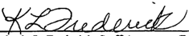

I am an officer of the Securities and Exchange Commission authorized to issue subpoenas in this matter. The Securities and Exchange Commission has issued a formal order authorizing this investigation under Section 20(a) of the Securities Act of 1933, Section 21(a) of the Securities Exchange Act of 1934, Section 209(a) of the Investment Advisers Act of 1940, and Section 42(a) of the Investment Company Act of 1940.

## Notice To Witness:

If you claim a witness fee or mileage, submit this subpoena with the claim voucher.

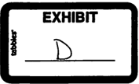

October 18, 2013

The Board of Directors: MusclePharm Corporation C/O Mr. Brad Pyatt, Chairman of the Board of Directors 4721 Ironton Street Denver, Colorado 90839

Brad thanks for the call today, I do appreciate your time. As we discussed, under the terms of our January 1, 2012 audit engagement letter with MusclePharm "reasonable costs and time spent [by Berman &amp; Company, P.A.] in legal matters or proceedings arising from our engagement, such as subpoenas, testimony or consultation involving private litigation, arbitration or government regulatory inquiries at your request or by subpoena will be billed to you (MusclePharm] separately and you [MusclePharm] agree to pay the same." As you agreed, Berman &amp; Company's costs or expenses incurred in connection with responding to the SEC Subpoena and any and ali related matters such as the time that Berman &amp; Company employees spend responding to the SEC document production, any future testimony and our legal fees or any other costs in connection therewith are allowable expenses. You and | agreed today, and previously with the SEC (your counsel is aware) that you require our workpapers for your own review. We agree to release these documents to you solely for that purpose, which is to ensure that the documents you have gathered consist of documents we obtained directly from you in the course of our prior audit work. Upon executing this letter, and wiring $50,000, we will immediately get you what you need, and we will make ourselves available to assist you with any questions.

Additionally, you agreed that after your meeting with the SEC on Wednesday of next week, you will let us (me and our counsel) know your interpretation of where things stand. We agree that we will provide any continued support to you in connection with this subpoena and related matters. Our billing rate per our old engagement letter was $350/hr, and we will continue to honor that rate.

Finally, we also discussed should the $50,000 not fully cover our costs we will bill you for any excess amounts and you agree to pay for such amounts and that if we are required to provide testimony we will require a further advance payment for both our time and expenses including but not limited to the cost of our legal fees.

I do wish you and the Company the best, and will be happy to help you any way that I can.

Very truly yours,

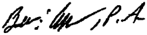

heheh

&amp; Berman P

WA, &amp; Company, NW Registered

## 551 ech Srrest Suite 201 © Boca Raton, FL 33487 61) 864-4444 © Fax: (561) 892. 3715 wf PCAC + Me © info@bermancpas. with the © Member AICPA Center for Audit Quality Member American Institute ified Public Accountants Member Florida Institute ified Public Accountants

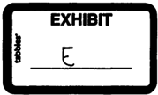
